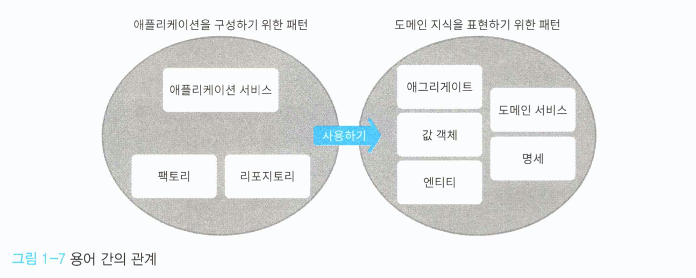

# Chapter 01 - 도메인 주도 설계란?

## 1.1 도메인 주도 설계란 무엇인가?

소프트웨어를 개발하다 보면 새로운 분야를 익히게 된다.

- 회계 시스템 → 경리 업무
- 물류 시스템 → 수송이나 배송 과정

개발자가 이용자들이 겪는 문제를 해결하려면 당연히 이용자의 세계에 대해 배워야한다.

단, 이용자에게 유용한 소프트웨어를 개발하려면 가치 있는 지식과 그렇지 않은 지식을 신중하게 구분해서 가치 있는 지식만 코드에 녹여 넣어야 한다. 이렇게 작성된 코드는 유용한 지식을 정리해놓은 문서와도 같다.

유용한 소프트웨어를 만들려면 이용자의 문제가 무엇인지 파악하고, 이를 해결할 수 있는 최선의 수단을 생각해야 한다.

**도메인 주도 설계는 이러한 고찰을 반복하는 설계를 통해 이용자의 세계와 소프트웨어 구현을 연결 짓는 것이 목적이다. 즉, 지식을 코드에 녹여 넣을 수 있게 하는 개념이다.**

## 1.2 도메인 지식에 초점을 맞춘 설계 기법

도메인이란 무엇일까? 도메인은 '영역'이라는 뜻이다. 특히 **소프트웨어 개발에서 말하는 도메인은 '프로그램이 쓰이는 대상 분야'라는 의미로 쓰인다.** 여기서 더 중요한 것은 도메인이 무엇인지보다는 도메인에 포함되는 것이 무엇인가 하는 것이다.

- 회계 시스템 → 금전, 장부, ...
- 물류 시스템 → 화물, 창고, 운송수단 ...

도메인에 포함되는 개념은 대상 분야가 무엇인지에 따라 크게 달라진다.

'지식에 초점을 맞춘다'라는 말의 의미는 무엇일까?

소프트웨어의 목적은 도메인에서 이용자들이 직면한 문제를 해결하는 것이다. 결국 이용자들의 문제를 정확히 이해하기 위해서는 이용자들의 관점이나 생각, 그들이 처한 환경을 제대로 이해해야 한다. => 이용자의 도메인을 접해야 한다.

**도메인에 속하는 개념과 사건을 이해하고, 그 중에서 문제 해결에 유용한 것을 뽑아낸 지식을 소프트웨어에 반영하는 과정은 소프트웨어 개발에 꼭 필요한 과정이다.**

이를 위해서는 소프트웨어가 사용될 분야(도메인)의 지식에 초점을 맞춰야 한다.

### 1.2.1 도메인 모델링 이란 무엇인가?

모델은 현실에 일어나는 사건 혹은 개념을 추상화한 개념이다. 추상이란 여러 사물 혹은 개념에서 공통적인 것을 뽑아 파악하는 것으로, 현실의 모든 것을 반영하는 것은 아니다. 상황에 따라 무엇을 버리고 무엇을 취할지는 도메인에 따라 결정된다.

펜을 예로 든다면, 소설가의 관점에서 펜은 도구이며 글자를 쓸 수 있다는 것이 중요한 성질이다. 반면 문구점의 관점에서 펜은 단순 상품일 뿐이다. 같은 대상이라도 중점이 달라질 수 있다는 것이다.

도메인의 개념을 빠짐없이 표현하는 것은 매우 어렵다. 표현에 제약이 많은 코드로 나타내야 한다면 더욱더 그렇다. 그러나 코드로 나타낼 대상을 소프트웨어가 맡은 바 역할을 다하기 위해 필요한 정보로 한정한다면, 현실적으로 실현하는 데 문제가 없다.

**이렇게 사건 혹은 개념을 "추상화하는 작업"을 "모델링"이라고 한다. 그리고 모델링의 결과를 모델이라고 한다. 도메인 주도 설계에서는 "도메인 개념을 모델링한 모델"을 "도메인 모델"이라고 한다.**

도메인 분야의 관계자는 도메인의 개념에 대한 지식은 있어도 소프트웨어에 대한 지식은 없다. 반면 개발자는 소프트웨어에 대한 지식은 있어도 도메인 개념에 대한 지식이 없다. 도메인 문제를 해결하는 소프트웨어를 만들려면 각 분야의 두 사람이 협력하여 도메인 모델을 만들어야 한다.

### 1.2.2 지식을 코드로 나타내는 도메인 객체

도메인 모델은 어디까지나 개념을 추상화한 지식이다. 이것만 가지고는 문제를 해결할 수 없다. 도메인 모델은 어떤 매체를 통해 표현돼야만 문제를 해결할 수 있는 힘을 갖는다.

**도메인 모델을 소프트웨어 형태의 동작하는 모듈로 나타낸 것이 도메인 객체다.**

어떤 도메인 모델을 도메인 객체로 구현할지도 중요한 문제다. 개발자는 정말로 유용한 모델과 그렇지 않은 모델을 구분해야 한다.

소프트웨어 사용자가 처한 세계는 항상 같은 상태로만 존재하지 않는다. 시간에 따라 변화하기 쉽다. **이럴 때 도메인 객체가 도메인 모델을 충실히 반영하고 있다면 도메인의 변화를 코드로 쉽게 옮길 수 있다.**

도메인에 발생한 변화는 우선 도메인 모델로 전달돼야 한다. 도메인에 일어난 변화는 도메인 모델을 통해 연쇄적으로 도메인 객체까지 전달된다.

이렇듯 도메인 개념과 도메인 객체는 도메인 모델을 통해 연결되며, 서로 영향을 주고받는 반복적 개발로 실현된다.

**도메인 개념 ↔ 도메인 모델 ↔ 도메인 객체**

## 1.3 이 책의 접근법과 목표

도메인 주도 설계와 관련된 개념 혹은 용어를 이해하려면 그 결론에 이르는 과정을 이해하기 위해 더 많은 배경지식이 필요하다. 그 하나하나는 사소한 지식일 수 있지만, 여러 개가 모이면 모두를 한 번에 이해하기 어렵다.

이 책에서는 이해와 실천이 힘든 것들은 일단 제쳐 놓고, 상대적으로 이해하기 쉽고 실천하기도 쉬운 구현 패턴에 집중해 상향식(Bottom-up)으로 설명하는 방식을 택했다. 개념에서 전제가 되는 지식 역시 그때그때 필요한 내용을 설명할 것이다.

> **도메인 주도 설계를 실천하기 어려운 이유**
>
> 도메인 주도 설계라는 주제는 구현뿐만 아니라 개발 관계자들 사이의 커뮤니케이션이나 팀 빌딩과도 밀접한 관계가 있다. 다시 말하면 개발자 개인 외에도 수많은 관계자가 엮여 있다는 말이다.
>
> 예를 들면, 도메인 모델을 확립하는 작업은 개발자가 자기 업무만 수행해서 마칠 수 있는 작업이 아니다. 도메인에 존재하는 개념을 포착하는 과정은 해당 도메인에 종사하는 실무자의 관점 없이는 불가능하며, 그들의 도움이 꼭 필요하다. 그러나 안타깝게도 이것이 불가능한 현장도 많다.
>
> 하지만 이러한 환경에 처했더라도 비관할 필요는 없다. 도메인 주도 설계의 모든 세부 주제가 도메인 실무자의 조력 없이 성립할 수 없는 것은 아니기 때문이다. 간혹 개발자 개인이 재량으로 실천할 수 있는 프랙티스도 있다.
>
> ...

## 1.4 이 책에서 설명하는 패턴에 대하여

이 책에서 다룰 도메인 주도 설계 패턴의 큰 그림은 다음과 같다.

- 지식 표현을 위한 패턴
  - 값 객체
  - 엔티티
  - 도메인 서비스
- 애플리케이션을 구성하기 위한 패턴
  - 리포지토리
  - 애플리케이션 서비스
  - 팩토리
- 지식 표현을 위한 고급 패턴
  - 애그리게이트
  - 명세

패턴은 도메인 지식을 설명하기 위한 것과 애플리케이션을 구성하기 위한 것으로 나뉜다.

## 1.5 지식 표현을 위한 패턴

먼저 객체 형태로 도메인 지식을 나타내는 도메인 객체를 이해하는 것부터 시작한다.

- 값 객체(2장)
  - 도메인만의 고유의 개념(금전, 제조번호 등)을 값으로 나타내는 패턴이다.
- 엔티티(3장)
  - 값 객체와 마찬가지로 도메인 개념을 나타내기 위한 객체지만, 값 객체와는 차이가 있다.
- 도메인 서비스(4장)
  - 값 객체나 엔티티만으로는 잘 표현할 수 없는 지식을 다루기 위한 패턴이다.

## 1.6 애플리케이션을 구성하기 위한 패턴

지식을 표현하는 방법을 익한 다음에는 이용자의 필요를 만족시킬 수 있는 애플리케이션을 구성하는 방법을 학습해야 한다.

- 리포지토리(5장)
  - 데이터의 저장과 복원을 의미하는 데이터 퍼시스턴시를 담당하는 객체다.
  - 관계형 데이터베이스와 같은 구체적인 데이터스토어를 떠올리기 쉬운데, 이들을 추상화한 개념이다.
- 애플리케이션 서비스(6장)
  - 값 객체, 엔티티, 도메인 서비스, 리포지토리 이렇게 4가지 요소를 익히면 애플리케이션을 구성하기 위해 필요한 최소한의 개념을 이해한 것이다.
  - 애플리케이션 서비스는 이 4가지 요소가 서로 협조하며 애플리케이션으로서 기능하는 장소가 된다.
- 팩토리(9장)
  - 객체를 만드는 데 필요한 지식이 특화된 객체다. 구조가 복잡한 객체는 객체를 만드는 방법도 복잡하다. 이 점은 도메인 객체도 마찬가지이므로 복잡한 객체를 만드는 방법도 복잡하게 마련이다.
  - 팩토리 패턴을 이용해 객체 생성에 대한 지식을 한곳에 모아 놓으면 도메인 객체가 더 잘 드러나며 그만큼 코드의 의도를 쉽게 이해할 수 있다.

## 1.7 자식 표현을 위한 고급 패턴

- 애그리게이트(12장)
  - 무결성을 유지하는 경계다. 값 객체나 엔티티 같은 도메인 객체를 한데 묶어 복잡한 도메인 개념을 나타낸다.
- 명세(13장)
  - 객체를 평가하기 위한 지식이다. 객체가 어떤 특정한 조건을 만족하는지 판정하는 평가 기준을 객체 내에 구현하면 객체가 이런 내용의 코드로 인해 불필요하게 복잡해질 수 있다.
  - 명세 패턴을 적용하면 객체를 평가하는 기준을 모듈로 분리할 수 있다.

> **왜 지금 도메인 주도 설계가 필요한가?**
>
> 소프트웨어는 항상 진화하는 존재다. 개발 극초기 잠깐 동안의 개발 속도를 우선시한 소프트웨어는 유연성이 떨어지며 변화에 대응하기 어렵다.
>
> 소프트웨어가 변화에 제대로 대응하려면 개발자가 지속해서 소프트웨어를 수정해야한다. 이렇게 여러 해가 지나다 보면 소프트웨어는 복잡하고 이리저리 기워진 누더기가 되기 일쑤다.
>
> 끝없는 땜질식 수정 업무에서 벗어나기 위한 수단 중 하나가 도메인 주도 설계인 것이다.
>
> 도메인 주도 설계는 도메인에 주목해 요구사항 분석부터 설계, 개발에 이르기까지 소프트웨어 개발 과정에서 상호작용이 필요하다. 개발 극초기에도 어느 정도 효과를 볼 수 있지만, **도메인 주도 설계의 진정한 가치가 드러나는 것은 변화에 대응해 소프트웨어를 수정할 때다.**
>
> **지금 당장 동작하는 프로그램을 만드는 것은 어렵지 않다. 그러나 앞으로도 계속 동작할 프로그램을 만들기는 여럽다. 시스템을 장기적으로 운영하기를 원한다면 도메인 주도 설계를 익혀야 한다.**