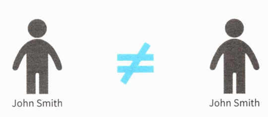

# 03 생애 주기를 갖는 객체 - 엔티티

엔티티는 소프트웨어 개발에서 상당히 자주 쓰이는 용어다. 

- ERD(Entity Relationship Diagram)

  : 데이터베이스 테이블 설계 개념

- ORM(Object Relation Mapping)

  : 퍼시스턴시 대상이 되는 객체


그러나 도메인 주도 개발에서 말하는 엔티티는 약간 의미가 다르다. 


## 3.1 엔티티란? 

**도메인 모델을 구현한 도메인 객체를 의미**한다. 이전에 다룬 값 객체도 도메인 객체지 않은가? 이 두가지 객체의 차이가 있는데 **동일성을 통해 식별이 가능한지** 아닌지다.


### 동일성(identity)

동일성은 속성이 아닌 무언가로 동일한지 식별할 수 있는 성질이다.

예를들어 사람은 이름, 키 , 체중, 취미 등 다양한 속성을 갖는다. 이 같은 속성들은 고정된 값이 아니며 여러 가지 요인에 의해 변화한다. 

나이를 먹는다고 전혀 다른 사람이 되지 않는다. 마찬가지로 체중도 늘어나거나 줄기는 하지만, 다른 사람이 되지 않는다. 이것은 어떤 사람이 그 사람이 되는 이유는 속성과 무관하며 동일성을 지켜주는 무언가가 있다는 것을 보여준다.

**소프트웨어 시스템에서도 마찬가지로 속성으로 구별되지 않는 객체**가 있다. 시스템의 사용자가 그 예다. 사용자가 최초 등록 시 입력한 정보 대부분은 임의로 수정할 수 있다. 이 정보가 수정된다고 해서 다른 사용자가 되는 일은 없다. 사용자는 **속성이 아닌 동일성로 식별되는 것**이다.


## 3.2 엔티티의 성질

엔티티와 값 객체는 모두 도메인 모델을 구현한 도메인 객체라는 점에서 비슷하지만 성질에는 차이가 있다.

| 값 객체                  | 엔티티                        |
| ------------------------ | ----------------------------- |
| 변하지 않는다.           | 가변이다.                     |
| 주고받을 수 있다.        | 속성이 같아도 구분할 수 있다. |
| 등가성을 비교할 수 있다. | 동일성을 통해 구별된다.       |

*값 객체와 엔티티의 성질*


### 가변이다

값 객체는 불변성을 갖는 객체였다. 때문에 객체를 교환(대입)해 수정했지만, 엔티티는 수정을 위해 객체를 교환하지 않는다. 엔티티의 속성을 수정하려면 객체의 행동을 통해 수정하면 된다. 

```C#
class User
{
  private string name;
  
  public User(string name)
  {
  	ChangeName(name);
  }
  
  public void ChangeName(string name)
  {
    if (name = null) throw new ArgumentNullException(nameof(name)).
    if (name.Length < 3) throw new ArgumentException("사용자명은 3글자 이상이어야함", nameof(name));
    
    this.name = name;
                                                   
  }
}
```

*사용자를 나타내는 User클래스*

시스템상의 사용자를 나타내는 User 클래스는 `ChangeName` 메소드를 통해 사용자명을 바꿀 수 있다.

값 객체는 불변성을 갖기 때문에 객체를 교환(대입)해 수정했지만, 엔티티는 수정을 위해 객체를 교환하지 않고 행동을 통해 수정한다.


### 속성이 같아도 구분할 수 있다

값 객체는 속성이 같다면 같은 것으로 취급했다. 이와 달리 엔티티는 **속성이 같아도 두 엔티티를 서로 다른것으로 취급**한다. 

#### 값 객체

예를들어 성명을 나타내는 값 객체는 성과 이름의 2개 속성으로 구성된다. 값 객체는 등가성을 통해 비교되므로 성과 이름의 값이 모두 같다면 두 값 객체는 완전히 같은 것으로 취급된다.


#### 엔티티

값 객체의 성질은 사람에게는 들어맞지 않는다. 



사람은 속성만으로 구별하지 않는다. 서로 다른 엔티티를 구별하는데는 식별자(identity)가 쓰인다. 사람과 마찬가지로 시스템을 사용하는 사용자 또한 등가성이 아닌 동일성을 통해 식별해야한다. 

이제 User 객체에 식별자를 추가해보자. 

```c#
class Userld
{
  private string value;

  public Userld(string value)
  {
    if (value = null) throw new ArgumentNullException(nameof(value));
    
    this.value = value; 
  }
}

class User {
  private readonly Userld id; 
  private string name;
  
  public User(string name) 
  {
  	ChangeName(name); 
  }
  
  public void ChangeName(string name) 
  {
	  if (id == null) throw new ArgurnentNullException(nameof(id)); 
    if (name == null) throw new ArgumentNullException(nameof(name));
    
	  this.id = id;
	  this.name = name; 
  }
}

```

이름이 완전히 같은 두 사용자가 있을 때 같은 사람인지 아닌지를 이 식별자를 통해 구별한다.


### 동일성

대부분의 시스템은 사용자명이 변경되어도 변경 전과 후의 사용자를 같은 사용자로 인식한다. 사용자에는 동일성이 있다. 객체 중에도 속성이 달라지더라도 같은 대상으로 판단해야하는 것들이 있다. 이들은 모두 동일성을 통해 식별되는 객체다.

물론 프로그램은 사용자가 동일한지 판단할 수 없으므로 동일성을 판단할 수단이 필요하다. 그 수단으로 식별자를 사용하므로 User 클래스에 식별자로 `id`를 추가해보자.

````c#
class User : IEquatable<User> 
{
	private readonly Userld id; 
  private string name;
  
  (...생략...)
  
  public bool Equals(User other) 
  {
    if (ReferenceEquals(null, other)) return false;
    if (ReferenceEquals(this, other)) return true;
    return Equals(id, other.id); // 실제 비교는 id 값끼리 이루어진다
  }
  
  public override bool Equals(object obj) 
  {
    if (ReferenceEquals(null, obj)) return false;
    if (ReferenceEquals(this, obj)) return true;
    if (obj.getType() 1= this.GetTypeO) return false; 
    return Equals((User) other.id);
  }
  
  // 언어에 따라 GetHashCode의 구현이 필요 없는 경우도 있다
  public override mnt GetHashCode()
  {
	  return (id 1=null ? id.GetHashCode() : 0);
	} 
}
````

필드로 저장한 식별자를 통해 동일성을 비교하는 행위인 `Equals` 메소드도 정의했다.


이 메소드는 다음과 같이 사용된다.

```c#
void Check(User leftUser, User rightUser)
{
  if (leftUser.Equals(rightUser))
  {
    Console.WriteLine("동일한 사용자임");
  }
}
```


## 3.3 엔티티 판단 기준

도메인 모델을 값 객체와 엔티티 중에 어떤 것으로 정의해야할지 판단의 기준이 필요하다. 여기에는 생애주기의 존재 여부와 그 생애주기의 연속성 여부가 중요한 판단 기준이 된다. 사용자 개념에는 다음과 같은 생애주기와 연속성이 있기 때문에 엔티티로 판단하기 문제가 없다.

```
- 시스템을 이용하려는 사람에 의해 생성
- 이용하면서 사용자명을 변경하는 경우도 생긴다.
- 더 이상 이용할 필요가 없을 때 삭제
```

*사용자의 생애주기와 연속성*

생애주기를 갖지 않거나 생애주기를 나타내는 것이 무의미한 개념이라면 우선 값 객체로 다루자. 생애주기를 갖는 객체는 태어나서 죽을 때까지 변화를 겪을 수 있다. 정확함이 필요한 소프트웨어를 만들려고 할 때 가변 객체는 신중히 다뤄야 할 성가신 존재다.  불변으로 남겨둘 수 있는 것은 최대한 불변 객체로 남겨둬야 시스템을 단순하게 유지할 수 있다.


## 3.4 값 객체도 되고 엔티티도 될 수 있는 모델

같은 대상이라도 어떤 도메인에 있느냐에 따라 모델링 방법이 달라진다. 타이어를 예로 들어보자. 타이어는 자동차를 구성하는 한 부품이다. 특성에는 세세한 차이가 있어도 서로 바꿔 쓸 수 있으므로 값 객체로 나타내기에 적합한 개념이다. 그러나 타이어를 만드는 공장이라면 그 타이어가 언제 만들어졌는지 등 개체를 식별하는 것이 중요하다. 여기서의 타이어는 엔티티로 나타내는 것이 더 적합하다.

값 객체아 엔티티 모두 될 수 있는 개념도 있으니 소프트웨어에 따라 어느 쪽으로 모델링하는 것이 더 적합한지 생각해보자.


## 3.5 도메인 객체를 정의할 때의 장점

1. 자기 서술적인 코드가 된다
2. 도메인에 일어난 변경을 코드에 반영하기 쉽다

이 장점은 최초 개발 시점보다는 개발 완료 후 유지보수 시점에 빛을 발한다.


### 자기 서술적인 코드가 된다

새로운 개발자가 코드를 보거나, 인수인계를 받는다거나 하는 이유로 전혀 내부를 알지 못하는 소프트웨어를 다루는 경우가 많다. 사전지식이 없는 개발자는 소프트웨어의 요구사항을 어떻게 파악할까?

대부분의 경우라면 기능 명세서를 통해 파악한다. 하지만 내부의 세세한 사항을 파악하기 힘들뿐더러 문서와 코드의 동기화가 안 맞을 수도 있다. 

문서가 도움이 안된다면 개발자는 코드에 의존할 수 밖에 없다. 만약 사용자명에 대한 명세를 알아보려고 할 때 User 클래스가 다음과 같다면 어떨까?

```c#
class User 
{
	public string Name { get; set; } 
}
```

해당 코드는 어떤 힌트도 얻을 수 없다. 이와 비교해 다음 UserName 클래스를 보면 사용자명의 제약사항이 한눈에 들어온다.

```c#
class UserName 
{
	private readonly string value;
  
	public UserName(string value) {
  	if (value = null)thrownewArgumentNullException(nameof(value));
		if (name.Length < 3) throw new ArgumentException("사용자명은 3글자 이상이어야함", nameof(name));
    
		this.value = value; 
  }
  
  public ChangeName(string value) {
    if (value = null)thrownewArgumentNullException(nameof(value));
		if (name.Length < 3) throw new ArgumentException("사용자명은 3글자 이상이어야함", nameof(name));
    
    this.value = value;
  }
  
	(...생략...) 
  
}
```

이렇듯 도메인 모델과 관련된 규칙이 모두 도메인 객체로 옮겨지면 이들 규칙이 도메인 객체의 유효성을 보장한다.


### 도메인에 일어난 변경을 코드에 반영하기 쉽다

다시 한번 도메인 객체의 행동이나 규칙이 작성되지 않은 User 클래스를 보자.

```c#
class User 
{
	public string Name { get; set; } 
}
```

해당 도메인의 규칙이 변경된 상황을 생각해보자. 사용자명의 최소 길이는 3글자라는 규칙이 최소 길이 6글자 이상으로 바뀌었다고 가정하자.

이러한 규칙 변화는 해당 유효성 검증이 포함된 코드를 직접 찾아 수정해야한다. 반대로 도메인 규칙을 도메인 객체 내에 옮겨놨다면 수정도 한 곳만 하면 될 것이다.

도메인 객체에 이와 관련된 행동이나 규칙을 코드로 작성해두면 도메인 모델로 전달된 도메인의 변화를 쉽게 객체까지 전달할 수 있다.

사람의 일은 변화하기 쉬우며 도메인도 그러하다. 그러므로 소프트웨어도 그에 맞춰 자주 변화해야한다. 소프트웨어가 미래에도 건강하게 성장해 나갈 수 있게 코드에 많은 정보를 담자.


## 3.6 정리

다양한 행동이 기술된 객체는 그 소프트웨어가 어떤 도메인 지식에 관심이 있는지, 또 그 지식을 어떻게 식별하는지를 드러낸다. 이들 객체는 나중에 참여하는 개발자들이 도메인을 이해하는데 유용한 힌트가 된다. 