# 04 부자연스러움을 해결하는 도메인 서비스

도메인 개념을 지식으로 녹인 후 값 객체나 엔티티를 행동으로 구현하려 하면 어딘가 어색한 부분이 생기는 경우가 있다. 이럴 때 어색한 느낌을 낳는 이 행동을 별도의 객체로 분리해 정의하는것이다. 이 객체가 도메인 서비스다.


## 4.1 서비스란?

소프트웨어 개발에서 말하는 서비스는 클라이언트를 위해 무언가를 해주는 객체를 말한다. 도메인 주도 설계에서 말하는 서비스는 크게 두 가지로 나뉜다. 첫 번째는 도메인을 위한 서비스고 두번째는 애플리케이션을 위한 서비스다. 


## 4.2 도메인 서비스란?

값 객체나 엔티티 같은 도메인 객체는 행동을 정의할 수 있다. 예를 들어 사용자명으로 사용할 수 있는 문자열의 길이나 문자의 종류에 제한이 있다면 이러한 지식은 사용자명을 나타내는 값 객체에 정의될 것읻.

그러나 시스템에는 값 객체나 엔티티로 구현하기 어색한 행동도 있다. 도메인 서비스는 이런 어색함을 해결해주는 객체다.


### 값 객체나 엔티티에 정의하기 어색한 행동

시스템에서는 사용자명을 중복으로 사용할 수 없게 하는 경우가 많다. 사용자명에 중복을 허용하지 않는 것은 도메인의 규칙이다. 따라서 도메인 객체에 행동으로 정의돼야 한다. 그렇다면 이 규칙은 구체적으로 어떤 객체에 구현돼야할까?

우선 사용자에 대한 사항은 사용자를 나타내는 객체에 담는다는 당연한 논리적 사고에 따라 User  클래스에 추가해보자.

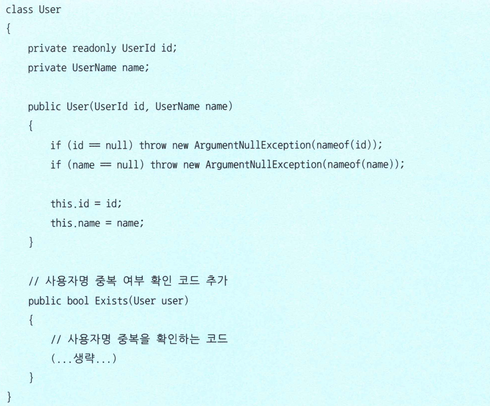


객체 정의만으로는 문제가 없어 보이지만, 사실 이 코드는 자연스럽지 못한 코드다. 실제로 이 메서드를 사용하는 과정을 따라가보자.

```c#
var userld = new Userld("id");
var userName = new UserName("smith"); 
var user = new User(userld, userName);

// 새로 만든 객체에 중복 여부를 묻는 상황이 됨
var duplicateCheckResult = user.Exists(user); Console.WriteLine(duplicateCheckResult); // true? false?
```

사용자명 중복을 확인하는 처리는 User 클래스에 있으니 결국 자기 자신에게 중복 여부를 묻는 상황이 된다. 이러한 중복 여부 확인을 새로 생성한 객체에 맡기면 개발자의 혼란을 일으키기 쉽다. 접근법을 바꿔 중복 확인만을 목적으로하는 전용 인스턴스를 만들어 보자.

```c#
varcheckld = newUserld("check"); 
varcheckName = newUserName("checker");
var checkObject = new User(checkld, checkName);

var userld = new Userld("id");
var userName = new UserName("smith"); 
var user = new User(userld, userName);

// 사용자명 중복 확인용 객체에 중복 여부를 문의함 
var duplicateCheckResult = checkObject.Exists(user); Console.WriteLine(duplicateCheckResult);
```

해당 코드를 보면 자신의 사용자명 중복 여부를 자기 자신에게 묻는다는 부자연스러움은 사라졌다. 그러나 사용자명 중복 확인을 위해 만든 checkObject가 사용자를 나타내는 객체이면서 사용자가 아니라는 점에서 여전히 부자연스러움이 남아있다. 올바른 코드라면 이런 부자연 스러운 객체가 존재해서는 안된다.

이러한 부자연스러움을 해결해주는 객체가 도메인 객체다.


### 부자연스러움을 해결해주는 객체

도메인 서비스도 일반적인 객체와 다를 것이 없다.

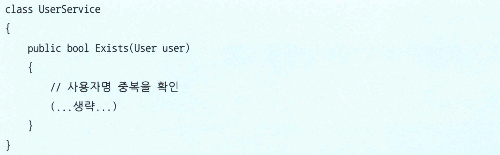

도메인 서비스는 **자신의 행동을 바꿀 수 있는 인스턴스만의 값을 갖지 않는다**는 점에서 값 객체나 엔티티와 다르다.


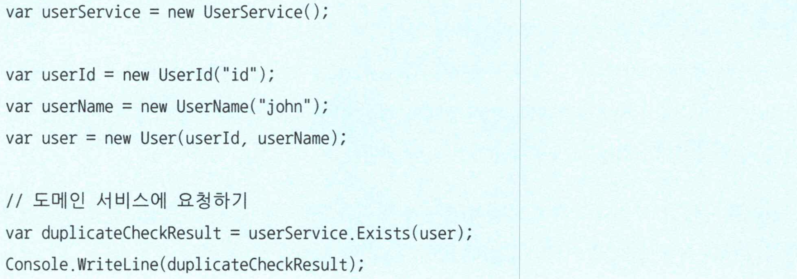

도메인 서비스를 이용하니 자기 자신에게 중복 여부를 확인하거나 중복 확인에만 사용되고 버려질 인스턴스를 만들 필요가 없어졌다. 개발자에게 혼란을 주지 않는 자연스러운 코드가 됐다.


## 4.3 도메인 서비스를 남용한 결과

엔티티나 값 객체에 정의하기 부자연스러운 처리는 도메인 서비스에 정의하면 된다. 이때 중요한 것은 '부자연스러운 처리'에만 한정해야 한다는 점이다. 그렇지 않으면 모든 처리가 도메인 서비스에 정의되는 결과를 낳을 수 있다.

다음은 사용자명 처리를 도메인 서비스에 정의한 코드이다.

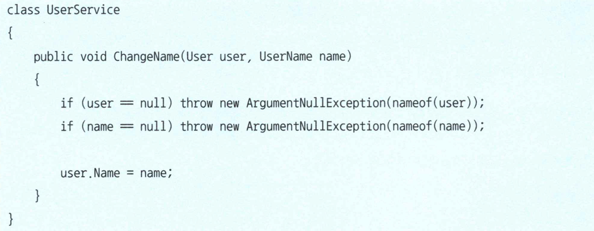

언뜻보면 올바르게 보이지만 이대로라면 User 클래스의 코드가 어떻게 될지 생각해보자

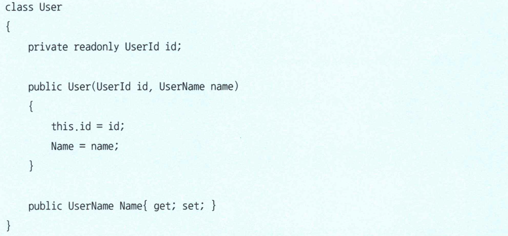

모든 처리를 도메인 서비스에 구현하면 엔티티에는 게터와 세터만 남게 된다. 아무리 숙련된 개발자라도 이러한 코드만으로는 사용자 객체의 처리 내용이나 적용되는 도메인 규칙을 발견하기 어렵다.

생각 없이 모든 처리를 도메인 서비스로 옮기면 다른 도메인 객체는 그저 데이터를 저장할 뿐, 별다른 정보를 제공할 수 없는 객체가 되는 결과를 낳는다. 이렇게 원래 포함했어야 할 지식이나 처리 내용을 모두 도메인 서비스나 애플리케이션 서비스에 빼앗긴 도메인 객체를 빈혈 도메인 모델이라고 한다.

사용자명 변경 처리는 원래대로라면 User 클래스에 정의해야 할 내용이다.

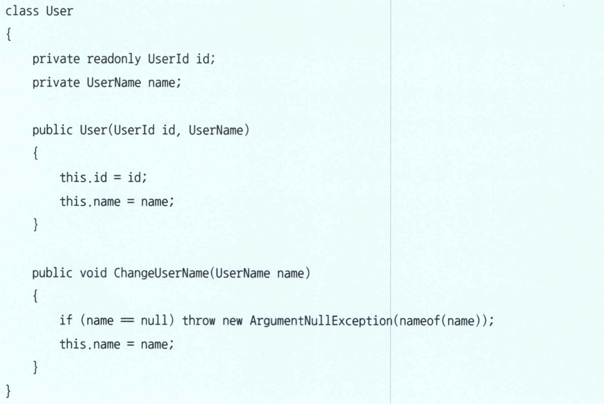


### 도메인 서비스는 가능한 피할것

물론 도메인 서비스로 옮기지 않으면 어색한 행위도 있다. 어디에 구현할지 고민된다면 우선 엔티티나 값 객체에 정의해야한다. 도메인 서비스를 남용하면 데이터와 행위가 단절돼 로직이 흩어지기 쉽다. 로직이 흩어지면 소프트웨어가 변화에 대응하는 유연성이 저해돼 심각하게 정체된다.


## 4.4 엔티티/값 객체와 함께 유스케이스 수립하기

도메인 서비스의 사용법을 살펴보기 위해 실제 유즈케이스를 세워보자. 이번 유즈케이스는 사용자, 그 중에서도 사용자 생성 처리를 소재로 한다.


### 사용자 엔티티 확인

사용자를 나타내는 User 클래스를 정의하자.

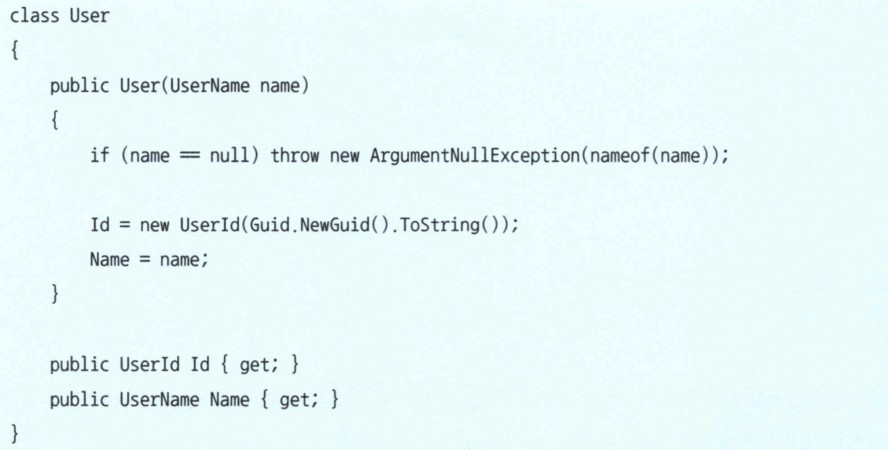


사요자는 Id로 식별되는 엔티티다. 그리고 사용자 생성 처리 중에는 User 클래스의 행동은 필요치 않으므로 주요 메소드는 여기에 정의하지 않았다.

User 클래스를 구성하는 객체도 살펴보자. UserId 타입의 식별자와 사용자명을 나타내는 UserName 타입의 속성을 가지고 있다.

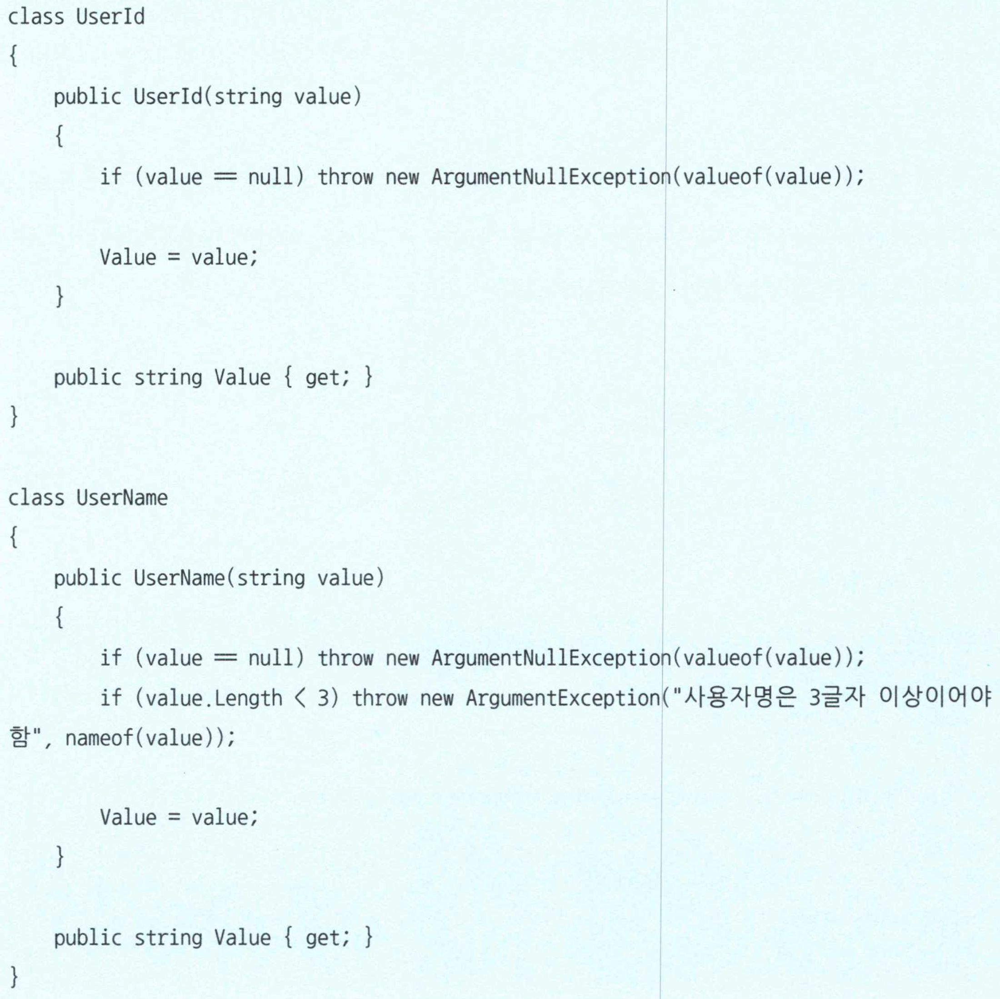


### 사용자 생성 처리 구현

이제 사용자 생성 처리 과정을 구현하자.


앞부분의 코드는 주의 깊게 읽지 않아도 사용자 생성 후 중복 확인을 거치는 것을 알 수 있다. 하지만 후반부의 코드는 눈으로 훑어서는 의도를 파악하기 어렵다. 코드 자체는 어렵지 않지만, 생성한 사용자를 저장한다는 의도를 파악하기 위해서는 코드를 자세히 봐야 한다.

도메인 서비스로 구현된 UserService의 구현은 어떻게 될까?

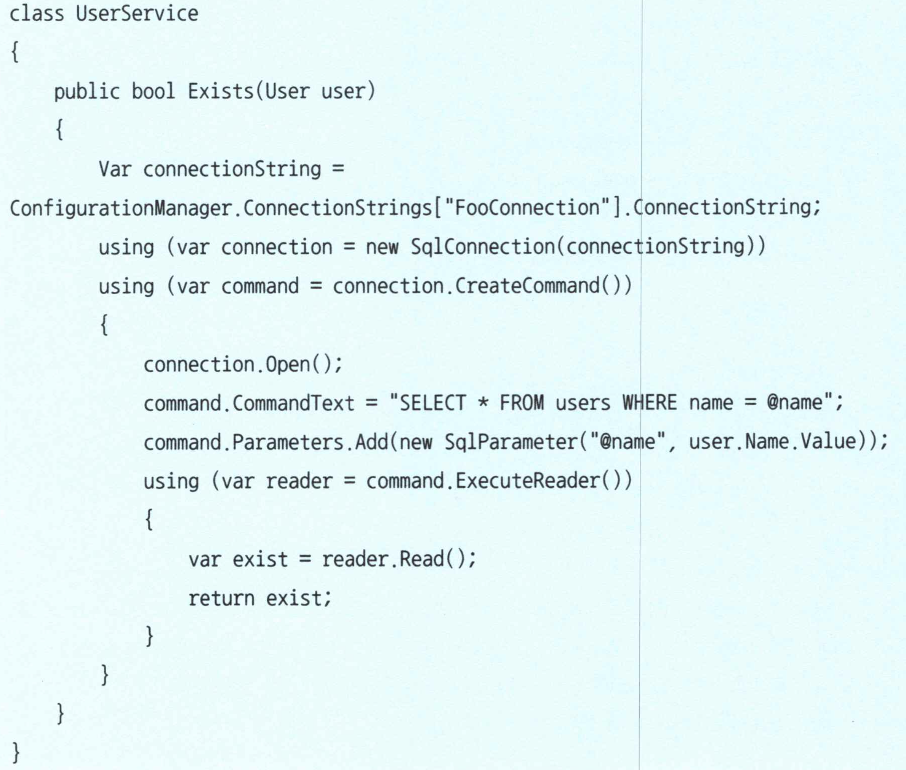

사용자명 중복 여부는 데이터스토어에 물어봐야 한다. 이 때문에 UserService 클래스의 사용자명 중복 확인 처리는 처음부터 끝까지 데이터 스토어를 다룬다.

이 코드는 바르게 동작하기는 하지만 유연성이 부족하다. 예를 들어 데이터스토어를 관계형 데이터베이스에서 NoSQL 데이터베이스로 바꿀 필요가 생겼다면 어떻게 될까? 사용자 생성 처리는 본질적으로 아무 변화가 없음에도 코드 대부분을 수정해야 할 것이다. 특히 UserService는 모든 코드를 NoSQL 데이터베이스를 다루느느 코드로 수정하지 않으면 안 된다.

데이터를 다뤄야하는 이상 데이터를 실제 읽고 쓰는 처리를 구현하지 않을 수는 없다. 그러나 사용자 생성 처리를 담당하는 코드의 태반이 데이터스토어를 다루는 코드, 그것도 특정한 데이터스토어에 의존적이 코드여야 할까?

물론 그렇지 않다. 사용자 생성 처리의 본질은 사용자를 생성하는 것과 사용자명 중복 여부를 확인하는 것 그리고 생성된 사용자 데이터를 저장하는 것이다. 코드로 나타내야 할 것은 이런 본질적인 내용이지 특정 데이터스토어를 직접 다루는 내용이어서는 안 된다. 

소프트웨어 시스템에서 데이터를 저장하는 처리는 꼭 필요하다. 그러나 이와 관련된 코드를 그대로 작성하면 그 처리의 의미가 잘 드러나지 않는다. 다음 장에서 설명한 리포지토리 패턴으로 이러한 문제를 해결할 수 있다.


## 4.5 물류 시스템의 도메인 서비스 예

이번엔 데이터스토어 같은 인프라스트럭처와 엮이지 않고 도메인 객체만 다루는 물류 시스템을 구성해보자. 물류 시스템에서는 화물이 직접 배송지로 보내지는 것이 아니라, 현재 거점에서 배송지에 가까운 거점을 거쳐 배송된다.


### 거점의 행동으로 정의하기

물류 도메인에서 중요한 개념인 거점부터 정의하자.

```c#
class PhysicalDistributionBase {
  (...생략...)
  
  public Baggage Ship(Baggage baggage) 
  {
  	(...생략...) 
  }
     
  public void Receive(Baggage baggage) 
  {
  	(...생략...) 
  }
}
```

거점은 출고(Ship)와 입고(Receive)라는 행위를 가진다. 출고와 입고는 함께 다뤄져야 하는 활동이다. 이를 운송이라는 행동으로 구현하자. 운성은 거점에서 거점으로 화물이 이동하는 것이므로 거점에 정의해본다.

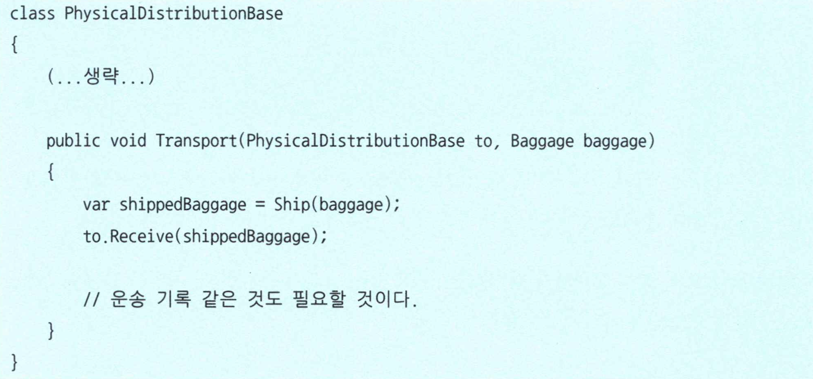

운송 처리는 잘 이루어질 것이다. 그러나 출발지 거점에서 출발지 거점의 출고와 도착지 거점의 입고까지 처리하는 것은 어딘가 어색하다. 또한 운송 기록 처리 같은 것이 필요할텐데 그 처리를 거점에서 처리하는 것은 더 어색해보인다.


### 운송 도메인 서비스 정의하기

운송이라는 행위는 특정 객체의 행위로 정의하기에는 어색하다. 운송을 맡을 별도의 도메인 서비스를 정의해보자.

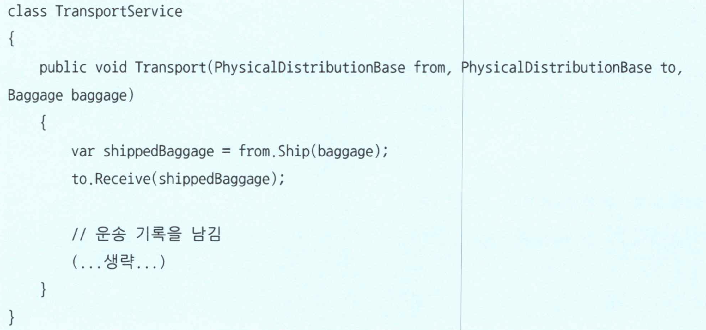


## 4.6 정리

도메인에는 도메인 객체에 구현하기에 자연스럽지 못한 행위가 있다. 이런 행위는 여러 개의 도메인 객체를 가로질러 이뤄지는 처리인 경우가 많다. 도메인 서비스는 이럴 때 활용하는 객체다. 

서비스는 이모저모 편리해보일 수 있지만, 도메인 객체에 구현해야 할 행위를 모두 서비스로 옮긴다면 빈혈 도메인 모델이 생길 수 있다. 행위가 빈약한 객체는 절차적 프로그래밍으로 빠지기 쉽게 때문에 도메인 지식을 객체의 행위로 나타낼 기회를 잃게 된다.

값 객체, 엔티티, 도메인 서비스 등 기본적 도메인 개념을 나타낼 수 있는 수단을 갖췄다. 하지만 한 가지 문제점도 살펴봤다. 유즈케이스가 처음부터 끝까지 데이터스토어를 다뤄야 한다는 점이다. 다음 장에서 리포지토리를 통해 이를 해결해보자.