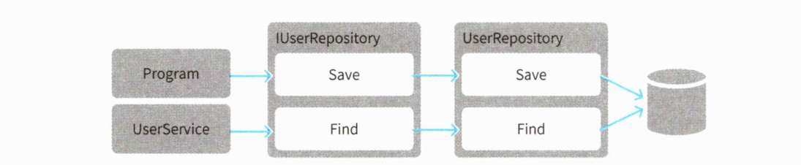

# 05 데이터와 관계된 처리를 분리하자 - 리포지토리

소프트웨어를 성장시키려면 코드의 의도를 명확히 해야한다. 당연히 객체를 저장하고 복원하는 퍼시스턴시 처리도 중요하지만, 데이터스토어를 다루는 코드는 프로그램의 의도를 가리기 쉽다. 의도가 잘 드러나도록 데이터스토어와 관련된 처리를 따로 떼어내야한다. 리포지토리는 이러한 처리를 추상적으로 다룰 수 있게 해준다. 또한 데이터스토어를 쉽게 교체하는 효과도 가져다 준다. 이를 통해 테스트가 쉬워지며, 프로그램의 변경도 쉬워진다.


## 5.1 리포지토리란 무엇인가


***데이터 보관창고***

리포지토리는 일반적으로 창고를 의미한다. 소프트웨어에서도 역시 데이터 보관창고를 의미한다.

도메인 개념을 표현했다고해서 그대로 애플리케이션이 되는 것이 아니다. 메모리에 로드된 데이터들은 프로그램 종료 시 그대로 사라진다. 특히 <u>엔티티는 생애주기를 갖는 객체이기 때문에 프로그램 종료와 함께 사라져서는 안된다.</u>


***리포지토리를 통한 객체의 저장 및 복원***

객체를 다시 이용하려면 데이터 스토어를 통해 저장 및 복원할 수 있어야한다. 리포지토리는 데이터를 저장하고 복원하는 처리를 추상화하는 객체다. 객체 인스턴스 저장 시 데이터스토어에 기록하는 처리를 직접 실행하는 대신 리포지토리에 객체의 저장을 맡기면 된다. 또한 읽어들일 때도 리포지토리에 복원을 맡긴다.

이런 방식은 소프트웨어의 유연성을 놀랄만큼 향상시킨다. 이러한 장점을 체감한 후 앞 장의 문제를 해결해보도록 하자.


## 5.2 리포지토리의 책임

*"리포지토리의 책임은 도메인 객체를 저장하고 복원하는 퍼시스턴스다."*

관계형 데이터베이스가 아닌 어떤 기술을 채용하든지 퍼시스턴시를 구현하는 코드는 특정 데이터스토어를 사용하기 위한 구체적인 절차를 따라야 하기 때문에 까다롭다. 이 까다로운 절차를 그대로 도메인 코드에 노출시키면 어떤 일이 벌어질까?


```c#
class Program 
{
    public void CreateUser(string userName) 
    {
        var user = new User(
                new UserName(userName)
        );
        
        var userService = new UserService;
        if (userService.Exists(user))
        {
            throw new Exception($"{userName}은 이미 존재하는 사용자명임");
        }
        
        var connectionString = ConfigurationManager.ConnectionStrings['FooConnection'].ConnectionString;
        using(var connection = new SqlConnection(connectionString))
        using(var command = connection.CreateCommandO)
        {
            connection.Open();
            command.CommandText = "INSERT INTO users (id, name) VALUES(@id, @name)";
            command.Parameters.Add(new SqlParameter("@id", user.Id.Value));
            command.Parameters.Add(new SqlParameter("@name", user.Name, Value));
            command.ExecuteNonQuery();
        }
    }
}
```

***4장의 사용자 생성 코드***

코드의 앞부분은 사용자 생성 및 중복 확인인 것이 명확하다. 하지만 후반부 코드는 SqlConnection을 통해 관계형 DB에 접근한다는 사실만이 보일 뿐 User 객체 인스턴스를 저장하겠다는 것을 파악하기 쉽지 않다.


```c#
class UserService 
{
    public bool Exists(User user) 
    {
        var connectionString = ConfigurationManager.ConnectionStrings["FooConnection"].ConnectionString;
        using(var connection = new SqlConnection(connectionString))
        using(var command = connection.CreateCommand())
        {
            connection.Open();
            command.CommandText = "SELECT * FROM users WHERE name = @name";
            command.Parameters.Add(new SqlParameter("@name", user.Name.Value));
            using(var reader = command.ExecuteReader0)
            {
                var exist = reader.Read();
                return exist;
            }
        }
    }
}
```

***4장의 유저 중복 체크 코드***

마찬가지로 중복 체크하는 `UserService.Exists` 메소드 또한 처음부터 끝까지 관계형 데이터베이스를 다루는 코드밖에 없어 이해하기 쉽지 않다. 중복 금지 규칙을 확인하려면 쿼리를 자세히 봐야한다.


사용자 생성 처리와 사용자명 중복 확인 처리 모두 바르게 동작하지만, 코드 대부분이 데이터스토어를 조작하는 인프라코드로 가득차 있어 의도를 이해하기 쉽지 않다. 코드의 의도를 더 잘 드러낼 수 있도록 퍼시스턴시를 리포지토리를 통해 추상화해서 다루게 수정하자.

```c#
class Program 
{
  private lUserRepository userRepository;
  
  public Program(IUserRepository userRepository) 
  {
  	this.userRepository = userRepository; 
  }
  
  public void CreateUser(string userName) 
  {
    var user = new User(
	    new UserName(userName)
    );
    
    var userService = new UserService(userRepository); 
    if (userService.Exists(user))
    {
	    throw new Exception($"{userName}은 이미 존재하는 사용자명임"); 
    }
    
    userRepository.Save(user); 
  }
}
```

***리포지토리를 이용하는 사용자 생성 처리***

User 객체의 퍼시스턴시는 IUserRepository 객체가 맡아 수행한다. 데이터스토어가 어떤 형태이든 도메인 입장에서는 중요한 문제가 아니다. 데이터스토어에 대한 명령을 추상화함으로써 데이터스토어를 다루는 까다로운 코드에서 해방되고 사용자 생성과 관련된 순수한 로직만 남은 코드가 됐다.


```c#
class UserService
{
  private IUserRepository userRepository;
  
  public UserService(IUserReository userRepository)
  {
    this.userRepository = userRepository;
  }
  
  public bool Exists(User user)
  {
    var found = userRepository.Find(user.Name);
    
    return found != null;
  }
}
```

***리포지토리를 이용하는 사용자 중복 체크 처리***

마찬가지로 사용자 중복 처리 쪽을 리포지토리를 사용해 추상화해보자. 복잡한 인프라스트럭쳐 코드는 사라지고 사용자 중복 체크는 사용자명을 기준으로 한다는 명확한 의도만 남았다.

이렇듯 객체의 퍼시스턴시와 관련된 처리를 리포지토리에 맡기면 비지니스로직을 더욱 순수하게 유지할 수 있다.


## 5.3 리포지토리의 인터페이스

*"리포지토리는 인터페이스로 정의된다."*

```c#
public interface lUserRepository 
{
	void Save(User user);
	User Find(UserName name); 
}
```

***User 클래스의 리포지토리 인터페이스***

사용자 처리를 구현하려면 인스턴스를 저장하는 처리와 중복 확인을 위한 객체 복원 처리가 필요하다. 따라서 인터페이스도 두 가지 행동을 제공한다. 


```c#
public interface lUserRepository 
{
	void Save(User user);
	User Find(UserName name); 
  bool Exists(User user);
}
```

***중복 처리코드가 포함된 리포지토리***

사용자명 중복 기능을 하는 `Exists`  메소드를 리포지토리에 구현하면 어떨까 생각이 들수도 있다. 그러나 리포지토리의 책임은 객체의 퍼시스턴시까지이다. 중복 확인은 도메인 규칙에 가까우므로(사용자명으로 체크를 한다던지) 이를 리포지토리에 구현하는 것은 책임을 벗어난다.


```c#
class UserService
{
	private lUserRepository userRepository;
	
  (...생략...)
	
  pubic bool Exists(User user)
	{
		// 중복 확인이 사용자명 기준이라는 지식이 도메인 객쳬에서 누락된다 
    return userRepository.Exists(user);
	}
}
```

 ***도메인 규칙을 확인할 수 없는 도메인 서비스***

위와 같이 도메인 규칙을 확인할 수 있어야하는 도메인 모델에서 사용자 이름으로 중복 체크한다는 도메인 규칙을 확인할 수 없게 된다.


## 5.4 SQL을 이용하는 리포지토리 구현하기

자 인터페이스를 정의해뒀으니 이제 관계형 DB를 사용하는 리포지토리를 구현해보자.


```c#
public class UserRepository : lUserRepository {
  private string connectionString = ConfigurationManager.ConnectionStrings["DefaultConnection"].ConnectionString;

  public void Save(User user) {
    using (var connection = new SqlConnection(connectionString)) 		
    using(varcommand=connection.CreateCommand())
    {
      connection.Open(); 
      command.Commandlext = @"
      	MERGE INTO users 
      	USING (
      		SELECT @id AS id, @name AS name 
        ) AS DATA
	      ON userd.id = data.id
  			WHEN MATCHED THEN
		      UPDATE SET name = data.name
    	  WHEN NOT MATCHED THEN
      		INSERT (id, name)
	      VALUES (data.id, data.name);
	    ";
      
      command.Parameters.Add(new SqlParameter("@id", user.Id.Value)); 
      command.Parameters.Add(new SqlParameter("@name", user.Name.Value)); 
      command.ExecuteNonQuery();
    } 
  }
  
  (...생략...) 
  
}
```

***SQL을 사용하는 리포지토리 구현***

UserRepository 클래스의 `Save` 메서드는 인스턴스를 관계형 DB에 저장하기 위해 UPSERT(기존 데이터 있으면 UPDATE, 없으면 INSERT)한다. UPSERT 처리 구현 방법은 자신을 찾는 SELECT 쿼리를 전달해도 좋고, 예제 코드처럼  데이터베이스 고유 문법인 MERGE를 사용해도 된다. 비지니스 로직에서 특정 기술에 의존하는 구현은 바람직하지 않지만, 리포지토리의 구현 클래스라면 문제가 없다.


```c#
public class UserRepository : lUserRepository 
{
  
	(...생략...)
  
  public User Find(UserName userName) 
  {
	  using (var connection = new SqlConnection(connectionString)) 
    using (var command = connection.CreateCommandO)
    {
      connection.Open(); 
      command.Commandlext="SELECT * FROM users WHERE name = @name";   
      command.Parameters.Add(new SqlParameter("@name", userName.Value)); 
      using (var reader = command.ExecuteReaderO)
        {
        if (reader.Read()) 
        {
          var id = reader["id"] as string;
          var name = reader["name"] as string;
                            
          return new User(
          	new Userld(id),
        		new UserName(name)
        	);
        } 
        else
        {
        	return null;
        } 
      }
    } 
  }
}
```

***SQL을 이용하는 리포지토리 구현(Find 메서드)***

추가로 Find 메서드 구현을 살펴보자. 인자로 받은 데이터로 user 테이블을 조회한 다음 User 객체의 인스턴스를 복원해 반환한다. 해당하는 데이터가 없으면 null을 반환한다.


```c#
var userRepository = new UserRepository(); 
var program = new Program(userRepository); 
program.CreateUser("john");
```

***Program 클래스에 리포지토리를 인자로 전달하기***

그렇게 만들어진 리포지토리 구현체는 생성자 메서드를 통해 Program 클래스에 전달된다.




***UserRepository가 동작하는 구도***

Program 클래스는 IUserRepository를 다루지만 실제 객체는 UserRepository다. 따라서 IUserRepository의 Save 메소드가 호출되면 실제 객체인 UserRepository의 Save가 호출되며 UPSERT 처리가 실행된다. 마찬가지로 Find도 UserRepository의 Find가 호출되며 객체가 복원된다.

이렇게 인터페이스를 잘 활용하면 Program 클래스에서 퍼시스턴시와 관련된 구체적 처리를 구현하지 않아도 객체 인스턴스를 데이터스토어에 저장할 수 있다.


## 5.5 테스트로 구현 검증하기

*"도메인 변화에 맞춰 소프트웨어를 변경하려면 테스트를 미리 갖춰놓자."*

테스트는 프로그램이 개발자의 의도대로 동작하는지 항상 확인할 수 있게해준다. 또한 동작을 확인하는 목적 외에 유연성을 향상시키기도 한다. 소프트웨어를 변경하는 것은 간단한 일이 아니다. 요구 조건에 따라 변경할 부분을 찾아 신중하게 코드를 변경하면서도 원래 있던 기능을 망가뜨려서는 안된다. 코드 변경 후 테스트를 실행해 보고 원래 있던 기능이 제대로 동작하는지 확인할 수 있다. 소프트웨어 변경에 따른 검증 비용을 줄여주는 것이다.


### 테스트가 필요한 작업 확인하기

사용자 생성 처리가 의도대로 동작하는지 확인하기 위해 테스트를 작성하는 상황을 생각해 보자.

1. 테스트를 수행하려면 우선 관계형 데이터베이스가 필요하다. 데이터 베이스를 설치한다.
2. 접속 문자열을 로컬 데이터베이스 접속용으로 교체한다.
3. 쿼리의 대상이 될 테이블을 만들자. 코드를 보니 `Select * From users` 와 같은 쿼리가 보인다. `user` 테이블을 만들자.
4. 코드를 한번 더 보니 사용자 ID와 사용자명 컬럼이 있으면 될 것 같다. 수집한 정보를 바탕으로 테이블을 수정한다.
5. 코드를 보니 중복 처리가 있다. 중복 확인을 위해 데이터를 미리 넣어둔다.

***사용자 생성 처리를 위해 해야하는 작업***


로직마다 다른 테이블이 필요하므로 로직이 늘어남에 따라 테이블도 추가해야한다. 여러 가지 기능이 있는 처리는 더 어렵다. 테스트가 필요한 항목마다 데이터를 미리 넣어둬야한다. 경우에 따라선 이전 테스트에서 사용한 데이터를 지워야할 수도 있다.

이 작업을 하루에도 몇 번씩 해야하면 어떻겠는가?


### 기도하는 자의 테스트 이론

*부디 이 코드가 문제없이 동작하게 해주세요. - 기도하는 자*

테스트 없이 코드를 짠 후 짧게는 며칠에서 몇 주, 가끔은 더 긴 기간 동안 문제가 없으면 안심하며 생각한다. 역시 그 코드는 문제가 없었다고. 잘못될만한 코드를 짜고 기도하기만 한다고 프로그램의 오류가 고쳐지진 않는다.


### 기도는 이제 그만

지금의 문제는 테스트를 위해 데이터베이스를 설치하고, 테이블을 만드는 등 준비작업이 너무 많다. 이 문제는 간단하게 해결된다. 데이터 베이스를 사용하지 않는 것이다. 즉, 데이터베이스가 없는 테스트용 리포지토리를 쓰는 것이다.


## 5.6 테스트용 리포지토리 만들기

테스트만을 위한 특정 인프라를 갖추는건 어렵다. 이 문제를 해결하기 위해 메모리를 데이터스토어로 삼자.


```c#
class InMemoryUserRepository : lUserRepository 
{
	// 테스트케이스에 따라 데이터를 확인해야 하는 경우도 있다
	// 확인을 위해 외부에서 접근할 수 있게 public으로 둔다
  public Dictionary<Userld,User> Store{ get; } = newDictionary<Userld,User>O;

  public User Find(UserName userNarne) 
  {
    var target = store.Values.FirstOrDefault(user => userName.Equals(user.Name));
    if (target 1= null) {
			// 인스턴스를 직접 반환하지 않고 깊은 복사한 사본을 반환 return Clone(target);
		} 
    else
		{
		return null;
		} 
  }
  
  public void Save(User user) {
  	// 저장 시에도 깊은 복사를 수행 
    Store[user.Id] = Clone(user);
  }
  
  // 깊은 복사를 담당하는 메서드 
  private User Clone(User user) {
    return new User(user.Id, user.Name);
  }
}
```

***Dictionary를 이용한 메모리 기반 리포지토리***

먼저 데이터가 저장 될 곳을 살펴보자. 데이터는 평범한 딕셔너리에 저장된다. Find 메서드를 살펴보자. 이 메서드는 딕셔너리에서 목표하는 인스턴스를 검색하는 역할을한다. 검색 결과로 찾은 인스턴스는 그대로 반환하는 것이 아니라 깊은 복사를 통해 만든 새로운 객체를 반환한다. 이렇게하는이유는 복원된 인스턴스를 조작했을 때 리포지토리에 저장된 객체에 그 영향이 미치지 않게하기 위해서다.


```c#
var userRepository = new InMemoryUserRepository(); 
var program = new Program(userRepository); 
program.CreateUser("john");

// 리포지토리에서 데이터를 꺼내 확인한다
var head = userRepository.Store.Values.First(); 
Assert.AreEqual("john", head.Name);
```

***사용자 생성 처리 테스트***

이제 실제로 테스트 코드를 작성해보자. 데이터베이스에 접속할 필요가 없으니 테스트가 놀랄만큼 간단해졌다. 코드가 제대로 동작하리라는 확신이 들 때까지 마음껏 테스트하자.


## 5.7 객체-관계 매핑이 적용된 리포지토리 구현하기

요즈음은 SQL을 직접 코드에 작성하는 대신 객체-관계 매핑(ORM, Object Relation Mapper)를 사용하는 스타일이 주류를 이룬다. 이를 이용한 리포지토리를 구현해보자.

C#에서는 EntityFramework를 ORM 라이브러리로 많이 사용한다. 다음 코드는 이 라이브러리를 사용한 리포지토리이다.

```c#
public class EFUserRepository : lUserRepository
{
  private readonly MyDbContext context;

  public EFUserRepository(MyDbContext context) 
  {
  	this.context = context; 
  }
  
  public User Find(UserName name)
  {
  	var target = context.Users.FirstOrDefault(userData => userData.Name - name.Value);
    if (target = null)
	  {
		  return null;
	  }
  
    return loModel(target); 
  }
  
  public void Save(User user)
  {
  	var found = context.Users.Find(user.Id.Value);
    
    if (found == null) 
    {
      var data = ToDataModel(user);
    }
    else
    {
      var data = Transfer(user, found);
      context.Users.Update(data);
    }
    
  
    context.SaveChanges();
  }
  
  private User ToModel(UserDataModel from) 
  {
    return new User(
      new UserId(from.id),
      new UserName(from.Name)
    );
  }
  
  private UserDataModel Transfer(User from, UserDataModel model)
  {
    model.id = from.Id.Value;
    model.Name = from.Name.value;
    
    return model;
  }
  
  private UserDataModel ToDataModel(User from)
  {
    return new UserDataModel {
      Id = from.Id.Value,
      Name = from.Name.Value
    };
  }
}
```

***EntityFramework를 이용한 리포지토리***


```c#
[Table["Users")]
public class UserDataModel
{
  [DatabaseGenerated(DatabaseGeneratedoption.None)] 
  public string Id { get; set; }
  
  [Required]
  [MinLength(3)]
  public string Name { get; set; }
}
```

***EntityFramework가 사용하는 데이터 모델***

EntityFramework에서 데이터 스토리지로 이용하는 객체(데이터 모델)를 엔티티라고 부른다. UserDataModel은 EntityFramework의 엔티티다. 이 엔티티는 이름만 같을 뿐 2장 도메인 주도 설계의 엔티티와는 전혀 다르다.  UserDataModel 이라는 이름에서 이를 강조하고 있다. 


```c#
namespace Infrastructure.DataModel.Users
{
  [Table("Users")] 
  public class User 
  {
  	[DatabaseGenerated(DatabaseGenerated0ption.None)] 
    public string Id { get; set; }
    
  	[Required]
	  [MinLength(3)]
  	public string Name { get; set; }
  } 
}
```

***네임스페이스를 이용해 User라는 클래스 명으로 정의한 데이터모델***

물론 네임스페이스를 이용해 User로 정의할 수도 있다. 중요한 것은 도메인 객체가 도메인 지식을 나타내는데 집중하게 해야한다. 특정한 기술에서만 사용될 게터와 세터를 도메인 객체에 추가하는 것은 바람직하지 못하다. 


```c#
var userRepository = new EFUserRepository(MyContext); 
var program = new Program(userRepository); 
program.CreateUser("smith");

// 리포지토리에서 데이터를 꺼내 확인한다 
var head = myContext.Users.First(); 
Assert.AreEqual("smith", head.Name);
```

***EntityFramework를 이용한 리포지토리 테스트***

자 이제 테스트해보자. 리포지토리의 구현체만 바뀌었을 뿐 Program 클래스의 인스턴스 생성 뒤의 처리 내용은 메모리를 이용한 리포지토리와 완전히 같다.


## 5.8 리포지토리에 정의되는 행동

리포지토리에 정의되는 행위는 객체의 저장 및 복원에 대한 것이다. 이 행위를 한번 살펴보자.


### 객체의 저장과 관계된 행위

```c#
public interface lUserRepository 
{
	void Save(User user);
	(...생략...)
}
```

***객체를 저장하는 행동***

객체 저장 행위는 이미 다뤘던 `Save` 메소드이다. 메소드 명은 강제가 아니다. `Store` 라고 지어도 무방하다.


```c#
interface lUserRepository {
	void UpdateName(Userld id, UserName name);
	(...생략...) 
}
```

***수정할 항목만을 인자로 받는 수정 처리(나쁜 예)***

객체를 저장하려면 저장 대상 객체를 인자로 전달 받아야한다. 위와 객체의 식별자 및 수정 항목을 인자로 받게 메서드를 정의하면 안된다.


```c#
interface lUserRepository
{
	void UpdateName(Userldid,UserNamename);
	void UpdateEmail(Userld id, Email mail);
	void UpdateAddress(Userld id, Address address); (...생략...)
}
```

***불필요하게 많은 수정 메서드가 정의된 리포지토리***

수정 항목을 받는 메서드를 정의한다면 위와 같이 수많은 메서드가 생기는 결과를 낳는다. 객체가 저장하고 있는 데이터를 수정하려면 애초에 객체 자신에게 맡기는게 옳다. 마찬가지로 객체 생성 처리도 리포지토리에 정의해서는 안된다. 생성자 메서드를 경유하지 않는 객체 생성에 관해선 9장에서 다룬다.


```c#
interface IUserRepository
{
  void Delete(User user);
  (...생략...)
}
```

***객체를 파기하는 행위가 정의된 리포지토리***

이 외에도 퍼시스턴시와 관련된 행동으로 객체의 파기도 있다. 이 또한 리포지토리에 정의하자.


### 저장된 객체의 복원과 관계된 행위

```c#
interface IUserRepository
{
  User Find(UserId id);
  (...생략...)
}
```

***식별자를 키로 객체를 검색하는 메서드***

객체를 복원하는 행위 중에 가장 자주 쓰이는 것은 식별자로 검색을 수행하는 메서드다. 


```c#
interface IUserRepository
{
	List<User> FindAll();
  (...생략...)
}
```

***저장된 모든 객체를 복원하는 메서드***

기본적으로 식별자를 키로 삼는 검색을 사용하지만, 사용자명 중복 여부를 확인하기 위해 모든 객체를 받아와야 할 경우도 있다. 이런 경우를 위해 저장된 모든 객체를 복원해오는 메서드를 정의한다. 이 경우는 주의해야한다. 복원해야하는 객체의 숫자에 따라 성능이 떨어질 수 있다.


```c#
interface IUserRepository
{
  User Find(UserName name);
  // 오버로딩을 지원하지 않는 언어라면 다음과 같이한다.
  User FindByUserName(UserName name);
  (...생략...)
}
```

***검색에 적합한 메서드 예***

성능에서 기인하는 문제를 회피하려면 검색에 적합한 메서드를 정의해야한다. 위와 같은 메서드라면 검색의 키가 될 데이터를 인자로 전달받기 때문에 리포지토리의 구현체도 최적화된 검색을 수행할 수 있다.


## 5.9 정리

*"로직이 인프라스터럭처 기술에 의존하면 소프트웨어가 경직된다."*

리포지토리를 이용하면 데이터 퍼시스턴시와 관련된 처리를 추상화할 수 있다. 예를 들어 개발 초기에 어떤 데이터스토어를 채용할지 결정하기 전이라도 인메모리 리포지토리 등을 이용해 먼저 로직을 구현할 수 있다. 이 외에도 더 성능이 높은 데이터스토어가 출시되면 쉽게 교출할 수 있다. 그리고 언제든 테스트가 가능하다.