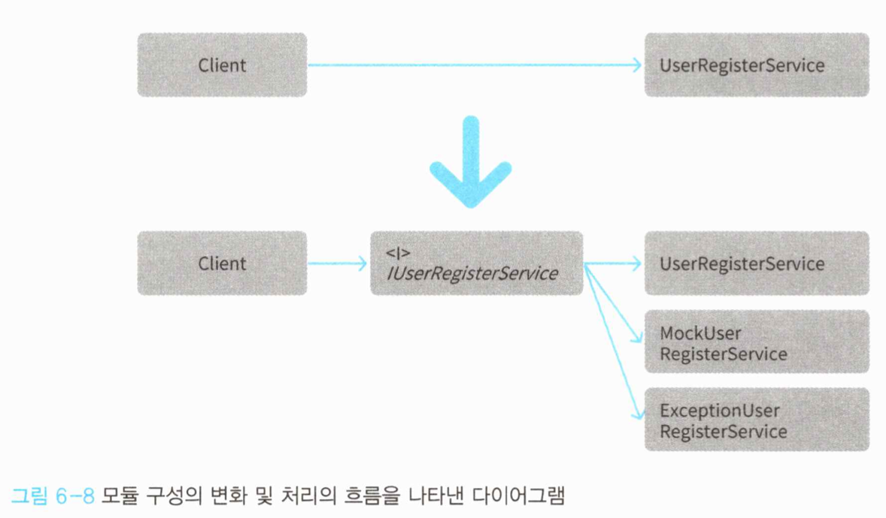

## 6.유스케이스를 구현하기 위한 '애플리케이션 서비스'

### 6.1 애플리케이션 서비스란 무엇인가

애플리케이션 서비스를 한마디로 표현하면 유스케이스를 구현하는 객체라고 할 수 있다.

>  유스케이스란 ? 시스템이 어떤 서비스나 기능을 제공하는지를 명세해주는 것


예를 들어 사용자 등록을 해야 하는 시스템에서 사용자 기능을 구현하려면 **'사용자 등록하기' 유스케이스**와 **'사용자 정보 수정하기' 유스케이스**가 필요하다.

사용자 기능에 대한 애플리케이션 서비스는 유스케이스를 따라 '사용자 등록하기' 행위와 '사용자 정보 수정하기'  행위를 정의한다.

```애플리케이션 서비스의 의미
애플리케이션은 일반적으로 이용자의 목적에 부응하는 프로그램을 의미한다. 애플리케이션의 목표는 이용자의 필요를 만족시키고 목적을 달성하게 하는 것이다.

도메인 객체는 도메인을 코드로 옮긴 것으로, 도메인 객체만으로 이용자가 당면한 문제나 필요가 해결되지 않는다. 이용자의 필요를 만족시키거나 문제를 해결하려면 도메인 객체의 힘을 하나로 엮어 올바른 방향으로 이끌어야 한다.

도메인 객체를 조작해서 이용자의 목적을 달성하게 이끄는 객체인 애플리케이션 서비스의 이름에 애플리케이션이라는 단어가 들어가는 것은 어찌보면 당연한 일이다.
```


### 6.2 유스케이스 수립하기

SNS(소셜 네트워킹 서비스)의 사용자 기능을 애플리케이션 서비스의 소재로 다뤄보자.

하나의 시스템을 이루기 위해 반드시 개발이 필요한 요소를 골라내기 위해 우선 사용자 기능이 어떤 것인지부터 살펴보겠다.

이용자는 시스템을 이용하기 위해 먼저 사용자 등록을 해야 한다. 이용자는 이전에 등록한 사용자 정보를 참조하기도 하고, 때에 따라서는 정보를 수정할 수도 있다. 만약 이용자가 더 이상 시스템이 필요하지 않게 됐을 때는 탈퇴를 통해 시스템 이용을 중지할 수 있다. (**CRUD**)


#### 6.2.1 도메인 객체 준비하기

애플리케이션 서비스가 다룰 도메인 객체를 준비하자.

이번에 소재가 된 사용자 개념은 **생애주기를 갖는 모델이므로 엔티티로 구현**된다.

##### 6-1. 사용자를 나타내는 엔티티


사용자는 동일성을 식별하기 위한 속성 Userld를 가지며, 사용자 정보에 해당하는 속성은 사용자명뿐이다. 


##### 6-2. User 클래스가 사용하는 값 객체 타입

모든 속성이 값 객체로 정의되어 있으나, 지금은 특별한 행위가 없으므로 거의 원시 타입을 단순히 래핑한 상태나 마찬가지다. (리스트6-2).


##### 6-3. 사용자 도메인 서비스

사용자 명의 중복 여부를 확인해야 하는 도메인 서비스도 갖춰야 한다. (리스트6-3).


##### 6-4. 사용자 리포지토리

사용자 객체의 퍼시스턴시를 구현하기 위해 리포지토리를 구현한다. (리스트6-4).


6-3에서 사용되는 메서드 외에도 (Find) CRUD 처리를 수행하는 퍼시스턴시 및 객체 파기 메서드가 정의된다. (리포지토리를 구현한 클래스는 아직 만들지 않겠다.)


#### 6.2.2 사용자 등록 처리 구현하기


Register 메서드를 보면 먼저 User 객체를 생성한 다음 UserService에 사용자명 중복 체크를 확인한다.  중복되지 않음을 확인하고 나면 lUserRepository 인스턴스에 해당 사용자 객체를 저장할 것을 요청하고 사용자 등록을 끝낸다.

사실 Program클래스가 바로 애플리케이션 서비스다.


#### 6.2.3 사용자 정보 확인 처리 구현하기

사용자 등록과 달리 사용자 정보 확인 처리는 확인된 결과를 반환해야 한다. 이때도 메인객체를 그대로 반환값으로 사용할지 말지에 대한 선택이 중요한 분기점이 된다.


도메인 객체를 공개한다면 애플리케이션 서비스 코드가 비교적 간단해지지만, 이로 인해 의도하지 않은 도메인 객체의 메서드 호출이 가능해진다.


이 코드를 실행해도 데이터 퍼시스턴시가 수행되지 않으므로 원하는 목적을 달성할 수는 없다.

하지만, **애플리케이션 서비스가 아닌 객체가(Client)** 도메인 객체의 직접적인 클라이언트가 되어 **도메인 객체를 자유롭게 조작**하고 있다는 점은 상당한 문제이다.

**도메인 객체의 행동을 호출**하는 것은 **애플리케이션 서비스**의 책임이다. 


이 구조가 지켜지지 않았을 때 

1) 애플리케이션 서비스가 아닌 여러 곳에 코드가 흩어질 수 있다. 
2) 뿐만 아니라, 도메인 객체에 대한 의존이 많이 발생하는 것 또한 문제이다. 도메인의 변화가 즉시 객체에 반영되어야 하는데, 복잡한 의존 관계의 핵심이 되는 코드를 수정하는 것은 매우 조심스러운 작업이다.

접근제어 수정자로 메서드 호출을 제한할 수는 있지만, 클라이언트, 애플리케이션 서비스, 도메인 객체가 모두 같은 패키지에 있다면 이 또한 사용하기 어렵다. 객체의 메서드 호출에 대한 제약을 두는 방법 역시 강제성이 없다는 것에 대한 문제가 있다.


이러한 문제로 도메인 객체를 비공개로 두고, DTO를 만들어 여기에 데이터를 옮겨 넣어 반환하는 방법을 권장한다.

> DTO? 클라이언트에 데이터 전송을 위한 객체 (Data Transfer Object)


DTO에 데이터를 옮겨 넣는 처리는 애플리케이션 서비스에서 수행한다. (리스트 6-9)


User 클래스의 인스턴스가 외부로 공개되지 않으므로 UserApplicationService의 클라이언트는

User 객체의 메서드를 직접 호출할 수 없다.


외부로 공개할 파라미터가 추가될 경우에는 리스트 6-10과 같이 코드를 수정해야 한다.


UserData 객체를 생성하는 곳이 여러 곳일 때 반복적인 수정 작업을 피하기 위해서 DTO 생성자 메서드에서 User 객체를 인자로 받는 방법이 있다.


UserData 타입의 목적이 User 객체 데이터의 공개인 만큼,  UserData가 User에 의존하는 것은 큰 문제가 되지 않는다.


파라미터를 추가하더라도 UserData 클래스만 수정한다.


마지막으로 리스트6-13의 UserData 클래스를 이용한 사용자 정보 확인 처리 구현을 살펴보자 (리스트 6-14).


DTO를 적용하면  DTO를 정의하는데 필요한 수고와 데이터를 옮겨 담는 데서 오는 약간의 성능저하가 따르지만 이는 엄청나게 많은 데이터가 아닌 이상 미미한 수준이다. 

오히려 불필요한 의존을 줄이고 도메인 객체의 변경을 방해받지 않는 데에 대한 이익이 더 크다.

도메인 객체를 외부에 공개하느냐 마느냐는 소프트웨어의 미래를 좌우할 수도 있는 큰 결정사항이므로 프로젝트의 정책을 따르는 것이 좋다.

```번거로운 작업을 줄이자
도메인 객체를 외부에 공개하지 않는다고 결정했을 때, DTO 역할을 하는 클래스 코드를 자동으로 생성해주는 도구를 만드는 등 대체 수단을 마련하는 등 귀찮은 작업을 덜어주자.
```


#### 6.2.4 사용자 정보 수정 처리 구현하기

사용자 정보 수정 처리에 대한 개개의 정보 항목마다 별도의 유스케이스를 둘 것인지, 아니면 단일 유스케이스로 여러 항목을 한꺼번에 수정할 수 있게 할지는 결정하기 까다로운 문제다.


여기서는 여러 항목을 한꺼번에 수정하는 유스케이스를 예제로 한다.


사용자 정보의 항목이 늘어나면 어떻게 되는지 코드를 통해 살펴보자.


사용자명만 변경하고 싶거나, 이메일 주소만 변경하고 싶을 수 있다. 

이렇게 구현하게 되면 사용자 정보 항목이 추가될 때마다, 애플리케이션 서비스가 갖는 메소드 시그니처가 수정돼야 한다.

커맨드 객체를 사용하면 시그니처를 매번 수정할 필요가 없다.

> 커맨드 객체란? 클라이언트가 전달해주는 파라미터 데이터를 주입 받기 위해 사용되는 객체


파라미터가 추가되더라도 커맨드 객체를 사용하기 때문에 메서드의 시그니처를 바꿀 필요가 없게 한다.


커맨드 객체를 만든다는 것은 간접적으로 애플리케이션 서비스의 처리 내용을 제어하는 것과 같다(리스트6-19).


이런 식으로 커맨드 객체는 어떤 처리의 파사드 역할을 한다.

> 파사트란? 건물의 정면. 복잡한 코드를 간략화해 노출하는 인터페이스


```에러냐 예외냐
처리 수행 중 실패했을 때 에러를 반환해야 하는지, 아니면 예외를 발생시켜야 하는지에 대해서 논의해보자.
에러를 반환하는 쪽은 결과 객체를 반환한다. 결과 객체는 개발자에게 강제력을 미치지 못해서, 처리 실패에 대한 핸들링을 어떻게 할지를 클라이언트에 전적으로 위임한다. 이는 자칫 의도치 않게 실패를 지나쳐버리는 결과를 낳는다.
반대로 예외를 발생시키는 쪽을 택하면 반환값을 반환하지 않는다. 예외를 발생시키고 아무 처리도 하지 않으면 프로그램이 종료되고, 프로그램이 종료되지 않게 하려면 발생한 예외를 catch 문을 통해 해결해야 하기 때문에 개발자에게 에러 핸들링을 강제할 수 있다. 그 결과로 실패를 그냥 지나치지 않을 수 있게 되지만 미미한 성능 하락이 있으며 반환 값의 에러 타입 현태로 전달되는 정보가 유실된다.
어느 쪽이든 장단점이 있다.
```


#### 6.2.5 탈퇴 처리 구현하기


탈퇴 처리는 리포지토리에서 탈퇴할 사용자의 인스턴스를 복원한 다음, 다음 리포지토리에 해당 사용자의 삭제를 요청하는 간단한 내용이다.


탈퇴 대상 사용자가 발견되지 않으면 탈퇴처리 성공으로 간주하고 예외 발생 없이 정상적으로 종료하게 할 수도 있다.


### 6.3 도메인 규칙의 유출

애플리케이션 서비스는 도메인객체가 수행하는 태스크를 조율하는데만 전념해야 한다. 

따라서 애플리케이션 서비스에 도메인 규칙을 기술해서는 안 된다. 도메인 규칙이 애플리케이션 서비스에 기술되면 같은 코드가 여러 곳에서 중복되는 현상이 나타난다.


예를 들어 사용자명의 중복을 금지하는 규칙은 도메인에 있어 중요도가 높은 규칙이다.

이 도메인 규칙이 애플리케이션 서비스에 기술됐을 때의 코드이다.


수정처리를 할 때에도 중복 여부를 확인해야 한다.


사용자명 중복 금지 규칙이 이메일 주소 중복 금지 규칙으로 변경된다면 어떻게 될까? 


이메일 주소 검색을 지원하는 메서드를 리포지토리에 추가한다.


해당 인터페이스를 사용하는 사용자 등록 처리도 변경한다.


사용자 수정 처리도 변경한다.


수정 내용 자체는 단순하지만, 앞으로 코드량이 증가하는 것을 생각해봤을 때는 수정할 곳을 빠뜨리는 위험이 생길 수 있다.

이 문제를 해결하기 위해 도메인 규칙은 도메인 객체에 구현하고, 애플리케이션 서비스는 이 도메인 객체를 사용하는 역할만 맡도록 변경한다.


이 코드는 최초 코드와 동일하다. 중복 체크 로직이 도메인 서비스에 숨겨져서 애플리케이션 서비스는 처음부터 끝까지 도메인 객체를 다루는 데만 전념한다.


사용자 정보 수정 처리도 동일하게 수정한다.


사용자 중복에 대한 규칙이 변경되면 도메인 서비스인 UserService를 수정하면 된다.


이제 UserService의 Exists 메서드가 쓰인 곳을 확인해 이곳을 필요에 따라 수정하면 빠짐없이 수정을 할 수 있다.

도메인 객체에 규칙을 구현하면 같은 규칙을 구현한 코드가 여러 곳에 반복되는 것을 방지하고 향후 수정 시에도 수정이 필요한 곳을 빠뜨려 발생하는 버그를 막을 수 있다.


### 6.4 애플리케이션 서비스와 프로그램의 응집도

응집도는 모듈의 책임 범위가 얼마나 집중되어 있는지 나타내는 척도다. 응집도가 높으면 하나의 관심사에 집중하고 있다는 의미이므로 모듈의 견고성, 신뢰성, 재사용성, 가독성 측면에서 바람직하다.

이 응집도를 측정하는 방법에는 LCOM(Lack of Cohesion in Methods) 라는 방식이 있다.

모든 인스턴스 변수가 모든 메서드에서 사용돼야 한다는 관점에서 인스턴스 변수의 개수와 메서드의 수를 통해 응집도를 계산하는 것이다.


LowCohesion클래스의 value1은 MethodA에는 사용됐지만, MethodB에는 사용되지 않았다.


이를 볼 때 value1과 MethodB는 본질적으로 관계가 없다고 볼 수 있다. 이들을 분리함으로써 응집도를 더 높일 수 있다.


무조건 응집도를 높이는 것이 능사는 아니지만 클래스를 설계할 때 한번쯤 고려해볼만한 가치가 있는 척도이다.


#### 6.4.1 응집도가 낮은 애플리케이션 서비스

응집도를 염두에 두고 애플리케이션 서비스의 코드를 다시 읽어보자.


UserRepository는 모든 메서드에서 사용되므로 응집도의 관점에서 바람직하다.

반면, userService는 사용자의 중복 확인에만 사용되고 삭제할 때는 불필요하다.


응집도를 높이려면 간단히 클래스를 분리하면 된다.


사용자 등록 처리를 우선 분리한다.


탈퇴 처리 역시 분리해서 클래스를 만들어보자.


모든 메서드가 모든 속성을 사용하게 됐으므로 응집도가 높아졌으며 가독성 역시 높아졌다.


사용자라는 개념을 통해 사용자 등록 처리와 탈퇴 처리가 묶여있었을 뿐, 그 목적과 처리 내용은 정반대다.

책임을 분명하게 나눈다면 클래스를 분리하는 것이 당연하다.


하지만 사용자와 관련된 처리에 어떤 것이 있는지 전체적인 파악도 가능하다. 이를 위한 기능이 바로 패키지이다. 

- Application.Users.UserRegisterService
- Application.Users.UserDeleteService


패키지 구조는 보통  디렉터리 구조에 그대로 반영되는 경우가 많다.


''유스케이스마다 클래스를 반드시 분리하라'' 기 보다는, 속성과 메서드로부터 계산되는 응집도 관점에서는 이러한 구성 방법도 가능하다. 

응집도가 절대적인 지표는 아니지만, 코드를 정돈하기 위한 참고사항이 될 수는 있다.


### 6.5 애플리케이션 서비스의 인터페이스

더 유연한 코드를 위해 애플리케이션 서비스의 인터페이스를 만드는 경우가 있다.


애플리케이션 서비스를 호출하는 클라이언트는 애플리케이션 서비스의 구현체를 직접 호출하는 것이 아니라 인터페이스를 통해 호출한다.


애플리케이션 서비스의 인터페이스를 정의하면 클라이언트 측의 편의성이 높아지게 되는데, 애플리케이션 서비스의 인터페이스를 미리 만들어두면 이를 구현한 목업 객체를 이용해 애플리케이션 서비스의 실제 구현이 완료되기를 기다릴 필요 없이 클라이언트의 구현을 진행할 수 있다.

> 목업 객체란? 어떠한 객체를 가짜로 대체하여 이를 검증할 수 있도록 하는 목적의 가짜 객체


목업 객체는 예외가 발생했을 때도 관련한 클라이언트 처리에 유용하다.


처리내용과 상관 없이 예외가 발생했을 때 어떻게 예외를 처리하는지를 확인하는 것이 목적이라면 인터페이스를 통해 애플리케이션 서비스 구현체를 교체하는 방식으로 목적을 달성할 수 있다




### 6.6 서비스란 무엇인가.

서비스는 클라이언트를 위해 무엇인가를 해주는 존재다.

값 객체와 엔티티는 자신을 위한 행동을 정의하지만, 서비스의 행동은 자신을 위한 것이 아니기 때문에 서비스는 어떤 사물이라기보다는 활동이나 행동인 경우가 많다.


서비스는 어떤 영역에도 존재할 수 있다.


도메인 관련 활동은 도메인 서비스고, 애플리케이션을 위한 서비스는 애플리케이션 서비스가 된다.

사용자명 중복확인은 도메인의 활동이며, 이를 제공하는 서비스 객체는 도메인 서비스이다. 도메인 서비스는 도메인 지식을 나타낸 도메인 객체이다.


애플리케이션 서비스 역시, 이용자 문제를 해결하기 위한 애플리케이션만의 기능을 정의한다.

이번 장에서 본 사용자 등록과 탈퇴 처리는 소프트웨어가 애플리케이션으로서 기능하기 위한 것이다. 따라서 이들 처리는 애플리케이션 고유의 행동이며 이들이 정의된 서비스도 애플리케이션 서비스가 된다.


도메인서비스와 애플리케이션 서비스는 대상 영역은 다르지만 본질적으로는 같다고 볼 수 있다.


#### 6.6.1 서비스는 무상태다.

서비스는 자신의 행동을 변화시키는 것을 목적으로 하는 상태를 갖지 않는다. 하지만 이를 서비스가 전혀 상태를 갖지 않는다고 이해해서는 안된다.


UserApplicationService도 상태를 갖는 예시 중 하나이다.


userRepository는 직접 서비스의 행동을 변화시키지 않기 때문에 자신의 행동을 변화시키기 위한 목적의 상태라고 할 수는 없다.


서비스가 자신의 행동을 변화시키는 목적의 상태를 갖는 것이란 무엇일까?


sendMail로 인해 서비스의 행동에 직접적으로 영향을 미치게 되고, 해당 값에 따라 처리내용이 달라지게 된다.

상태가 만들어내는 복잡성은 개발자를 혼란스럽게 하기 때문에 상태를 만들지 않을 방법을 먼저 생각해서 설계하자.


### 6.7 정리

도메인 모델을 표현하는 것만으로 애플리케이션이 완성되지는 않는다. 애플리케이션 서비스는 도메인 객체를 다루는데 전념하며 유스케이스를 구현한다.


애플리케이션 서비스를 구현할 때는 도메인 규칙에 대한 기술이 포함되지않게 주의해야 한다. 애플리케이션 서비스에 도메인 지식이 담기면 단기적으로는 문제가 없겠지만 장기적으로는 도메인 지식이 변경 됐을 때 한곳에서 수정하기가 어렵다. 

도메인 규칙은 도메인 객체에만 기술하는 것이 좋다.