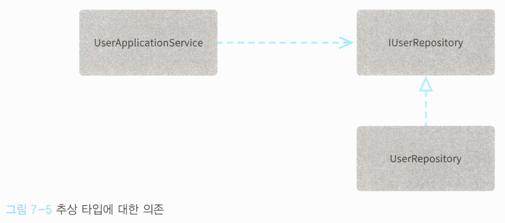
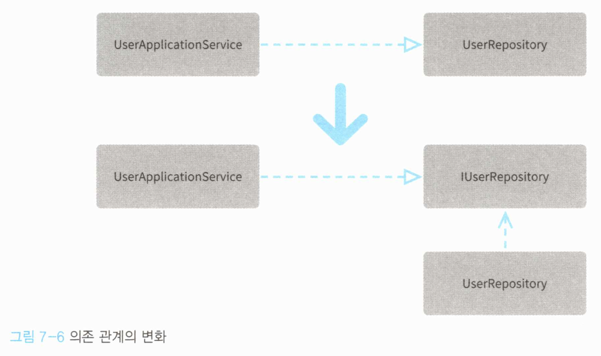
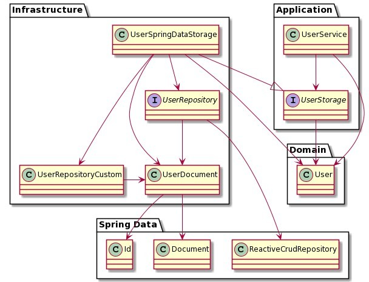

# Chapter 07 - 소프트웨어의 유연성을 위한 의존 관계 제어

## 7.1 특정 기술 요소에 대한 의존의 결과

- 쌓여있는 나무 블록 중 중간 것을 뽑으면 -> 섣불리 하다가는 위의 블록이 모두 무너져 내릴 수 있다.
- 소프트웨어에서 중요한 객체를 수정할 때도 -> 의존 관계를 맺고 있는 여러 객체들이 있기 때문에 잘못 수정하면 문제가 발생할 수 있다.

의존 관계는 객체를 사용하기만 해도 발생하므로 객체 간 의존 관계가 발생하는 것 자체를 막을 수는 없고, 의존 자체를 피하기보다는 이를 잘 제어하는 것이 더 중요하다.


## 7.2 의존이란 무엇인가

- 참조를 통해 발생하는 의존 관계

  - 어떤 객체가 다른 객체를 참조한다.

  - ```c#
    public class ObjectA {
        private ObjectB objectB;
    }
    ```

  - 

- 인터페이스와 그 구현체가 되는 구상 클래스

  - 의존 관계는 참조를 통해서만 발생하는 것은 아니다. 인터페이스와 그 구현체가 되는 구상 클래스 사이에서도 의존 관계가 생긴다.

  - ```c#
    public class UserRepository : IUserRepository {
        public User Find(UserId userId) {
            (...)
        }
    }
    ```

  - 


### 의존 관계의 방향 바꾸기

```c#
public class UserApplicationService  {
    private readonly UserRepository userRepository;
 
    public UserApplicationService(UserRepository userRepository)  {
        this.userRepository = userRepository;
    }
    ...
}
```

- 위 Service는 UserRepository가 사용하는 특정 퍼시스턴스 기술에 의존한다.
  - 소프트웨어가 건강하게 성장하려면 개발/테스트 각각을 위해 언제든 부담없이 코드를 실행할 수 있어야하는데, 특정 DB 기술과 밀접하게 엮여 있으면 어려움이 발생한다.

```c#
public class UserApplicationService  {
    private readonly IUserRepository userRepository; // 구상 클래스 대신 추상 타입을 이용하도록 변경
 
    public UserApplicationService(IUserRepository userRepository)  {
        this.userRepository = userRepository;
    }
    ...
}
```

- Service가 특정 Repository 구현체에 직접 의존하지 않고, Interface를 통해 사용하도록 변경되었기 때문에 특정 구현으로부터 자유로워졌다.



- 이처럼 모듈이 추상 타입에 의존하도록 하면 비즈니스 로직이 특정 구현으로부터 자유로워질 수 있다.
  - 이렇게 추상 타입을 이용해 의존 관계를 제어하는 방법을 `의존 관계 역전 원칙` 이라고 한다.


## 7.3 의존관계 역전 원칙이란 무엇인가

- 의존 관계 역전 원칙 (DIP, Dependency Inversion Principle)의 정의
  1. 추상화 수준이 높은 모듈이 낮은 모듈에 의존해서는 안 되며 두 모듈 모두 추상 타입에 의존해야 한다.
  2. 추상 타입이 구현의 세부 사항에 의존해서는 안 된다. 구현의 세부 사항이 추상 타입에 의존해야 한다.


### 7.3.1 추상 타입에 의존하라

- 추상화 수준이란? 입출력으로부터의 거리
  - 낮다는 것은 → 기계와 가까운 구체적인 처리
  - 높다는 것은 → 사람과 가까운 추상적인 처리
- UserApplicationService(도메인 로직)보다 UserRepository(특정 데이터스토어를 다룸)의 추상화 수준이 더 낮다.
  
  - 하지만 UserApplicationService가 UserRepository에 의존하고 있었기 때문에 위 DIP 정의 1에 위배됨
    - IUserRepository를 도입하며 해소되었다.
- 추상 타입이 구현의 세부 사항에 의존해서는 안 된다. 구현의 세부 사항이 추상 타입에 의존해야 한다.
  - 구현 클래스가 interface에 의존하지 interface가 구현클래스에 의존할 수가 있나?

결과적으로 객체 사이의 의존은 항상 interface를 이용해 느슨한 의존관계를 형성해야한다.





### 7.3.2 주도권을 추상 타입에 둬라

- 추상 타입(interface)이 세부 사항에 의존하면 낮은 추상화 수준의 모듈에서 일어난 변경이 높은 추상화 수준의 모듈까지 영향을 미치게 된다.
  - ex. 데이터스토어 변경 때문에 비즈니스 로직이 변경됨
- 주체가 되는 것은 추상화 수준이 높은 모듈 or 추상 타입이어야 한다.
- 추상화 수준이 낮은 모듈을 인터페이스와 함께 구현하면 좀 더 중요도가 높은 고차원적 개념에 주도권을 넘길 수 있다.


## 7.4 의존 관계 제어하기

테스트에는 테스트용 인메모리 repository, 배포 빌드라면 운영용 repository를 사용하는 것처럼 상황에 따라 객체가 의존하는 구상 클래스를 변경해야 할 수 있다.

```c#
public class UserApplicationService  {
    private readonly IUserRepository userRepository;
 
    public UserApplicationService()  {
        this.userRepository = new InMemoryUserRepository();
    }
}
```

다른 repository를 사용하고 싶을 때 userRepository에 의존하는 class 코드를 일일히 변경해야 한다. (InMemoryUserRepository를 다른 것으로)


### 7.4.1 Service Locator 패턴

ServiceLocator에 의존 해소 대상이 되는 객체를 미리 등록한 뒤, 필요한 곳에서 ServiceLocator를 통해 객체를 받아 사용한다.

대상 객체는 시작 스크립트 등을 이용해 미리 등록된다. → ServiceLocator의 의존 관계 설정은 운영용, 테스트용으로 나눠 일괄 관리하면 편리하다.

```c#
public class UserApplicationService  {
    private readonly IUserRepository userRepository;
 
    public UserApplicationService()  {
        // ServiceLocator를 통해 필요한 인스턴스를 받음
        this.userRepository = ServiceLocator.Resolve<IUserRepository>();
    }
}
```

- 장점
  - 핵심 로직을 수정하지 않아도 repository를 교체할 수 있다.
  - ServiceLocator에 객체를 생성, 등록하는 한 군데만 고치면 repository에 의존하는 모든 객체에 대해 변경이 적용된다.
  - 처음부터 커다란 설정을 만들 필요가 없어 최초 도입이 쉽다.
- 단점
  - 의존 관계를 외부에서 보기 어렵다
    - 위 코드에서, UserApplicationService를 사용하기 위해서는 ServiceLocator에 미리 IUserRepository가 등록되어야 한다는 것을 알 수 없다.
  - 테스트 유지가 어렵다
    - 테스트 환경에서 ServiceLocator에 IUserRepository를 등록하지 않았거나 UserApplicationService에 ServiceLocator로부터 받아와야 하는 객체가 추가된 경우
      - 테스트가 깨지긴 하겠지만, 컴파일 에러 등으로 강제하는 것은 아니기 때문에 테스트를 실행할 때까지 깨진 것을 알 수 없다.


### 7.4.2 IoC Container 패턴

- 생성자를 통해서 외부에서 필요한 의존성을 주입받아 사용하면 어떨까?

- ```c#
  var userRepository = new InMemoryUserRepository();
  var userApplicationService = new UserApplicationService(userRepository); // 생성자를 통한 주입
  ```

- 생성자 메서드에 인자가 추가될 때, 테스트 코드에서 컴파일 에러가 날 것이며, 강제로 수정을 해야만 한다 -> 테스트가 잘 유지됨

- 그렇다면 userRepository가 변경될 때 userApplicationService의 모든 client를 일일히 수정해 주어야 하나?

  - IoC container 패턴으로 해결 가능
    - IoC = Inversion of Control
    - DI (=dependency injection, 의존 관계 주입)을 이용해서 의존하는 모듈을 외부에서 주입한다.

- ```c#
  // IoC Container
  var serviceCollection = new ServiceCollection();
  // 의존 관계 해소를 위한 설정 등록
  serviceCollection.AddTransient<IUserRepository, InMemoryUserRepository>();
  serviceCollection.AddTransient<UserApplicationService>();
   
  // IoC Container를 통해 필요한 인스턴스를 받아옴
  var provider = serviceCollection.BuildServiceProvider();
  var userApplicationService = provider.GetService<UserApplicationService>();
  ```

- Service locator 패턴이 "Service locator가 객체를 등록해주고 UserApplicationService가 그것을 직접 가져오는 것" 이었다면

  - IoC container 패턴은 "IoC container가 객체의 등록, UserApplicationService에의 제공까지 전부 담당" 한다

- IoC container의 설정도 Service locator와 마찬가지로 시작 스크립트 등을 이용한다.


## 7.5 정리

의존 관계는 소프트웨어를 만들 때 자연스럽게(항상) 발생한다. 그러나 잘못 다루면 손대기 어려울 정도로 유연성을 잃은 소프트웨어가 된다.

소프트웨어는 원래 유연해야 한다. 소용자가 처한 환경에 변화에 맞춰 변화하며 지속적으로 사용자에게 도움을 줄 수 있어야 한다. 그렇기 때문에 "소프트"웨어인 것이다. (?)

의존 관계의 발생을 막을 수는 없어도 그 방향성을 개발자가 절대적으로 제어 가능하니 두려워하지 말라.


## + 7.6 실전

Spring Data를 사용할 때는 어떻게 적용할 수 있을까?

