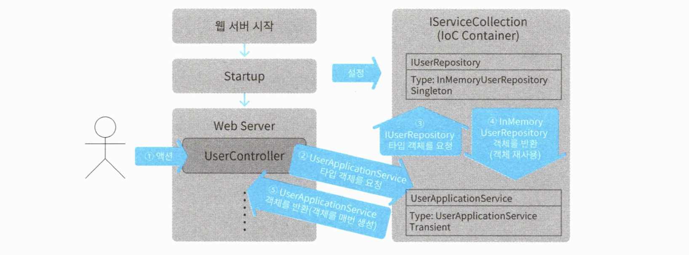
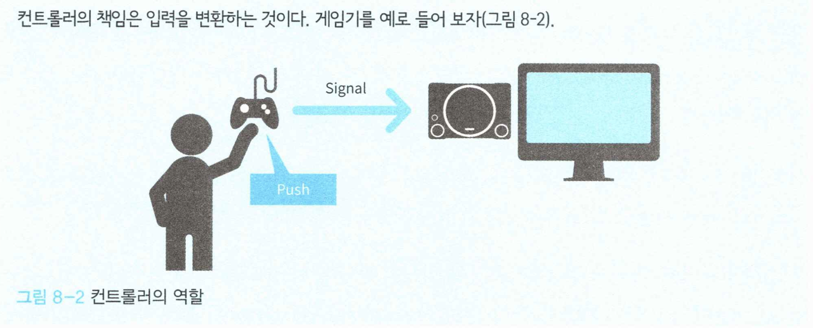

# 08 소프트웨어 시스템 구성하기

이전까지 만들어진 애플리케이션을 직접 사용자가 사용하려면 사용자 인터페이스가 필요하다. 지금까지 만들어온 애플리케이션은 특정 사용자 인터페이스에 의존하지 않는다. 이 장이 끝나면 문자던 그래픽이던 원하는 인터페이스를 추가할 수 있다


## 8.1 소프트웨어에 꼭 필요한 사용자 인터페이스

사용자 인터페이스는 사용자가 애플리케이션을 이용할 수 있게 해준다. 이 책에서는 웹 GUI를 사용하는 웹 애플리케이션을 주 예제로 삼고 있지만, 그렇다고 도메인 주도 설계가 웹 애플리케이션에만 한정된 것이라는 뜻은 아니다. 

사용자가 문자열이나 아이콘 중에 어떤 것을 사용해 지시를 내리든, `사용자 등록`이라는 비지니스 로직에는 변함이 없기 때문이다. 사용자 인터페이스로 무엇을 선택하든 도메인 주도 설계의 장점을 체감하는 데는 문제가 없다는 것을 확인해보자.


## 8.2 명령행 인터페이스 추가하기

도메인 주도 설계가 사용자 인터페이스에 종속적이지 않다는 것을 보기 위해 먼저 CLI 인터페이스를 추가해보자. 먼저 볼 것은 의존 관계를 등록하는 코드다. 의존관계 제어를 위해 IoC Container를 적용했다. 여기서는 C#의 IoC Container인 ServiceCollection를 사용한다.

***의존 관계 등록하기***

```c#
class Program
{
  private static ServiceProvider serviceProvider;

  public static void Main(string[] args)
  {
    Startup();
    
    (...생략...)
  }

  private static void Startup()
  {
    // C#의 IoC Container
    var serviceCollection = new ServiceCollection();
    
    // 의존 관계 등록
    // IUserRepository가 처음 필요해지면 InMemoryUserRepository를 생성해 전달함 (생성된 인스턴스는 이후로도 다시 씀)
    serviceCollection.AddSingleton<IUserRepository, InMemoryUserRepository>();
    
    // UserService가 필요해지면 매번 인스턴스를 생성해 전달함
    serviceCollection.AddTransient<UserService>();
    
    // UserApplicationService가 필요해지면 매번 인스턴스를 생성해 전달함
    serviceCollection.AddTransient<UserApplicationService>();
    
    // 의존 관계 해소를 위한 프로바이더 생성
    // 프로그램은 serviceProvider에 의존 관계 해소를 요청함
    serviceProvider = serviceCollection.BuildServiceProvider();
  }
}
```

`IUserRepository`의 의존 관계 해소에 쓰이는 `InMemoryUserRepository`는 `AddSingleton` 메서드를 통해 싱글턴으로 등록된다. 

싱글턴으로 등록하지 않았다면 `IoC Container`가 `lUserRepository`의 의존 관계 해소를 요청받을 때마다 `InMemoryUserRepository`의 인스턴스를 새로 만든다. `InMemoryUserRepository`는 메모리상에서 동작하는 객체이므로 인스턴스마다 데이터를 따로 저장한다. 따라서 인스턴스를 재사용하지 않으면 다른 인스턴스에 저장했던 데이터가 유실된다.

> ⚠️ 싱글턴 패턴에 대한 오해
>
> 싱글턴에 대한 많은 오해가 있다. 그 중 하나는 싱글턴을 static의 대체재로 인식하는 것이다. 싱글턴의 이유는 인스턴스 개수를 하나로 제한하면서도 일반적인 객체처럼 다루기 위해서다. static에서는 누릴 수 없는 다형성 같은 객체 지향 프로그래밍의 장점을 그대로 활용하는 것이 목적이다.

`UserApplicationService`는 `AddTransient`를 통해 등록한다. `AddTransient`는 등록된 타입의 객체를 요청 받으면 매번 새로운 인스턴스를 생성해 제공한다. 

지금 보고 있는 스크립트의 내용대로라면 `AddSingleton`으로 등록해도 무방하지만, 인스턴스의 생애주기는 가능한 한 짧게 가져가는 것이 관리상 유리하다. 성능에 영향을 끼치지 않는 한 인스턴스를 매번 새로 생성해도 문제는없다.


### 8.2.1 Main 구현하기

의존 관계 설정을 마쳤으니 진입점 역할을 하는 Main을 구현해보자.

***진입점 역할을 하는 Main 구현하기***

```c#
class Program
{
  private static ServiceProvider serviceProvider;

  public static void Main(string[] args)
  {
    // 시작 스크립트 - 의존관계 설정
    Startup();
    
    while (true)
    {
      Console.WriteLine("Input user name");
      Console.Write(">");
      var input = Console.ReadLine();
      
      // 의존성 받기
      var userApplicationService = serviceProvider.GetService<UserApplicationService>();
      var command = new UserRegisterCommand(input);
      userApplicationService.Register(command);

      Console.WriteLine("-------------------------");
      Console.WriteLine("user created:");
      Console.WriteLine("-------------------------");
      Console.WriteLine("user name:");
      Console.WriteLine("- " + input);
      Console.WriteLine("-------------------------");
      Console.WriteLine("continue? (y/n)");
      Console.Write(">");
      var yesOrNo = Console.ReadLine();
      if (yesOrNo == "n")
      {
        break;
      }
    }
  }

  (...생략...)
}
```

코드를 보면 `IoC Container`로부터 `UserApplicationService` 객체를 제공받아 사용자 등록 처리를 호출했다. 인스턴스를 직접 생성하는 대신 `IoC Container`를 통해 제공받으므로 시작 스크립트 등에 의존 관계 설정을 모아둘 수 있다.

운영용 관계형 데이터 베이스에 접속하기 위한 리포지토리를 사용하려면 시작 스크립트를 다음과 같이 수정하자.

***리포지토리 교체하기***

```c#
class Program
{
  (...생략...)
  
  private static void Startup()
  {
    var serviceCollection = new ServiceCollection();
    // 리포지토리를 UserRepository로 교체함
    serviceCollection.AddSingleton<IUserRepository, UserRepository>();
    serviceCollection.AddTransient<UserService>();    
    serviceCollection.AddTransient<UserApplicationService>();

    serviceProvider = serviceCollection.BuildServiceProvider();
  }
}
```

이런 방법으로 `IoC Container`를 활용해 Main 메서드에 손을 대지 않고도 데이터스토어를 변경할 수 있다.


## 8.3 MVC 프레임워크 적용하기

웹 애플리케이션 개발에는 일반적으로 웹 프레임워크가 사용된다. 여기서는 `ASP.net Core MVC`를 기준으로 한다. 웹 GUI 역시 CLI 구현 때와 마찬가지로 시작 스크립트에 의존 관계를 설정한 후, 사용자의 액션에 따라 필요한 인스턴스를 `IoC Container`에 요청합니다. 그 다음 실제 사용자의 조작이 일어났을 때 처리가 실행되는 부분을 확인한다. 

처리 흐름은 다음과 같다.

***MVC 프레임워크와 IoC Container의 연동 과정***




### 8.3.1 의존 관계 설정하기

의존 관계 설정은 이전처럼 시작 스크립트에 작성한다. `ASP.net Core MVC`는 시작 스크립트 기능을 가진 Startup 클래스를 제공한다. 여기에 서버 시작 시 실행할 처리를 정의할 수 있다.

***ASP.net Core MVC에 제공되는 Startup 클래스***

```c#
public class Startup
{
  public Startup(IConfiguration configuration)
  {
    Configuration = configuration;
  }

  public IConfiguration Configuration { get; }

  // This method gets called by the runtime. Use this method to add services to the container.
  public void ConfigureServices(IServiceCollection services)
  {
    var factory = new DependencySetupFactory();
    var setup = factory.CreateSetup(Configuration);
    setup.Run(services);

    services.AddControllers();
  }

  (...생략...)
}
```


Startup 클래스의 ConfigureServices 메서드에서 IoC Container를 이용해 의존 관계를 등록하자.

***MVC 프레임워크의 시작 스크립트에 의존 관계 해서 설정하기***

```c#
public class Startup
{
  (...생략...)

  public void ConfigureServices(IServiceCollection services)
  {
		services.AddControllersWithViews();
    
    services.AddSpaStaticFiles(configuration) =>
    {
      configuration.RootPath = "ClientApp/build";
    });
    
    // 리포지토리나 애플리케이션 서비스에 대한 의존 관계 설정
    services.AddSingleton<IUserRepository, InMemoryUserRepository>();
    services.AddTransient<UserService>();
    services.AddTransient<UserApplicationService>();
  }
}
```


시스템이 커질수록 리포지토리 수가 많아질 것이다. 위와 같이 설정 자체에는 문제가 없지만, 운영용 데이터베이스로 교체할 때 설정 스크립트를 수정해야 한다.  수 많은 리포지토리 설정을 일일이 고칠 수 없으니 설정 스크립트를 디버그용과 운영용으로 나눠 따로 관리하자.

***테스트용 설정 스크립트***

```c#
public class InMemoryModuleDependencySetup : IDependencySetup
{
  public void Run(IServiceCollection services)
  {
    SetupRepositories(services);
    SetupApplicationServices(services);
    SetupDomainServices(services);
  }

  private void SetupRepositories(IServiceCollection services)
  {
    services.AddSingleton<IUserRepository, InMemoryUserRepository>();
  }

  private void SetupApplicationServices(IServiceCollection
                                        services)
  {
    services.AddTransient<UserApplicationService>();
  }

  private void SetupDomainServices(IServiceCollection services)
  {
    services.AddTransient<UserService>();
  }
}
```

***운영용 설정 스크립트***

```c#
public class SqlConnectionDependencySetup : IDependencySetup
{
  private readonly IConfiguration configuration;

  public SqlConnectionDependencySetup(IConfiguration configuration)
  {
    this.configuration = configuration;
  }

  public void Run(IServiceCollection services)
  {
    SetupRepositories(services);
    SetupApplicationServices(services);
    SetupDomainServices(services);
  }

  private void SetupRepositories(IServiceCollection services)
  {
    services.AddTransient<IUserRepository, SqlUserRepository>();
  }

  private void SetupApplicationServices(IServiceCollection services)
  {
    services.AddTransient<UserApplicationService>();
  }

  private void SetupDomainServices(IServiceCollection services)
  {
    services.AddTransient<UserService>();
  }
}
```


위의 스크립트들은 프로젝트 구성 파일을 이용해 쉽게 교체할 수 있다. `ASP.net Core`를 사용할 경우 `appsetting.json` 파일을 통해 설정할 수 있다.

***프로젝트 구성 파일에서 설정 스크립트 선택하기***

```json
{
  "Dependency": {
  	"SetupName": "InMemoryModuleDependencySetup" 
  }
}
```


이 설정 스크립트를 시작 스크립트에서 읽으면 의존 관계 설정 내용이 교체된다.

***설정 내용에 따라 설정 스크립트를 선택하는 모듈***

```c#
class DependencySetupFactory
{
  public IDependencySetup CreateSetup(IConfiguration configuration)
  {
    // appsetting.json 환경설정 파일 가져오기
    var setupName = configuration["Dependency:SetupName"];
    
    // 적절한 DependencySetup 반환
    switch (setupName)
    {
      case nameof(InMemoryModuleDependencySetup):
        return new InMemoryModuleDependencySetup();

      case nameof(SqlConnectionDependencySetup):
        return new SqlConnectionDependencySetup(configuration);

      default:
        throw new NotSupportedException(setupName + " is not registered.");
    }
  }
}
```

***시작 스크립트에서 스크립트 선택 모듈 사용***

```c#
public class Startup
{
  public IConfiguration Configuration { get; }

  public void ConfigureServices(IServiceCollection services)
  {
    // 의존 관계 설정 스크립트를 받아온 다음 실행함 
    var factory = new DependencySetupFactory();
    var setup = factory.CreateSetup(Configuration); 
    setup.Run(services);
    
    services.AddControllersWithViews();
    
    services.AddSpaStaticFiles(configuration => 
		{
      configuration.RootPath="ClientApp/build"; 
    });
  }
  
  (...생략...)
}
```


### 8.3.2 컨트롤러 구현하기

의존 관계 설정 코드를 모두 봤으니 컨트롤러의 구현을 살펴보자. 사용자 등록을 위해 데이터를 받아 사용자를 등록하는 액션부터 살펴보자.

대부분의 **MVC 프레임워크는 `IoC Container`와 연동되므로 생성자 메소드에서 등록된 객체를 받을 수 있다.** 아래와 같이 받고자하는 서비스를 생성자 메서드로부터 인스턴스를 받고 액션에서 서비스를 호출하게 하면 된다.

***사용자 등록을 위한 액션***

```c#
[Route("api/[controller]")]
public class UserController : Controller
{
  private readonly UserApplicationService userApplicationService;

  // IoC Container와의 연동을 통해 의존 관계를 해소한다
  public UserController(UserApplicationService userApplicationService)
  {
    this.userApplicationService = userApplicationService;
  }

  (...생략...)
  
  [HttpPost]
  public void Post([FromBody] UserPostRequestModel request)
  {
    var command = new UserRegisterCommand(request.UserName);
    userApplicationService.Register(command);
  }
}
```

> ⚠️ ***프론트엔드 입력 데이터와 서비스의 커맨드 객체***
>
> Post 액션에 인자인 `UserPostRequestModel`는 뷰로부터 전달되는 데이터가 바인딩된 객체다. 이 객체는 서비스가 받는 `UserRegisterCommand`와 유사하므로 재사용하고 싶어지겠지만, 프론트엔드에서 들어오는 데이터를 전달하는 객체와 서비스의 행동을 실행하기 위한 커맨드 객체는 엄연히 용도가 다르므로 재사용하지 않도록 한다.


그 외 다른 액션은 다음과 같다.

***컨트롤러에 구현된 그 외 액션***

```c#
 [Route("api/[controller]")]
 public class UserController : Controller
 {
   private readonly UserApplicationService userApplicationService;
 
   public UserController(UserApplicationService userApplicationService)
   {
     this.userApplicationService = userApplicationService;
   }
 
   [HttpGet]
   public UserIndexResponseModel Index()
   {
     var result = userApplicationService.GetAll();
     var users = result.Users.Select(x => new UserResponseModel(x.Id, x.Name)).ToList();
     return new UserIndexResponseModel(users);
   }
 
   [HttpGet("{id}")]
   public UserGetResponseModel Get(string id)
   {
     var command = new UserGetCommand(id);
     var result = userApplicationService.Get(command);
     var userModel = new UserResponseModel(result.User);
     return new UserGetResponseModel(userModel);
   }
 
 	(...생략...)
 
   [HttpPut("{id}")]
   public void Put(string id, [FromBody] UserPutRequestModel request)
   {
     var command = new UserUpdateCommand(id, request.Name);
     userApplicationService.Update(command);
   }
 
   [HttpDelete("{id}")]
   public void Delete(string id)
   {
     var command = new UserDeleteCommand(id);
     userApplicationService.Delete(command);
   }
 }
```

모든 액션에서 컨트롤러는 **프론트엔드의 데이터를 받아 비지니스 로직이 필요로하는 입력 데이터로 변환하는 작업에만 집중**하고 있다. 애플리케이션 서비스에 비지니스 로직을 맡긴다면 컨트롤러 코드는 단순해진다.

> ***컨트롤러의 책임***
>
> 
>
> 게임 컨트롤러는 버튼이 눌렸음이라는 정보를 받아 그대로 게임기에 보내는 것이 아니라 버튼이 눌렸다는 사실을 게임기가 이해할 수 있는 전기신호로 변환해 보낸다. 
>
> MVC 패턴의 컨트롤러도 마찬가지다. 메시지 변환 그 이상의 일을 맡은 컨트롤러가 있다면 도메인의 중요한 지식 혹은 로직이 컨트롤러로 유출됐을 가능성을 의심해야한다.


## 8.4 단위 테스트 작성하기

소프트웨어가 의도대로 동작하는지 테스트를 위해 단위 테스트를 작성하자.


### 8.4.1 사용자 등록 처리를 위한 단위 테스트

단위 테스트를 실행할 때마다 테스트 데이터를 준비하는 방법은 현실적이지 않다. 단위 테스트에서는 일반적으로 실제 데이터스토어에 접속하지 않는다. 이를 대신하는 것이 테스트용 리포지토리다.

우선 사용자 등록 처리가 정상적으로 완료되는지 확인하는 테스트를 작성하자.

***사용자 등록 처리의 정상 완료 여부를 검증하는 단위 테스트***

```c#
[TestClass]
public class UserRegisterTest
{
  [TestMethod]
  public void TestSuccessMinUserName()
  {
    var userRepository = new InMemoryUserRepository();
    var userService = new UserService(userRepository);
    var userApplicationService = new UserApplicationService(userRepository, userService);

    // 사용자명의 최소 길이(3글자)를 만족하는 사용자 등록이 정상적으로 완료되는지 확인
    var userName = "123";
    var minUserNameInputData = new UserRegisterCommand(userName);
    userApplicationService.Register(minUserNameInputData);

    // 사용자 정보가 잘 저장됐는지 확인
    var createdUserName = new UserName(userName);
    var createdUser = userRepository.Find(createdUserName);
    Assert.IsNotNull(createdUser);
  }

  [TestMethod]
  public void TestSuccessMaxUserName()
  {
    var userRepository = new InMemoryUserRepository();
    var userService = new UserService(userRepository);
    var userApplicationService = new UserApplicationService(userRepository, userService);

    // 사용자명의 최장 길이(20글자)를 만족하는 사용자 등록이 정상적으로 완료되는지 확인
    var userName = "12345678901234567890";
    var maxUserNameInputData = new UserRegisterCommand(userName);
    userApplicationService.Register(maxUserNameInputData);

    // 사용자 정보가 잘 저장됐는지 확인
    var createdUserName = new UserName(userName);
    var maxUserNameUser = userRepository.Find(createdUserName);
    Assert.IsNotNull(maxUserNameUser);
  }
}
```

사용자 등록 처리가 정상적으로 완료됐는지 검증을 위해 사용자가 잘 저장됐는지와 제한 조건의 경곗값에 대한 검증도 함께 실시한다. 생성된 사용자의 저장 여부를 확인할 수 있게 인메모리 리포지토리를 대상으로 처리를 실행하며, 처리가 완료된 다음 리포지토리에 해당 사용자에 대한 정보를 요청한다.

테스트 대상에 따라 리포지토리에 정보 요청 메서드가 없는 경우도 있다. 이런 경우 리포지토리에 정보를 요청하는 대신 리포지토리가 데이터를 보관하는 인스턴스 변수를 외부로 공개하면 된다.

***테스트 결과 확인을 위해 테스트용 리포지토리의 내부 데이터를 외부에 공개하기***

```c#
public class InMemoryUserRepository : lUserRepository 
{
	// 데이터가 담긴 딕셔너리를 외부로 공개해 직접 확인을 허용
  publicDictionary<Userld,User> Store { get; } = newDictionary<Userld,User>();
  
	(...생략...) 
}
```


이 객체를 이용하는 테스트 코드는 리포지토리에 사용자 정보를 요청하는 대신 속성에 직접 접근한다.

***사용자 정보 직접 확인하기***

```c#
[TestClass]
public class UserRegisterTest
{
  [TestMethod]
  public void TestSuccessMinUserName()
  {
    var userRepository = new InMemoryUserRepository();
    var userService = new UserService(userRepository);
    var userApplicationService = new UserApplicationService(userRepository, userService);

    // 사용자명의 최소 길이(3글자)를 만족하는 사용자 등록이 정상적으로 완료되는지 확인
    var userName = "123";
    var minUserNameInputData = new UserRegisterCommand(userName);
    userApplicationService.Register(minUserNameInputData);

    // 사용자 정보가 잘 저장됐는지 확인
    var createdUser = userRepository.Store.Values
      .FirstOrDefault(user => user.Name.Value == userName);
    Assert.IsNotNull(createdUser);
  }
}
```


정상 케이스에 대한 테스트 뒤에는 이상 케이스 테스트를 진행한다.

- 사용자명의 길이가 3자 미만 20자 초과인 경우
- 사용자명이 이미 등록된 것일 경우

***사용자명 길이의 이상 케이스에 대한 에러 발생 테스트***

```c#
[TestClass]
public class UserRegisterTest
{
  (...생략...)
  
  [TestMethod]
  public void TestInvalidUserNameLengthMin()
  {
    var userRepository = new InMemoryUserRepository();
    var userService = new UserService(userRepository);
    var userApplicationService = new UserApplicationService(userRepository, userService);

    bool exceptionOccured = false;
    try
    {
      var command = new UserRegisterCommand("12");
      userApplicationService.Register(command);
    }
    catch
    {
      exceptionOccured = true;
    }

    Assert.IsTrue(exceptionOccured);
  }

  [TestMethod]
  public void TestInvalidUserNameLengthMax()
  {
    var userRepository = new InMemoryUserRepository();
    var userService = new UserService(userRepository);
    var userApplicationService = new UserApplicationService(userRepository, userService);

    bool exceptionOccured = false;
    try
    {
      var command = new UserRegisterCommand("123456789012345678901");
      userApplicationService.Register(command);
    }
    catch
    {
      exceptionOccured = true;
    }

    Assert.IsTrue(exceptionOccured);
  }
}
```

***사용자명이 중복된 이상 케이스에 대한 에러 발생 테스트***

```c#
[TestClass]
public class UserRegisterTest
{
  (...생략...)

  [TestMethod]
  public void TestAlreadyExists()
  {
    var userRepository = new InMemoryUserRepository();
    var userService = new UserService(userRepository);
    var userApplicationService = new UserApplicationService(userRepository, userService);

    var userName = "test-user";
    // 사용자명 'test-user'인 유저 생성
    userRepository.Save(new User(
      new UserId("test-id"),
      new UserName(userName)
    ));

    bool exceptionOccured = false;
    try
    {
	    // 사용자명 'test-user'인 유저 한번 더 생성
      var command = new UserRegisterCommand(userName);
      userApplicationService.Register(command);
    }
    catch
    {
      exceptionOccured = true;
    }

    Assert.IsTrue(exceptionOccured);
  }
}
```

단위테스트는 어떤 입력이 들어와야하는지, 그리고 그 입력에 대한 결과가 어떠해야하는지를 기술한다. 문서화가 전혀 안 되어있는 프로젝트라면 단위 테스트가 로직의 설계를 보여주는 마지막 단서가 되기도한다.


## 8.5 정리

지금까지 기존에 배운 패턴을 정리하고 애플리케이션에 사용자 인터페이스(CLI, 웹GUI)를 추가해 독립적으로 기능하는 소프트웨어를 만드는 방법을 살펴봤다.

사용자 인터페이스를 실제로 교체하는 경우는 드무나, 교환 가능한 상태라는 것은 애플리케이션이 독립적으로 기능할 수 있으며 인터페이스와 무관하게 단위 테스트를 수행할 수 있는 상태라는 의미이다.

소프트웨어가 자신에게 요구되는 변화에 부응하려면 리팩토링이 필요하고 리팩토링이 기존 기능을 망가뜨리지 않음을 확인하려면 단위테스트가 갖춰져있어야한다.

도메인의 변화를 도메인 객체에 잘 반영하고 시스템이 도메인과 항상 동기화되기를 원한다면 단위 테스트를 잘 갖춰야 한다.