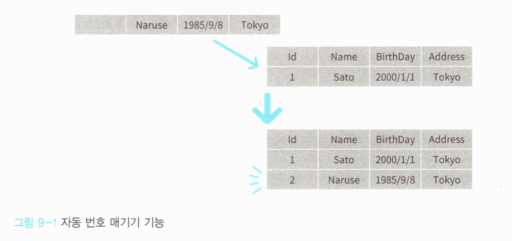

# 13 복잡한 조건을 나타내기 위한 명세

객체를 평가하기 위해 복잡한 절차가 필요한 경우가 있는데, 이러한 절차를 해당 객체의 메서드로 정의했을 때 취지가 잘 드러나지 않는 경우가 있다. 이럴 때 평가 절차를 별도의 명세라는 객체로 분리할 수 있다. 


## 13.1 명세란?

객체를 평가하는 절차가 단순하다면 평가해야하는 해당 객체의 메서드에 포함해도 되겠지만, 복잡한 평가 절차가 필요한 경우 대상 객체에 메서드로 두는게 자연스럽지 못한 경우가 있다.

이런 절차는 애플리케이션 서비스에 구현되기 마련인데, 이 평가 조건은 도메인 규칙 중에서도 중요도가 높으므로 서비스에 구현하기에 걸맞은 내용이 아니다. 이를 위해 쓰는 것이 명세인데, 어떤 객체가 그 객체의 평가 기준을 만족하는지 판정하기 위한 객체다. 


### 객체의 복잡한 평가 절차

***특정한 조건 충족 여부를 평가하는 메서드***

```c#
public class Circle
{
  private List<UserId> members;
  
  (...생략...)
  
  public bool IsFull()
  
  {
  	return CountMembers() >= 30;
	} 
}
```

어떤 객체가 특정 조건을 만족하는지 간단한 조건이라면 위와 같이 해당 객체의 메서드로 정의한다. 이 정도의 조건이라면 큰 문제가 되지 않는다. 

그럼 더 복잡해진다면? 다음과 같이 규칙이 변경된다고 가정해보자.

1. 사용자 중에는 프리미엄 사용자라는 유형이 존재한다.
2. 서클의 최대 인원은 서클장과 소속 사용자를 포함해 30명이다.
3. 프리미엄 사용자가 10명 이상 소속된 서클은 최대 인원이 50명으로 늘어난다.

서클 객체는 자신에게 소속된 사용자 목록을 저장하고 있지만, `UserId`의 컬렉션을 포함하는 것을 넘어 프리미엄 여부를 알기 위해 사용자 리포지토리를 통해 확인해야한다. 그러나 Circle 객체는 사용자 리포지토리를 가지고 있지 않다. 그러므로 이 리포지토리를 가진 애플리케이션에서 처리해야한다.


***서클의 최대 인원이 조건에 따라 변화하는 경우***

```c#
public class CircleApplicationService 
{
  private readonly ICircieRepository circleRepository; 
  private readonly lUserRepository userRepository;

  (...생략...)
  
  public void Join(CircleJoinCommand command)
  {
    var circleld = new Circleld(command.Circleld); 
    var circle = circleRepository.Find(circleld);
    
    var users = userRepository.Find(circle.Members);
    // 서클에 소속된 프리미엄 사용자의 수에 따라 최대 인원이 결정됨 
    var premiumUserNumber = users.Count(user => user.IsPremium); 
    var circleUpperLimit = premiumUserNumber < 10 ? 30 : 50;
	  if (circle.CountMembers() >= circleUpperLimit)
  	{
  		throw new CircleFullException(circleld); 
  	}
    
	  (...생략...)
	}
}
```

서클의 최대 인원 규칙은 도메인 규칙이다. **서비스는 도메인 규칙에 근거한 로직을 포함하면 안된다.** 이리저리 도메인 주요 규칙이 중복되기 때문이다. 도메인 규칙은 도메인 객체에 정의해야한다. 

`Circle` 클래스의 `isFull` 메서드에 정의할 방법을 찾아보자. 식별자만으로 사용자 정보를 얻으려면 `isFull` 메서드가 리포지토리를 전달받아야 한다.


***리포지토리를 갖게 된 엔티티***

```c#
public class Circle
{
  // 소속된 사용자 중 프리미엄 사용자의 수를 확인해야 하는데
  // 가진 정보는 사용자의 식별자 뿐
  private List<UserId> members;

  (...생략...)

  // 엔티티가 사용자 리포지토리를 갖는다?
  public bool IsFull(IUserRepository userRepository)
  {
    var users = userRepository.Find(Members);
    var premiumUserNumber = users.Count(user => user.IsPremium);
    var circleUpperLimit = premiumUserNumber < 10 ? 30 : 50;
    return CountMembers() >= circleUpperLimit;
  }
}
```

이 방법은 좋지 않다. 리포지토리는 도메인 설계에 포함된다는 점에서 도메인 객체라고 할 수 있지만, 도메인 개념에서 유래한 객체는 아니다. `Circle` 클래스가 사용자 리포지토리를 갖게 되면 도메인 모델을 나타내는데 전념하지 못하게 된다. 엔티티나 값 객체가 도메인 모델을 나타내는 데 전념할 수 있으려면 리포지토리를 다루는 것은 가능한 피해야 한다.

> ⚠️ **의도가 잘 드러나지 않는 객체**
>
> 객체를 평가하는 코드를 곧이 곧대로 해당 객체에 구현하면 객체의 원래 의도가 잘 드러나지 않는다. 다시 말해 이 객체가 무엇이며 어떤 역할을 하는지 잘 알 수 없다. 다음과 같은 코드는 아래에서 다룰명세 같은 외부 객체로 분리하는 선택지도 있다.
>
> ```c#
> public class Circle 
> {
>   public bool IsFull();
>   public bool IsAnniversary(DateTime today);
>   public bool IsRecruiting();
>   public bool IsLocked();
>   public bool IsPrivate();
>   public bool IsJoin(User user);
> }
> ```


### 이 문제의 해결책 - 명세

명세를 이용하면 위와 같은 문제를 해결할 수 있다. 평가 코드를 다음과 같이 명세로 분리해보자.

***서클의 최대 인원에 여유가 있는지 확인하는 명세***

```c#
public class CircleFullSpecification
{
  private readonly IUserRepository userRepository;

  public CircleFullSpecification(IUserRepository userRepository)
  {
    this.userRepository = userRepository;
  }

  public bool IsSatisfiedBy(Circle circle)
  {
    var users = userRepository.Find(circle.Members);
    var premiumUserNumber = users.Count(user => user.IsPremium);
    var circleUpperLimit = premiumUserNumber < 10 ? 30 : 50;
    return circle.CountMembers() >= circleUpperLimit;
  }
}
```

명세는 객체가 조건을 만족하는지 확인하는 역할만 수행한다. 평가 대상 객체가 복잡한 평가 절차 코드에 파묻히는 일 없이 원래 의도를 드러내도록 돕는다.


***명세를 이용한 예***

```c#
public class CircleApplicationService
{
  private readonly ICircleRepository circleRepository;
  private readonly IUserRepository userRepository;
  
  (...생략...)


  public void Join(CircleJoinCommand command)
  {
    var circleId = new CircleId(command.CircleId);
    var circle = circleRepository.Find(circleId);

    var circleFullSpecification = new CircleFullSpecification(userRepository);
    if (circleFullSpecification.IsSatisfiedBy(circle))
    {
      throw new CircleFullException(circleId);
    }

    (...생략...)
=======
# 9. 복잡한 객체 생성을 맡길 수 있는 '팩토리 패턴'

## 9.1 팩토리의 목적

객체 지향 프로그래밍에 쓰이는 클래스는 도구 그 자체다. 메서드의 사용 방법만 알면 클래스 내부 구조를 몰라도 누구든 사용할 수 있다.

그러나 도구는 편리함만큼이나 복잡한 구조를 갖는다.

복잡한 객체는 객체를 생성하는 처리도 그만큼 복잡하다. 복잡한 객체를 생성하기 위한 복잡한 처리는 도메인 모델을 나타낸다는 객체의 애초 취지를 불분명하게 만든다. 그렇다고 클라이언트에만 맡기는 것도 좋은 방법이 아니다. 객체 생성 과정 자체는 도메인에 큰 의미가 없을지 몰라도, 도메인을 나타내기 위한 계층의 책임임에는 변함이 없기 때문이다.


여기서 바로 객체 생성 과정을 객체로 정의할 필요가 생긴다. 이렇게 객체 생성을 책임지는 객체를 마치 도구를 만드는 공장과도 같다고 해서 '팩토리'라고 부른다. **팩토리는 객체 생성 과정과 관련 지식이 정리된 객체**다.


## 9.2 번호 매기기를 구현한 팩토리의 구현 예

지금까지는 User 클래스의 인스턴스를 생성할 때 객체의 식별자로 GUID를 사용했다.


```c#
public class User
{
  private readonly UserId id; 
  private UserName name;
  
  // 사용자를 최초 생성할 때 실행되는 생성자 메서드
  public User(UserName name)
  {
    if (name == null) throw new ArgumentNullException(nameof(name));
    // 식별자로 GUID를 사용한다
    Id = new UserId(Guid.NewGuid().ToString()); 
    this.name = name;
  }
  
  // 사용자 객체를 복원할 때 실행되는 생성자 메서드 
  public User(UserId id, UserName name)
  {
    if (id == null) throw new ArgumentNullException(nameof(id));
    if (name == null) throw new ArgumentNullException(nameof(name));
    this.id = id;
    this.name = name; 
  }
  (...생략...) 
}
```


User 클래스는 생성자 메서드를 2개 갖추고 있다. UserId 객체를 인자로 받는 생성자 메서드는 사용자 객체를 복원하기 위한 용도이며, 나머지 다른 생성자 메서드는 사용자 객체를 최초 생성할 때 사용한다. 

사용자 객체를 최초 생성할 때 함께 생성되는 GUID는 유일한 식별자로 사용할 수 있는 무작위 문자열이므로, 항상 유일 식별자임이 보장된다.


그러나 시스템에 따라 식별자가 매겨지는 과정을 통제해야 하는 경우가 있다. 이렇게 번호를 매기는 처리는 어떻게 구현해야 할까?


전통적인 방법은 시퀀스나 테이블을 이용하는 방법이 있다. 

시퀀스를 이용해 번호를 매기도록 수정해보자

```c#
public class User 
{
  private readonly UserId id; 
  private UserName name;
  
  public User(UserName name) 
  {
    string seqId;
    // 데이터베이스 접속 설정에서 커넥션을 생성 
    var connectionString = ConfigurationManager.ConnectionStrings["DefaultConnection"].ConnectionString; 
    using (var connection = new SqlConnection(connectionString))
    using (var command = connection.CreateCommand())
    {
      connection.Open();
      // 번호 매기기용 테이블을 이용해 번호를 매김 
      command.CommandText = "SELECT seq = (NEXT VALUE FOR UserSeq)";
      
      using (var reader = command.ExecuteReader())
      {
      	if (reader.Read())
        {
          var rawSeqId = reader["seq"];
          seqId = rawSeqId.ToString(); 
				}
        else 
        {
          throw new Exception(); 
        }
      } 
    }
  	id = new UserId(seqId); 
    this.name = name;
  	(...생략...)
  }
}
복잡한 객체 평가 코드를 캡슐화해 원래 객체 의도를 잘 드러내게 됐다.
```


### 리포지토리를 되도록 사용하지 않기

명세도 도메인 객체이므로 내부에서 일어나는 입출력(리포지토리 사용)을 최대한 억제해야 한다는 의견도 있다. 이런 경우 일급 컬렉션(first-class collection)을 이용하는 방법이 있다. 

> 🔍 **[일급 컬렉션](https://jojoldu.tistory.com/412)**
>
> List 등의 제네릭 컬렉션 객체 대신 특화된 컬렉션 객체를 사용하는 패턴이다.


서클의 소속 사용자를 일급 컬렉션으로 나타내보자.

***서클의 소속 사용자를 나타내는 일급 컬렉션***

```c#
public class CircleMembers
{
  private readonly User owner;
  private readonly List<User> members;

  public CircleMembers(CircleId id, User owner, List<User> members)
  {
    Id = id;
    this.members = members;
  }

  public CircleId Id { get; }

  public int CountMembers()
  {
    return members.Count() + 1;
  }

  public int CountPremiumMembers(bool containsOwner = true)
  {
    var premiumUserNumber = members.Count(member => member.IsPremium);
    if (containsOwner)
    {
      return premiumUserNumber + (owner.IsPremium ? 1 : 0);
    }
    else
    {
      return premiumUserNumber;
    }
  }
}
```

일반적으로 사용되는 List 등과 달리 서클의 식별자와 이에 소속된 사용자 정보를 모두 저장한다. 그리고 독자적인 계산 처리를 메서드로 정의할 수 있다. 


***CircleMember 클래스를 사용한 명세***

```c#
public class CircleMembersFullSpecification
{
  public bool IsSatisfiedBy(CircleMembers members)
  {
    var premiumUserNumber = members.CountPremiumMembers(false);
    var circleUpperLimit = premiumUserNumber < 10 ? 30 : 50;
    return members.CountMembers() >= circleUpperLimit;
=======
위 코드는 그리 바람직한 코드가 아니다. 추상화 수준이 높은 개념인 User에 데이터베이스를 다루는 낮은 추상화 수준의 처리가 작성돼 있기 때문이다. 


테스트 목적으로 대충 인스턴스를 생성하고 싶을 때는 적당히 식별자를 붙여주고, 그렇지 않은 경우에는 데이터베이스에서 제대로 된 식별자를 매겨주고 싶을 때 팩토리를 사용한다.


먼저 팩토리 인터페이스를 정의한다.

```c#
public interface IUserFactory 
{
	User Create(UserName name); 
}
```


팩토리에는 UserName을 인자로 받아 User의 인스턴스를 반환하는 메서드가 정의되어 있는데, 앞으로 User 객체를 새로 만들때는 생성자 메서드 대신 이 메서드를 사용한다.

User를 생성하는 처리는 위 인터페이스를 구현한 클래스가 맡게 된다.


다음은 시퀀스를 이용해 번호를 매기는 팩토리의 구현이다.

```c#
public class UserFactory : IUserFactory 
{
  public User Create(UserName name) 
  {
    string seqId;
    var connectionString = ConfigurationManager.ConnectionStrings["DefaultConnection"].ConnectionString;
   
    using (var connection = new SqlConnection(connectionString))
    using (var command = connection.CreateCommandO)
    {
      connection.Open(); 
      command.CommandText = "SELECT seq = (NEXT VALUE FOR UserSeq)"; 
      using (var reader = command.ExecuteReader())
      {
        if (reader.Read()) 
        {
          var rawSeqld = reader["seq"];
          seqId = rawSeqId.ToString();
        } 
        else 
        {
        	throw new Exception(); 
        }
      }
    }
    var id = new UserId(seqId);
    return new User(id, name); 
  }
}
```

CircleMember를 사용한 명세는 위와 같다. 


***일급 컬렉션 객체에 정보 주입하기***

```c#
var owner = userRepository.Find(circle.Owner);
var members = userRepository.Find(circle.Members);
var circieMembers = new CircleMembers(circle.Id, owner, members); 
var circieFullSpec = new CircleMembersFullSpecification();
if (circieFullSpec.IsSatisfiedBy(circleMenibers)) {
	(...생략...) 
}
```

이렇게 정의한 일급 컬렉션을 적용하기로 했다면 애플리케이션 서비스에서 일급 컬렉션 객체에 정보를 주입하는 절차를 추가로 해야한다. 도메인 객체에서 입출력을 가능한 한 배제해야 한다. 일급 컬렉션을 통해 이를 관철하는데 도움을 받을 수 있다.


## 13.2 명세와 리포지토리의 조합

명세는 리포지토리와도 사용될 수 있다. 리포지토리가 명세를 받아 명세에 전달된 조건과 합치하는 객체를 검색하는 것이다. 

리포지토리에 검색에 필요한 규칙을 작성할 수도 있지만, 중요한 도메인 규칙이 리포지토리로 빠지는 것은 지양해야한다. 이럴 때는 중요 규칙을 명세로 정의한 후 리포지토리에 이를 전달해 중요 코드가 리포지토리로 빠져나가는 것을 방지할 수 있다.


### 추천 서클 검색 기능으로 본 복잡한 검색

사용자가 서클에 가입할 때 사용자에 맞는 서클을 찾을 수 있도록 '활동이 활발한 서클'과 '최근에 결성된 클럽'을 검색할 수 있게 추천 서클 기능을 제공한다고 하자. 다음의 두 조건을 만족하는 서클을 추천 서클로 삼는다.

- 최근 1개월 이내에 결성된 서클
- 소속된 사용자 수가 10명 이상


***리포지토리에 추천 서클 검색 메서드 추가하기***

```c#
public interface ICircleRepository 
{
  (...생략...)
  public List<Circle> FindRecommended(DateTime now);
}
```

추천 서클의 정의가 결정됐으니 추천 서클 검색 기능을 지금까지처럼 리포지토리에 맡기도록해보자. FindRecommended 메서드는 인자를 받은 날로부터 조건에 가장 부합한 서클을 골라주는 메서드다. 


***애플리케이션 서비스에서 추천 서클을 검색하는 코드***

```c#
public class CircleApplicationService
{
  private readonly DateTime now;

  (...생략...)

  public CircleGetRecommendResult GetRecommend(CircleGetRecommendRequest request)
  {
    // 리포지토리에 모두 맡기면 된다
    var recommendCircles = circleRepository.FindRecommended(now);
    return new CircleGetRecommendResult(recommendCircles);
=======


인스턴스를 생성하는 처리를 팩토리로 옮겼으니 User 클래스를 만들려면 반드시 외부에서 Userld를 전달받아야 한다. 이로 인해Userld를 생성하던 User의 생성자 메서드가 불필요하게 됐다.

```c#
public class User
{
  private readonly UserId id; 
  private UserName name;
  
  public User(UserId id, UserName name)
  {
    if (id == null) throw new ArgumentNullException(nameof(id));
    if (name == null) throw new ArgumentNullException(nameof(name));
    
    this.id = id;
    this.name = name; 
  }
  (...생략...) 
}
```

이제 User 클래스의 생성자 메서드에서 데이터베이스에 접속하는 코드가 사라졌다.


그리고 팩토리를 사용하면 UserApplicationService의 사용자 등록 처리 역시 인스턴스 생성을 팩토리에 위임하게 된다.

```c#
public class UserApplicationService {
  private readonly IUserFactory userFactory; 
  private readonly IUserRepository userRepository; 
  private readonly UserService userService;
  
  (...생략...)
  
  public void Register(UserRegisterCommand command) 
  {
    var userName = new UserName(command.Name); 
    // 팩토리를 이용해 인스턴스를 생성
    var user = userFactory.Create(userName);
    
    if (userService.Exists(user)) 
    {
    	throw new CanNotRegisterUserException(user); 
    }
    
    userRepository.Save(user); 
  }
}
```


Register 메서드를 테스트할 때는 데이터베이스 없이 인메모리로 동작하게 하면 좋을 것 같다.

다음과 같이 팩토리를 구현한다.

```c#
class InMemoryUserFactory : IUserFactory
{
  // 마지막으로 발행된 식별자 
  private int currentId;
  public User Create(UserName name) 
  {
    // 사용자를 생성할 때마다 1씩 층가 
    currentld++;
    return new User(
    	new Userld(currentId.ToString()), 
      name
    );
  }
}
```

애플리케이션에서 리포지토리의 메서드를 사용하면된다. 하지만 문제가 있다. 추천 서클을 가려내는 조건이 리포지토리의 구현체에 의존한다는 것이다. 이 조건은 중요도 높은 도메인 규칙이다. **이 규칙이 인프라스트럭처 객체인 리포지토리 구현체에 좌지우지되는 것은 바람직하지 않다.**


### 명세를 이용한 해결책

***추천 서클 조건 만족 여부를 판단하는 명세 객체***

```c#
public class CircleRecommendSpecification
{
  private readonly DateTime executeDateTime;
  public CircleRecommendSpecification(DateTime executeDateTime)
  {
    this.executeDateTime = executeDateTime;
  }

  public bool IsSatisfiedBy(Circle circle)
  {
    if (circle.CountMembers() < 10)
    {
      return false;
    }
    return circle.Created > executeDateTime.AddMonths(-1);
  }
}
```

도메인 중요 지식은 도메인 객체로 표현해야한다. 추천 서클 여부 판단 처리는 말 그대로 객체에 대한 평가이므로 명세로 정의할 수 있다.


***명세를 통해 추천 서클 검색하기***

```c#
public class CircleApplicationService
{
  private readonly IUserRepository userRepository;
  private readonly DateTime now;

  (...생략...)
  
  public CircleGetRecommendResult GetRecommend(CircleGetRecommendRequest request)
  {
    var recommendCircleSpec = new CircleRecommendSpecification(now);
    var circles = circleRepository.FindAll();
    var recommendCircles = circles
      .Where(recommendCircleSpec.IsSatisfiedBy)
      .Take(10)
      .ToList();
    
    return new CircleGetRecommendResult(recommendCircles);
  }
}
```

CircleRecommendSpecification 은 추천 서클 조건 만족 여부를 판단하는 객체로 이 명세를 사용해 추천 서클을 검색하는 코드는 위와 같다. 이것으로 추천 서클의 선정 조건을 리포지토리에 구현할 필요가 없게 됐다. 


***명세의 인터페이스 및 구현 클래스***

```c#
public interface ISpecification<T>
{
  public bool IsSatisfiedBy(T value);
}

public class CircleRecommendSpecification : ISpecification<Circle>
{
  (...생략...)
}
```

명세의 메서드를 직접 호출하지 않고 리포지토리에 명세를 전달해 메서드를 호출할 수도 있다(더블 디스패치). 이런 방법을 사용하려면 미리 명세의 인터페이스를 정의한다.


***명세 인터페이스를 사용해 추천 서클을 추려내는 리포지토리***

```c#
public interface ICircleRepository
{
  (...생략...)
  
  public List<Circle> Find(ISpecification<Circle> specification);
}
```

리포지토리는 명세의 인터페이슬ㄹ 사용해 추천 서클을 필터링해 반환한다. 

명세를 인터페이스로 정의하면 리포지토리가 모든 명세 타입을 메서드에 추가로 정의할 필요가 없어진다.  `ISpecification<Circle>` 인터페이스를 구현해 새로운 명세를 정의하고 그대로 인자로 전달하기만 하면 해당 명세에 따른 검색이 가능하다.


***명세를 이용해 구현한 추천 서클 검색***

```c#
public class CircleApplicationService
{
  private readonly IUserRepository userRepository;
  private readonly DateTime now;

	(...생략...)
  
  public CircleGetRecommendResult GetRecommend(CircleGetRecommendRequest request)
  {
    var circleRecommendSpecification = new CircleRecommendSpecification(now);
    
    // 리포지토리에 명세를 전달해 추천 서클을 추려냄(필터링)
    var recommendCircles = circleRepository.Find(circleRecommendSpecification)
      .Take(10)
      .ToList();

    return new CircleGetRecommendResult(recommendCircles);
=======
이 팩토리를 의존 관계 해소 설정에 포함시키면 테스트를 수행할 수 있다.

> 팩토리를 만들었으니 앞으로는 객체를 생성할 때 팩토리를 이용할거라고 생각할 것이다. 
>
> 그러나 User 클래스의 코드만 봐서는 팩토리의 존재감을 느끼기 어렵다.
>
> public class User
> {
>     // 생성자 메서드가 있다는 것만 알 수 있다 
>     public User(Userld id, UserName name); 
>     (...생략...)
> }
>
> 팩토리의 존재감을 좀 더 확실하게 느끼게 할 수 있는 방법이 있다. 
>
> 먼저 패키지를 다음과 같이 구상한다. 
>
> SnsDomain.Models.Users.User 
> SnsDomain.Models.Users.IUserFactory
>
> 나중에 참여한 개발자가 SnsDomain.Models.Users패키지를 열어보면 User와 lUserFactory클래스가 함께 있는 것을 보게 될 것이다.


### 9.2.1 자동 번호 매기기 기능 활용하기

SQL Server를 예로 들면, IDENTITY 속성을 적용한 칼럼은 레코드가 추가될 때마다 자동으로 번호가 매겨진다.



자동 번호 매기기는 데이터베이스에 객체를 저장할 때 ID가 부여된다. 그러므로 객체가 최초 생성될 때는 ID가 없는 상태로 생성된다. 

그리고 객체가 데이터베이스에 저장될 때 ID가 생성 되므로 식별자에 대한 세터가 필요하다. 이러한 요소는 객체를 불안정하게 만 든다.

```c#
public class User {
  private UserName name;
  public User(UserName name)
  {
  	this.name = name;
  }
  public UserId Id { get; set; } 
}
```


엔티티는 식별자를 통해 식별되는 객체다. 객체를 데이터베이스에 저장할 때까지 이 식별자가 부여되지 않는다는 것은 자연스럽지도 않고 범해서는 안 되는 금기사항이다. 식별자가 부여되지 않은 상태에서 객체를 잘못 다루면 의도하지 않은 동작을 보일 것이다. 


주의할 점은 또 있다. 

식별자에 대한 세터가 있다는 점이다. 위의 User 클래스의 Id 속성에 대한 세터는 리포지토리에서만 식별자를 다룬다는 것을 전제로 만들어진 것이다. 그러나 코드만으로는 이런 규칙을 알 수 없으니 앞뒤 사정을 모르는 개발자가 식별자를 바꾸는 코드를 작성할 가능성은 언제나 존재한다.


### 9.2.2 번호 매기기 메서드를 리포지토리에 두기

리포지토리에 번호 매기기 메서드를 두는 패턴도 가능하다.

```c#
public interface IUserRepository
{
	User Find(UserId id); 
  void Save(User user); 
  UserId NextIdentity();
}
```

Nextldentity 메서드는 새로운 생성자 Userld를 생성한다. 


이 메서드를 사용하면 UserApplicationService의 register 메서드는 다음과 같이 변경된다.

```c#
public class UserApplicationService {
  private readonly IUserRepository userRepository;
  (...생략...)
  
  public void Register(UserRegisterCommand command) 
  {
    var userName = new UserName(command.Name); 
    var user = new User(
      userRepository.Nextldentity(), 
      userName
    );
    (...생략...)
  }
}
```

명세를 이용해 구현한 추천 서클 검색은 위와 같다. 이 방법으로 추천 서클을 선정하는 조건을 서비스 대신 도메인 객체에 구현할 수 있게됐다.


### 명세와 리포지토리를 함께 사용할 때 생기는 성능 문제

리포지토리에 명세를 전달하는 방법은 도메인 규칙을 도메인 객체에서 유출되지 않게 하고 확장성을 높일 수 있는 방법이지만 단점도 존재한다.


***명세 객체를 이용하는 리포지토리 구현체***

```c#
public class CircleRepository : ICircleRepository
{
  private readonly SqlConnection connection;

  (...생략...)
  
  public List<Circle> Find(ISpecification<Circle> specification)
  {
    using (var command = connection.CreateCommand())
    {
      // 모든 정보를 가져오는 쿼리
      command.CommandText = "SELECT * FROM circles";
      using (var reader = command.ExecuteReader())
      {
        var circles = new List<Circle>();
        while (reader.Read())
        {
          // 인스턴스를 생성해 조건에 부합하는지 확인(조건을 만족하지 않으면 버림)
          var circle = CreateInstance(reader);
          if (specification.IsSatisfiedBy(circle))
          {
            circles.Add(circle);
          }
        }
        return circles;
      }
    }
  }
}
```

`ICircleRepository` 구현 클래스를 보자. 명세에 정의된 조건과 부합 여부는 객체 생성 후 명세의 메서드를 통해 확인해야 알 수 있다. 결과적으로 모든 서클의 정보를 받아온 후 하나하나 조건 평가를 해야한다. 데이터 건수가 많아지면 매우 느린 작업이 될 수 있다.

**리포지토리에서 명세를 필터로 이용할 때는 항상 성능을 염두에 두자.**


### 복잡한 쿼리는 리드모델로

추천 서클 검색과 같은 특정 조건 만족 객체 검색 기능은 소프트웨어라면 반드시 포함되는 기능이다. 이러한 기능은 대부분 사용자 편의성을 위한 기능으로 성능 면에서도 요구사항이 높은 경우가 많다.

이런 상황이라면 명세와 리포지토리를 결합해 사용하는 패턴을 사용하지 않는 것도 고려해야 한다. 


***서클 목록을 받아오는 코드***

```c#
public class CircleApplicationService
{
  (...생략...)
  
  public CircleGetSummariesResult GetSummaries(CircleGetSummariesCommand command)
  {
    // 모든 서클의 목록을 받아옴
    var all = circleRepository.FindAll();
    
    // 페이징 처리
    var circles = all
      .Skip((command.Page - 1) * command.Size)
      .Take(command.Size);
    var summaries = new List<CircleSummaryData>();
    foreach(var circle in circles)
    {
      // 각 서클의 서클장에 해당하는 사용자 정보 검색
      var owner = userRepository.Find(circle.Owner);
      summaries.Add(new CircleSummaryData(circle.Id.Value, owner.Name.Value));
    }
    
    return new CircleGetSummariesResult(summaries);
=======
리포지토리에 번호매기기 메서드를 두면 팩토리를 만들 정도로 수고롭지는 않으면서 식별자가 없는 불안정한 엔티티의 존재를 허용하지도 않는다.


하지만 번호 매기기와 객체를 저장하기 위한 기술이 서로 어긋나게 되는 경우 자연스럽지 않게 된다.

```c#
public class UserRepository : IUserRepository {
  private readonly NumberingApi numberingApi; 
  (...생략...)
  
  // 객체 저장에 관계형 데이터베이스를 사용하지만 
  public User Find(Userld id)
    {
    var connectionString =
     ConfigurationManager.ConnectionStrings["DefaultConnection"].ConnectionString; 
    using (var connection = new SqlConnection(connectionString))
    using (var command = connection.CreateCommand())
    {
      connection.Open();
      command.CommandText = "SELECT * FROM users WHERE id = @id"; 
      command.Parameters.Add(new SqlParameter("@id", id.Value)); 
      using (var reader = command.ExecuteReader())
      {
      	if(reader.Read())
        {
          var name = reader["name"] as string; 
          return new User(
            id,
            new UserName(name)
          );
        }
        else 
        {
        	return null;
        } 
      }
    } 
  }
  
  // 자동 번호 매기기에는 다른 기술을 사용함
  public Userld Nextldentity()
  {
  	var response = numberingApi.Request(); 
    return new Userld(response.NextId);
  }
}
```

위 코드는 서클의 목록을 받아온 후 각 서클의 서클장이 되는 사용자의 정보도 함께 받아오는 코드다. 

이 코드에는 두 가지 문제가 있다.

1. 코드 초반에 모든 서클의 목록을 가져온다. 페이징 처리가 포함돼 있으므로 모든 서클의 목록이 필요하지 않다. 시스템 자원을 들여 복원한 대부분의 인스턴스는 한번의 참조 없이 버려진다.

2. 서클에 소속된 사용자 정보를 받아오는 검색이 반복문을 통해 여러 번 실행된다. 일반적인 SQL을 상정하면 대량의 쿼리가 쓰이는 셈이다. 원래라면 JOIN 문 등을 이용해 하나의 쿼리로 만들 수도 있다.

위의 코드는 정상적으로 동작하지만 최적화와는 거리가 멀다. 도메인 지식을 모아둔다는 목적으로는 일리가 있겠지만, 이 이유만으로 사용자 편의성을 위한 최적화 요청을 외면할 수 있을까?

시스템의 애초 존재 의의는 사용자의 문제를 해결하는 것이다. 도메인의 보호를 이유로 사용자에게 불편을 강요하는 것은 결코 옳은 일이 아니다.

복잡한 읽기 작업에서 성능 문제가 우려된다면 이러한 부분에 한해 도메인 객체의 제약에서 벗어나는 방법도 가능하다.


***최적화를 위해 직접 쿼리를 실행하는 코드***

```c#
public class CircleQueryService
{
  private readonly DatabaseConnectionProvider provider;

  public CircleQueryService(DatabaseConnectionProvider provider)
  {
    this.provider = provider;
  }

  public CircleGetSummariesResult GetSummaries(CircleGetSummariesCommand command)
  {
    var connection = provider.Connection;
    using (var sqlCommand = connection.CreateCommand())
    {
      sqlCommand.CommandText = @"
 SELECT
   circles.id as circleId,
   users.name as ownerName
 FROM circles
 LEFT OUTER JOIN users
 ON circles.ownerId = users.id
 ORDER BY circles.id
 OFFSET @skip ROWS
 FETCH NEXT @size ROWS ONLY
";
      
      var page = command.Page;
      var size = command.Size;
      sqlCommand.Parameters.Add(new SqlParameter("@skip", (page - 1) * size));
      sqlCommand.Parameters.Add(new SqlParameter("@size", size));
      
      using (var reader = sqlCommand.ExecuteReader())
      {
        var summaries = new List<CircleSummaryData>();
        while (reader.Read())
        {
          var circleId = (string) reader["circleId"];
          var ownerName = (string) reader["ownerName"];
          var summary = new CircleSummaryData(circleId, ownerName);
          summaries.Add(summary);
        }

        return new CircleGetSummariesResult(summaries);
      }
    }
  }
}
```

위의 코드는 페이징을 위한 쿼리를 직접 실행하는 예이다.


***ORM(EntityFramework)가 적용된 경우***

```c#
public class EFCircleQueryService
{
  private readonly MyDbContext context;

  public EFCircleQueryService(MyDbContext context)
  {
    this.context = context;
  }

  public CircleGetSummariesResult GetSummaries(CircleGetSummariesCommand command)
  {
    var all =
      from circle in context.Circles
      join owner in context.Users
      on circle.OwnerId equals owner.Id
      select new { circle, owner };

    var page = command.Page;
    var size = command.Size;

    var chunk = all
      .Skip((page - 1) * size)
      .Take(size);

    var summaries = chunk
      .Select(x => new CircleSummaryData(x.circle.Id, x.owner.Name))
      .ToList();

    return new CircleGetSummariesResult(summaries);
  }
}
```

이러한 방식은 ORM에서도 적용 가능한데, 적용된 모델의 예는 위와 같다.


### CQRS 패턴

프레젠테이션 계층의 요구에 특화된 유스케이스는 편의성에 신경 쓴 시스템이라면 거의 필수다. 읽기 대상 내용은 복잡하지만, 동작 내용 자체는 도메인 로직이라 할 만한 것이 거의 없다. 반대로 쓰기 작업에는 도메인에 의한 제약이 있는 경우가 많다.

이 때문에 쓰기 작업에서는 도메인과 결합을 느슨하게 하기 위해 도메인 객체 등을 적극적으로 활용하지만, 읽기 작업은 그렇지 않다. 이런 아이디어는 `CQS(Command-query separation)` 또는 `CQRS(command-query responsibility sgregation)`라는 개념에서 온 것이다. 

이들 개념은 객체의 메서드를 성격에 따라 커맨드와 쿼리로 크게 나눠 다르게 다루는 것이 요점이다. 프레젠테이션 계층의 성능적 요구를 만족하면서도 시스템의 통제를 늦추지 않는 효과를 얻을 수 있다.

> 🔍 **지연 실행(Lazy Processing)**
>
> 리포지토리를 그대로 쓰면서도 성능 문제를 해결하는 방법이 있다. 
>
> ***지연 실행을 고려한 리포지토리 인터페이스***
>
> ```c#
> public interface ICircleRepository
> {
>   IEnumerable<Circle> FindAll();
> }
> ```
>
> 지연 실행을 사용하려면 인터페이스의 검색 메서드의 반환 타입을 IEnumerable로 바꿔야한다. IEnumerable 은 컬렉션 타입이지만, 실제 요소에 접근하기 전까지 컬렉션이 확정되지 않는다.
>
> ***지연 실행 리포지토리를 적용한 예***
>
> ```c#
> public class CircleApplicationService
> {
>   private readonly ICircleRepository circleRepository;
> 
>   public CircleGetSummariesResult GetSummaries(CircleGetSummariesCommand command)
>   {
>     // 아직은 데이터를 받아오지 않았다
>     var all = circleRepository.FindAll();
>     // 야기서는 페이징 처리 조건만 부여한 것으로 데이터를 받지는 않았다
>     var chunk = all
>       .Skip((command.Page - 1) * command.Size)
>       .Take(command.Size);
>     // 이 시점에서 처음으로 컬렉션의 요소에 접근했으므로 조건에 따라 데이터를 받아온다
>     var summaries = chunk
>       .Select(x =>
>               {
>                 var owner = userRepository.Find(x.Owner);
>                 return new CircleSummaryData(x.Id.Value, owner.Name.Value);
>               })
>       .ToList();
>     return new CircleGetSummariesResult(summaries);
>   }
> }
> ```
>
> 해당 리포지토리를 쓰는 코드는 위와 같다. `FindAll` 메서드를 호출해 모든 서클 객체 컬렉션을 만든다. 이 시점에는 컬렉션 요소에 직접 접근하지 않으므로 실제 데이터를 받아오지 않는다. 그 뒤 페이징에서도 마찬가지다. 실제 받아오는 시점은  `ToList` 메서드를 실행하면서 컬렉션 내용이 확정되는 순간이다. 이 시점에서야 앞서 부여된 페이징 조건에 따라 데이터를 필터링해 받아온다.
>
> 이런식으로 실제 데이터가 필요한 시점까지 처리를 미루는 것을 지연실행이라고 한다. C#에서 쓰이는 EntityFramework도 이 기능을 지원한다. 하지만 이를 사용한다는 것은 특정 기술에 코드가 종속된다는 것이기도 하다. 


## 13.3 정리

객체의 평가는 그 내용만으로도 지식이다. 명세는 객체를 평가하는 조건과 절차를 모델링한 객체이다. 객체의 평가를 객체 자체에 맡기는 방법도 있지만 이는 항상 바람직한 방법은 아니다. 

이번 장에서 리포지토리에 명세 객체를 전달해 필터링 하는 방법도 다뤘지만 항상 만능은 아니며 성능 문제도 생길 수 있다.

읽기 작업은 단순화하지만 최적화를 필요로 하는 경우가 많다. 도메인 제약을 잠시 잊고 클라이언트 편의성에 집중할 줄도 알아야한다.
=======
한 클래스의 정의 안에 여러가지 기술 기반이 섞여 사용되고 있다.

리포지토리는 애초 객체를 저장하고 복원하기 위한 객체라는 점에서 번호매기기까지 리포지토리의 책임으로 확장하는 것은 좀 지나치다는 생각이다.


## 9.3 팩토리 역할을 하는 메서드

클래스 자체가 아닌 메서드가 팩토리 역할을 하는 경우도 있다. 이런 방법은 객체 내부의 데이터를 이용해 인스턴스를 생성할 필요가 있을 때 흔히 쓰인다.


서클 기능을 예로 들어보자. 서클은 동아리나 팀처럼 사용자가 소속되어 취미 등에 대한 의견을 나누는 모임이다. 서클에는 서클장의 역할을 맡는 사용자가 있다. 어떤 서클의 서클장이 누구인지에 대한 정보를 그 사용자의 사용자ID를 통해 나타낸다고 하자. 

```c#
var circle = new Circle(
	user.Id, // 게터를 통해 사용자 ID를 받아옴 
  new CircleName("my circle")
),
```

서클장의 사용자 ID를 Circle 객체에 전달하려면 게터를 이용해야 한다. 게터는 마냥 편하게 사용할 만한 메서드가 아니다 (12장에서)

내부 정보를 사용하지만 외부로 공개하지 않는 것은 메서드로 인스턴스를 생성하고 반환 값으로 주는 방법으로 가능하다.

```c#
public class User
{
  // 외부로 공개하지 않아도 된다
  private readonly Userld id; 
  (...생략...)
  
  // 팩토리 역할을 하는 메서드
  public Circle CreateCircle(CircleName circleName) 
  {
  	return new Circle( 
      id,
      circleName
    );
	}
}
```

이 방법이 옳은 것인지는 도메인을 어떤 관점에서 모델링 했는지에 따라 달라진다. 사용자가 서클을 생성하는 것을 도메인 객체의 행위로 정의해야 한다면 이를 정당화 할 수 있다.


## 9.4 복잡한 객체 생성 절차를 캡슐화하기

다형성 장점을 누릴 수 있게 팩토리를 만들 수 있지만, 이와 달리 단순히 생성 절차가 복잡한 인스턴스를 만드는 코드를 모아둔 팩토리를 만드는 것도 좋은 습관이다.


원래대로라면 객체의 초기화는 생성자 메서드의 역할이지만, 생성자 메서드의 단순함을 유지하기 위해 팩토리를 정의할 수 있다.


'생성자 메서드 안에서 다른 객체를 생성하는가' 라는 질문은 팩토리의 필요성을 나타내는 좋은 지표라고 할 수 있다. 만약 생성자 메서드가 다른 객체를 생성하고 있다면, 이 객체가 변경되었을 때 생성자도 같이 변경될 우려가 있다.

물론 모든 인스턴스를 팩토리에서 만들어야하는 것이 아닌, '그냥 하던대로 객체를 생성하지 말고, 팩토리가 필요하지는 않은가 검토하는 습관을 들이자’는 것이다.

> 팩토리는 도메인에서 유래한 객체가 아니다. 이 점은 리포지토리와 같다. 그렇다면 팩토리나 리포지토리는 도메인과는 무관한 존재일까? 그렇지는 않다.
>
> 객체의 생성은 도메인에서 유래한 것은 아니지만, 도메인을 표현하기 위해 필요한 요소다. 도메인을 표현하는데 도움을 주는 팩토리와 리포지토리 등의 요소는 도메인 설계를 구성하는 요소가 된다.
>
> 도메인을 모델에 녹여내고 코드로 다시 모델을 표현하는 과정인 도메인 설계를 완성하려면 도메인 모델을 표현하지 않는 요소도 필요하다는 점을 알아두자.


## 9.5 정리

팩토리는 객체의 생애 주기의 시작 단계에서 자신의 역할을 수행한다.

팩토리를 통해 생성 절차가 복잡한 객체를 생성하면 코드의 의도를 더 분명히 드러낼 수 있으며, 똑같은 객체 생성 코드가 이곳저곳 중복되는 것도 막을 수 있다.

팩토리를 이용해 객체 생성 절차를 캡슐화하는 것도 로직의 의도를 더 명확히 드러내면서 유연성을 확보할 수 있는 좋은 방법이다.
