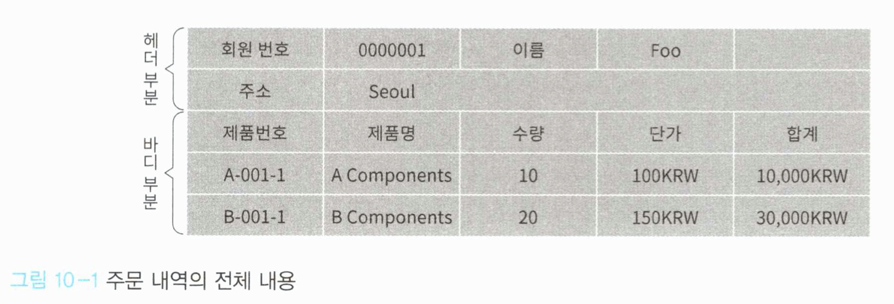
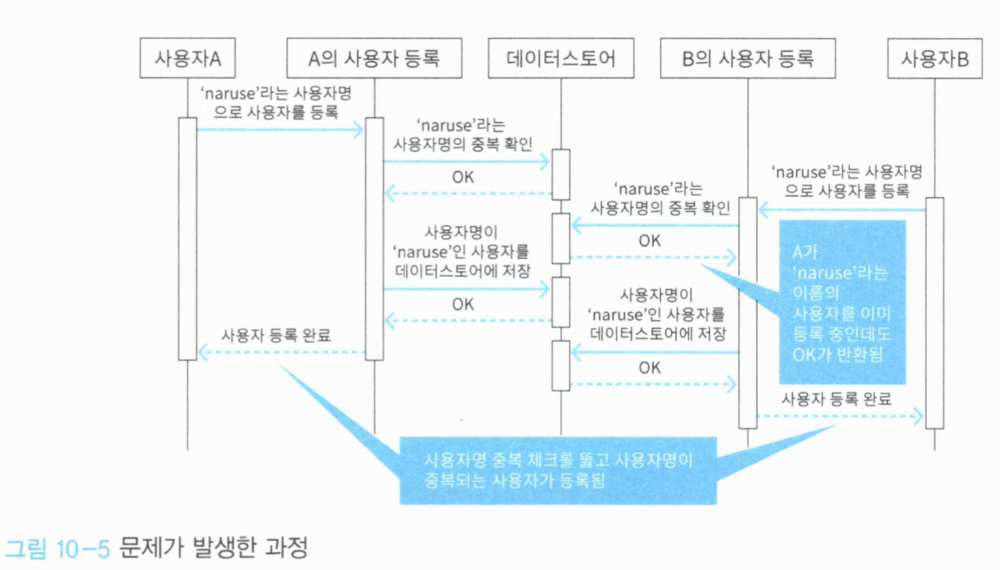
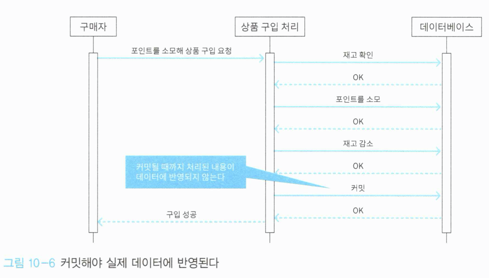

# Chapter 10 - 데이터의 무결성 유지하기

시스템은 데이터의 무결성을 유지해야 하고, 일반적으로 트랜잭션이라는 방법이 사용된다. 도메인 주도 설계에만 한정된 이야기는 아니지만 꼭 필요한 존재이므로 트랜잭션을 활용하는 방법들에는 무엇이 있는지 살펴본다.


## 10.1 무결성이란 무엇인가

- 무결성: 서로 모순이 없고 일관적인 특성
- 상품 주문 내역을 예로 들어보자
  - 주문 내역에는 헤더 부분과 바디 부분으로 구성된다.
  - 헤더에는 주문자명, 주소 등의 정보가 기재된다.
  - 바디에는 주문한 상품의 종류 및 수량이 기재된다.



- 헤더와 바디 둘 중 하나라도 누락되면 정상적인 주문서가 되지 못한다.
- 헤더와 바디는 항상 함께 존재해야 한다는 일관성이 필요하며, 이것이 바로 무결성이다.
- 무결성이 깨질 가능성이 있는 경우?
  - 프로그램이 정상적으로 동작하는 와중이라면 헤더나 바디가 누락되는 일은 없을 것이다.
  - 문제가 되는 경우는 프로그램이 비정상적으로 종료되었을 때
    - 주문서를 작성하는 도중 헤더 부분을 저장하다가 프로그램이 종료되는 경우


## 10.2 치명적인 버그

이전에 작성했던 UserApplicationService는 무결성을 망가뜨릴 수 있는 문제를 안고 있다.

```c#
public class UserApplicationService {
    private readonly IUserFactory userFactory;
    private readonly IUserRepository userRepository;
    private readonly UserService userService;
 
    //... 생략
    public void Register(UserRegisterCommand command) {
        var name = new UserName(command.Name);
        var user = userFactory.Create(name);
 
        if (userService.Exists(user))
        {
            throw new CanNotRegisterUserException(user, "이미 등록된 사용자임");
        }
 
        userRepository.Save(user);
    }
    //... 생략
}
```

- 사용자 등록 처리에는 사용자명 중복을 허용하지 않는 규칙이 포함되어 있다.
- 이 규칙은 만약 한 사용자가 naruse라는 이름으로 사용자 등록을 시도하고 → 리포지터리에 인스턴스를 저장하기 전에 → 다른 유저가 동일한 naruse라는 이름으로 사용자 등록을 시도하여 중복 체크를 하게 되면?
  - naruse라는 이름을 가진 두 명의 사용자가 등록되게 된다.




## 10.3 방법 1 - 유일 키 제약

- 데이터베이스의 특정 컬럼 값이 각각 유일한 값이 되게 보장하는 기능
- 유일 키 제약을 위반하는 레코드를 추가하고자 하면 에러가 발생한다.


### 10.3.1 유일 키 제약에 중복 확인을 맡겼을 경우의 문제점

- 유일 키 제약은 강력한 수단이지만, 잘못 사용하면 코드의 표현력이 저하된다.
- 위의 예를 살펴볼 때, 유효하지 않은 사용자 명을 탐지하고 강제 종료되므로 중복 확인을 별도로 할 필요가 없어진다.
- 그렇다고 해서 중복 확인을 하는 코드 자체를 지운다면 어떻게 될까?
  - 도메인 개념이 표현된 코드를 보고 사용자명의 중복이 허용되지 않는다는 규칙을 확인할 수가 없게 된다.
  - 유일 키 제약이라는 특정 데이터베이스 기술 기반에 의존하는 부분이 생기게 된다.
  - 만약 중복의 기준이 사용자명 → 이메일로 변경된다면, 일부 지워진 코드만 보고는 데이터베이스의 테이블 제약을 변경해야 한다는 사실을 알아챌 수가 없게 된다.


### 10.3.2 유일 키 제약의 올바른 사용

예를 들어 중복 기준을 사용자 명이 아닌 이메일 주소라고 착각하고 개발자가 구현한다고 생각해보자.

```c#
ublic class UserService {
    private readonly IUserRepository userRepository;
 
    public UserService(IUserRepository userRepository) {
        this.userRepository = userRepository;
    }
 
    public bool Exists(User user) {
        var duplicatedUser = userRepository.Find(user.Mail);
 
        return duplicatedUser != null;
    }
}
```

- 사용자 명이 중복된 경우 프로그램이 예외를 발생시키며 종료될 것이므로, 시스템을 보호할 수 있다.
- 유일 키 제약은 규칙 준수의 수단이 아닌 안전망의 역할로 활용하는 것이 좋다.
- 소프트웨어의 안전성을 향상시키기 위해 중복 확인을 위한 코드 + 유일 키 제약을 함께 사용하자


## 10.4 방법 2 - 트랜잭션

- 데이터의 무결성을 유지하기 위한 수단으로는 데이터베이스의 트랜잭션 기능이 더 일반적이다.
- 서로 의존적인 조작을 한꺼번에 완료하거나 취소하는 방법으로 데이터의 무결성을 지킨다.
- 트랜잭션 기능이 적용되면
  - 데이터베이스에 대한 조작이 데이터에 바로 반영되지 않고, 실제 반영을 위해서는 **커밋**이라는 절차가 필요하다. 
- 전자상거래 사이트에서 사용자가 포인트를 소모해 상품을 구입하는 처리의 예



- 트랜잭션이 적용되면, 처리 도중에 프로그램이 비정상 종료해도 사용자의 포인트가 소모되지 않는다. 실제 소모되는 시점은 커밋 후 처리 결과가 데이터에 반영될 때이다.


### 10.4.1 트랜잭션을 사용하는 패턴

- 트랜잭션은 데이터베이스 커넥션을 통해 사용해야 한다.
- 리포지터리가 이 커넥션 객체를 전달받고 사용하는 역할을 맡는다.

```c#
public class UserRepository : IUserRepository {
    private readonly SqlConnection connection;
 
    public UserRepository(SqlConnection connection)
    {
        this.connection = connection;
    }
 
    public User Find(UserId id) {
        using (var command = connection.CreateCommand()) {
            command.CommandText = "SELECT * FROM users WHERE id = @id";
            command.Parameters.Add(new SqlParameter("@id", id.Value));
 
            using (var reader = command.ExecuteReader()) {
                if (reader.Read()) {
                    var user = Read(reader);
 
                    return user;
                }
                else
                {
                    return null;
                }
            }
        }
    }
 
    public User Find(UserName name) {
        using (var command = connection.CreateCommand()) {
            command.CommandText = "SELECT * FROM users WHERE name = @name";
            command.Parameters.Add(new SqlParameter("@name", name.Value));
 
            using (var reader = command.ExecuteReader()) {
                if (reader.Read()) {
                    var user = Read(reader);
 
                    return user;
                }
                else {
                    return null;
                }
            }
        }
    }
 
    public List<User> FindAll() {
        using (var command = connection.CreateCommand()) {
            command.CommandText = "SELECT * FROM users";
 
            using (var reader = command.ExecuteReader())
            {
                var results = new List<User>();
                while (reader.Read())
                {
                    var user = Read(reader);
                    results.Add(user);
                }
 
                return results;
            }
        }
    }
 
    public void Save(User user) {
        using (var command = connection.CreateCommand()) {
            command.CommandText = @"
                MERGE INTO users
                USING (
                    SELECT @id AS id, @name AS name
                ) AS data
                ON users.id = data.id
                WHEN MATCHED THEN
                    UPDATE SET name = data.name
                WHEN NOT MATCHED THEN
                    INSERT (id, name)
                    VALUES (data.id, data.name);
                ";
            command.Parameters.Add(new SqlParameter("@id", user.Id.Value));
            command.Parameters.Add(new SqlParameter("@name", user.Name.Value));
 
            command.ExecuteNonQuery();
        }
    }
 
    public void Delete(User user) {
        using (var command = connection.CreateCommand()) {
            command.CommandText = "DELETE FROM users WHERE id = @id";
            command.Parameters.Add(new SqlParameter("@id", user.Id.Value));
            command.ExecuteNonQuery();
        }
    }
 
    public User Read(SqlDataReader reader) {
        var id = (string)reader["id"];
        var name = (string)reader["name"];
 
        return new User(
            new UserId(id),
            new UserName(name)
        );
    }
}
```

- 트랜잭션 시작 및 커밋을 제어하기 위해 UserApplicationService 역시 동일한 SqlConnection을 전달받고, 사용자 등록 처리 시 트랜잭션을 적용한다

```c#
public class UserApplicationService {
    private readonly SqlConnection connection;
    private readonly IUserFactory userFactory;
    private readonly IUserRepository userRepository;
    private readonly UserService userService;
 
    public UserApplicationService(SqlConnection connection, IUserFactory userFactory, IUserRepository userRepository, UserService userService) {
        this.connection = connection;
        this.userFactory = userFactory;
        this.userRepository = userRepository;
        this.userService = userService;
    }
 
    // ... 생략
 
    public void Register(UserRegisterCommand command) {
        // 커넥션을 통해 트랜잭션을 시작
        using (var transaction = connection.BeginTransaction()) {
            var name = new UserName(command.Name);
            var user = userFactory.Create(name);
 
            if (userService.Exists(user)) {
                throw new CanNotRegisterUserException(user, "이미 등록된 사용자임");
            }
 
            userRepository.Save(user);
            // 처리가 완료되면 커밋
            transaction.Commit();
        }
    }
}
```

- 문제점? UserApplicationService (애플리케이션 서비스)가 SqlConnection 객체에 의존하게 되었다.
  - SqlConnection은 관계형 데이터베이스에 기초한 객체이다. 다른 데이터베이스를 쓰거나, 리포지터리의 구현체로 InMemoryUserRepository를 쓰게 된다면 SqlConnection을 활용할 수 없게 된다.


### 10.4.2 트랜잭션 범위를 사용하는 패턴

- 비즈니스 로직의 입장에서 볼 때, 무결성을 지키는 수단이 무엇인지는 그리 중요하지 않다.
- 따라서 비즈니스 로직에는 무결성을 확보하기 위한 구현 코드보다는 **특정 부분에서 데이터 무결성을 확보해야 한다는 것을 명시적으로 보여주는 코드가** 담겨야 한다.
- C#의 경우 해당 코드가 데이터 무결성을 필요로 한다는 것을 표현하기 위한 트랜잭션 범위라는 기능을 제공한다.

```c#
public class UserApplicationService {
    private readonly IUserFactory userFactory;
    private readonly IUserRepository userRepository;
    private readonly UserService userService;
 
    public UserApplicationService(IUserFactory userFactory, IUserRepository userRepository, UserService userService) {
        this.userFactory = userFactory;
        this.userRepository = userRepository;
        this.userService = userService;
    }
 
    public UserGetResult Get(UserGetCommand command) {
        var id = new UserId(command.Id);
        var user = userRepository.Find(id);
        if (user == null) {
            throw new UserNotFoundException(id, "사용자를 찾지 못했음");
        }
 
        var data = new UserData(user);
 
        return new UserGetResult(data);
    }
 
    public UserGetAllResult GetAll() {
        var users = userRepository.FindAll();
        var userModels = users.Select(x => new UserData(x)).ToList();
        return new UserGetAllResult(userModels);
    }
 
    public void Register(UserRegisterCommand command) {
        // 트랜잭션 범위를 생성함
        // using 문의 범위 안에서 커넥션을 열면 자동으로 트랜잭션이 시작된다
        using (var transaction = new TransactionScope()) {
            var name = new UserName(command.Name);
            var user = userFactory.Create(name);
 
            if (userService.Exists(user)) {
                throw new CanNotRegisterUserException(user, "이미 등록된 사용자임");
            }
 
            userRepository.Save(user);
            // 실제 데이터에 반영하기 위해 커밋
            transaction.Complete();
        }
    }
 
    public void Update(UserUpdateCommand command) {
        using (var transaction = new TransactionScope()) {
            var id = new UserId(command.Id);
            var user = userRepository.Find(id);
            if (user == null) {
                throw new UserNotFoundException(id);
            }
 
            if (command.Name != null) {
                var name = new UserName(command.Name);
                user.ChangeName(name);
 
                if (userService.Exists(user))
                {
                    throw new CanNotRegisterUserException(user, "이미 등록된 사용자임");
                }
            }
 
            userRepository.Save(user);
 
            transaction.Complete();
        }
    }
 
    public void Delete(UserDeleteCommand command) {
        using (var transaction = new TransactionScope()) {
            var id = new UserId(command.Id);
            var user = userRepository.Find(id);
            if (user == null) {
                return;
            }
 
            userRepository.Delete(user);
 
            transaction.Complete();
        }
    }
}
```


### 10.4.3 AOP를 사용하는 패턴

- 위의 C#의 트랜잭션 범위와 동일한 효과가 자바 코드에서는 @Transactional 애노테이션을 이용해 구현될 수 있다.
- 메소드가 정상적으로 종료되면 커밋을 실행하며 실행 도중 예외가 발생하면 롤백이 실행된다.

```c#
public class UserApplicationService {
    private final UserRepository userRepository;
    private final UserFactory userFactory;
    private final UserService userService;
 
    // ... 생략
     
    @Transactional
    public void Register(UserRegisterCommand command) {
        UserName userName = new UserName(command.getName());
        User user = userFactory.create(userName);
 
        if (userService.exists(user)) {
            throw new CanNotRegisterUserException(user, "이미 등록된 사용자임");
        }
         
        userRepository.save(user);
    }
}
```


### 10.4.4 유닛오브워크를 사용하는 패턴

- 유닛오브워크(UnitOfWork): 어떤 객체의 변경 사항을 기록하는 객체
  - 객체를 읽어들일 때에는 유닛오브워크가 객체의 상태를 기록한다.
  - 객체가 변경되거나 삭제되어도 유닛오브워크가 이를 모르는 상태에서는 데이터스토어에 객체의 변화가 반영되지 않는다.
  - 커밋을 호출해야 그때까지의 변경 사항이 데이터스토어에 반영된다.
  - Persistency의 대상 객체의 생성 / 변경 / 삭제 모두 유닛오브워크를 통해 이루어지게 된다.

- 유닛오브워크 정의

```c#
public class UnitOfWork {
    public void RegisterNew(object value) {
        throw new NotImplementedException();
    }
    public void RegisterDirty(object value) {
        throw new NotImplementedException();
    }
    public void RegisterClean(object value) {
        throw new NotImplementedException();
    }
    public void RegisterDeleted(object value) {
        throw new NotImplementedException();
    }
    public void Commit() {
        throw new NotImplementedException();
    }
}
```

- Register로 시작하는 메소드는 인스턴스의 상태가 변경될 때마다 그 내용을 기록하고, Commit 메소드가 호출되면 기록된 변경 사항을 데이터스토어에 반영한다.
- 유닛오브 워크를 사용하기 위한 엔티티의 기반 클래스

```c#
public abstract class Entity {
    protected void MarkNew() {
        UnitOfWork.Current.RegisterNew(this);
    }
    protected void MarkClean() {
        UnitOfWork.Current.RegisterClean(this);
    }
    protected void MarkDirty() {
        UnitOfWork.Current.RegisterDirty(this);
    }
    protected void MarkDeleted() {
        UnitOfWork.Current.RegisterDeleted(this);
    }
}
```

- 엔티티는 위의 클래스를 상속하여 데이터가 변경될 때 필요한 마킹을 하도록 한다.

```c#
public class User : Entity {
    public User(UserId id, UserName name) {
        if (id == null) throw new ArgumentNullException(nameof(id));
        if (name == null) throw new ArgumentNullException(nameof(name));
 
        Id = id;
        Name = name;
        MarkNew();
    }
 
    public UserId Id { get; }
    public UserName Name { get; private set; }
 
    public void ChangeName(UserName name) {
        if (name == null) throw new ArgumentNullException(nameof(name));
 
        Name = name;
        MarkDirty();
    }
}
```

- 유닛오브워크 패턴이 적용된 사용자 등록 처리

```c#
public class UserApplicationService {
    // 유닛오브워크 객체
    private readonly UnitOfWork uow;
    private readonly IUserFactory userFactory;
    private readonly IUserRepository userRepository;
    private readonly UserService userService;
 
    public UserApplicationService(UnitOfWork uow, IUserFactory userFactory, IUserRepository userRepository, UserService userService) {
        this.uow = uow;
        this.userFactory = userFactory;
        this.userRepository = userRepository;
        this.userService = userService;
    }
    // ... 생략
    public void Register(UserRegisterCommand command) {
        var name = new UserName(command.Name);
        var user = userFactory.Create(name);
 
        if (userService.Exists(user)) {
            throw new CanNotRegisterUserException(user, "이미 등록된 사용자임");
        }
 
        userRepository.Save(user);
        uow.Commit(); // 커밋
    }
 
    public void Update(UserUpdateCommand command) {
        var id = new UserId(command.Id);
        var user = userRepository.Find(id);
        if (user == null) {
            throw new UserNotFoundException(id);
        }
 
        if (command.Name != null) {
            var name = new UserName(command.Name);
            user.ChangeName(name);
 
            if (userService.Exists(user)) {
                throw new CanNotRegisterUserException(user, "이미 등록된 사용자임");
            }
        }
 
        userRepository.Save(user);
        uow.Commit(); // 커밋
    }
 
    public void Delete(UserDeleteCommand command) {
        var id = new UserId(command.Id);
        var user = userRepository.Find(id);
        if (user == null) {
            return;
        }
 
        userRepository.Delete(user);
        uow.Commit(); // 커밋
    }
}
```

- 개발자가 명시적으로 호출할 수도 있지만, 묵시적으로 실행하기 위해서는 AOP를 적용해 메서드 실행 후 자동으로 커밋하게 할 수 있다.


#### 유닛오브워크의 또 다른 구현 예 (C#'s Entity Framework)

- 유닛오브워크 객체에 리포지터리를 포함시켜서 리포지터리 자체가 변경 이력을 추적하게 하는 패턴도 있다. 이 경우 앞의 엔티티의 기반이 되는 클래스가 별도로 필요하지 않다.
- 변경 이력 추적 책임을 리포지터리에 맡기는 유닛오브워크
- 코드 생략.


#### 칼럼: 그렇다면 무엇을 쓰는 것이 좋을까?

- 선언적으로 사용 가능한 트랜잭션 범위, C# 이외의 언어라면 AOP (@Transactional)


### 10.4.5 트랜잭션으로 인한 로크 (Lock)

- 데이터베이스에서 제공하는 트랜잭션은 일관성 유지를 위해 데이터에 lock을 건다.
- 트랜잭션을 사용할 때에는 이 lock의 범위를 항상 염두에 두어야 한다.
- lock의 범위는 최소한으로 하는 것이 좋으며, 넓어지면 처리가 실패할 가능성이 높아진다.
- 1개의 트랜잭션으로 저장하는 객체의 수를 1개로 제한하고, 객체의 크기를 가능한 줄이면 그에 따라 lock의 범위도 줄어들게 된다.

 

## 10.5 정리

어느 것을 사용해도 원하는 목적을 달성할 수 있다.