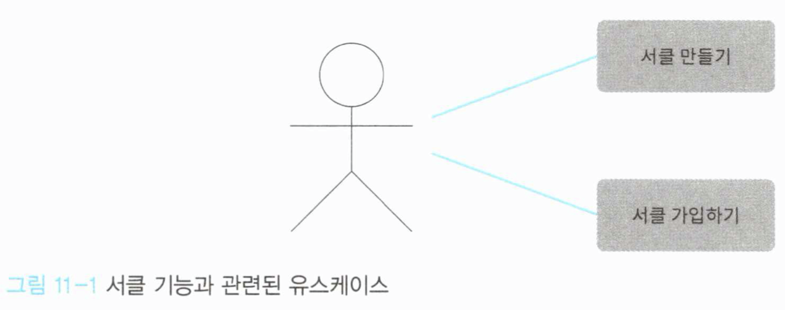

# Chapter 11 - 애플리케이션 밑바닥부터 만들기


## 11.1 애플리케이션을 만드는 과정

이 책에서 애플리케이션을 만드는 과정으로 소개하는 것은 다음과 같다.

- 가장 먼저 확인할 것은 어떤 기능이 필요한가 하는 것이다.
- 추가할 기능을 결정했다면 그 다음에는 그 기능의 기반이 될 유스케이스를 수립한다.
- 필요한 유스케이스를 모두 수립한 다음, 도메인 개념과 규칙으로부터 다시 애플리케이션에 필요한 지식을 추출해 도메인 객체를 정의한다.
- 도메인 객체로 유스케이스를 실제 기능으로 제공할 애플리케이션 서비스를 구현한다.


## 11.2 어떤 기능을 구현할까

책에서는 애플리케이션을 만드는 예제로 같은 취미를 갖는 사용자끼리 교류하기 위한 그룹인 서클을 예로 들고 있다.


### 11.2.1 서클 기능 분석하기



서클 기능을 구현하기 위해 필요한 유스케이스는 `서클 만들기`와 `서클 가입하기` 다.
탈퇴, 해체도 가능하겠지만, 책에서는 위 그림에 나오는 유스케이스만 구현한다.

서클에는 다음과 같은 규칙이 적용된다.

- 서클명의 길이는 3글자 이상 20글자 이하여야 한다.
- 서클명은 중복되지 않아야 한다.
- 서클에 소속된 사용자의 수는 서클장과 사용자를 포함해 최대 30명이다.


## 11.3 서클에 대한 지식을 담은 객체 만들기

- 서클은 생애주기를 갖는 객체이므로 엔티티가 된다. 식별자는 값이므로 **값 객체**로 구현한다.

```c#
public class CircleId {
    public CircleId(string value) {
        if (value == null) throw new ArgumentNullException(nameof(value));
 
        Value = value;
    }
    public string Value { get; }
}
```


- 서클명을 나타낼 **값 객체**도 정의한다. (서클명에 대한 규칙을 위반하는 이상값을 발견하면 예외를 발생시킨다.)

```c#
public class CircleName : IEquatable<CircleName> {
    public CircleName(string value) {
        if (value == null) throw new ArgumentNullException(nameof(value));
        if (value.Length < 3) throw new ArgumentException("서클명은 3글자 이상이어야 함", nameof(value));
        if (value.Length > 20) throw new ArgumentException("서클명은 20글자 이하이어야 함", nameof(value));
 
        Value = value;
    }
 
    public string Value { get; }
 
    public bool Equals(CircleName other) {
        if (ReferenceEquals(null, other)) return false;
        if (ReferenceEquals(this, other)) return true;
        return string.Equals(Value, other.Value);
    }
 
    public override bool Equals(object obj) {
        if (ReferenceEquals(null, obj)) return false;
        if (ReferenceEquals(this, obj)) return true;
        if (obj.GetType() != this.GetType()) return false;
        return Equals((CircleName) obj);
    }
 
    public override int GetHashCode() {
        return (Value != null ? Value.GetHashCode() : 0);
    }
}
```


- 이들 값 객체를 이용해 다시 생애주기를 갖는 서클 **엔티티**를 정의한다.

```c#
public class Circle {
    public Circle(CircleId id, CircleName name, User owner, List<User> members) {
        if (id == null) throw new ArgumentNullException(nameof(id));
        if (name == null) throw new ArgumentNullException(nameof(name));
        if (owner == null) throw new ArgumentNullException(nameof(owner));
        if (members == null) throw new ArgumentNullException(nameof(members));
 
        Id = id;
        Name = name;
        Owner = owner;
        Members = members;
    }
 
    public CircleId Id { get; }
    public CircleName Name { get; private set; }
    public User Owner { get; private set; }
    public List<User> Members { get; private set; }
}
```


- 그 다음으로 서클 객체에 퍼시스턴시를 제공할 **리포지토리**를 정의한다.

```c#
public interface ICircleRepository {
    void Save(Circle circle);
    Circle Find(CircleId id);
    Circle Find(CircleName name);
}
```


- 서클 객체의 생성을 맡을 **팩토리**도 같은 방법으로 정의한다.

```c#
public interface ICircleFactory {
    Circle Create(CircleName name, User owner);
}
```


- 서클은 서클명이 중복되지 않아야 한다.
  - 중복에 대한 기준 및 처리를 Circle에 맡기는 것은 자연스럽지 못하다. 
  - 지금껏 예제로 삼았던 사용자 기능에서처럼 중복 기준 및 처리는 **도메인 서비스**로 정의한다.

```c#
public class CircleService {
    private readonly ICircleRepository circleRepository;
 
    public CircleService(ICircleRepository circleRepository) {
        this.circleRepository = circleRepository;
    }
 
    public bool Exists(Circle circle) {
        var duplicated = circleRepository.Find(circle.Name);
        return duplicated != null;
    }
}
```


## 11.4 유스케이스 구현하기

- 서클 생성을 위한 **커맨드 객체**를 구현

```c#
public class CircleCreateCommand {
    public CircleCreateCommand(string userId, string name) {
        UserId = userId;
        Name = name;
    }
    public string UserId { get; }
    public string Name { get; }
}
```


- 커맨드 객체를 받아 실제로 서클 생성 처리를 수행하는 코드는 다음과 같이 구현한다.
  - 서클장이 될 유저를 먼저 찾고,
  - 서클명을 중복 확인하여 서클을 생성한다
  - 서클 생성 처리는 트랜잭션 범위를 적용해서 데이터 무결성을 유지하는 것을 확인할 수 있다.

```c#
public class CircleApplicationService {
    private readonly ICircleFactory circleFactory;
    private readonly ICircleRepository circleRepository;
    private readonly CircleService circleService;
    private readonly IUserRepository userRepository;
 
    public CircleApplicationService(
        ICircleFactory circleFactory,
        ICircleRepository circleRepository,
        CircleService circleService,
        IUserRepository userRepository)
    {
        this.circleFactory = circleFactory;
        this.circleRepository = circleRepository;
        this.circleService = circleService;
        this.userRepository = userRepository;
    }
 
    public void Create(CircleCreateCommand command) {
        using (var transaction = new TransactionScope()) {
            var ownerId = new UserId(command.UserId);
            var owner = userRepository.Find(ownerId);
            if (owner == null) {
                throw new UserNotFoundException(ownerId, "서클장이 될 사용자가 없음");
            }
 
            var name = new CircleName(command.Name);
            var circle = circleFactory.Create(name, owner);
            if (circleService.Exists(circle)) {
                throw new CanNotRegisterCircleException(circle, "이미 등록된 서클임");
            }
 
            circleRepository.Save(circle);
            transaction.Complete();
        }
    }
}
```


- 서클 가입을 위한 커맨드 객체

```c#
public class CircleJoinCommand {
    public CircleJoinCommand(string userId, string circleId) {
        UserId = userId;
        CircleId = circleId;
    }
 
    public string UserId { get; }
    public string CircleId { get; }
}
```


- 서클 가입 코드는 다음과 같다.

```c#
public class CircleApplicationService {
    // ... 생략 ...
 
    public void Join(CircleJoinCommand command) {
        using (var transaction = new TransactionScope()) {
            var memberId = new UserId(command.UserId);
            var member = userRepository.Find(memberId);
            if (member == null) {
                throw new UserNotFoundException(memberId, "사용자를 찾지 못했음");
            }
 
            var id = new CircleId(command.CircleId);
            var circle = circleRepository.Find(id);
            if (circle == null) {
                throw new CircleNotFoundException(id, "서클을 찾지 못했음");
            }
 
            // 서클에 소속된 사용자가 서클장을 포함 30명 이하인지 확인
            if (circle.Members.Count >= 29) {
                throw new CircleFullException(id);
            }
 
            // 가입 처리
            circle.Members.Add(member);
            circleRepository.Save(circle);
            transaction.Complete();
        }
    }
}
```


### 11.4.1 말과 어긋나는 코드가 일으킬 수 있는 일

- Join()은 사용자의 서클 가입이라는 유스케이스를 구현하기는 했지만, 자연스럽지 못한 부분이 있다.
- if (circle.Members.Count >= 29) 부분이 이에 해당한다.
- 규칙에는 소속 가능한 최대 사용자 수가 30이라고 되어 있는데, 코드에는 29라는 숫자가 사용되었다.
- Circle 클래스 내부에서 서클장을 별도로 관리하기 때문에, 코드에는 29라는 숫자가 사용된 것이다.

```c#
public class CircleApplicationService {
    // ... 생략 ...
 
    public User Owner { get; private set; }
    public List<User> Members { get; private set; }
}
```


### 11.4.2 규칙이 도메인 객체를 이탈했을 때 생기는 일


- '서클에 소속된 사용자 수는 서클장과 사용자를 포함해 최대 30명이다'라는 규칙은 도메인에서 중요도가 높은 규칙이다.
- 원래 이런 규칙은 도메인 객체에 구현되어야 한다.


```c#
public class CircleApplicationService {
    public void Invite(CircleInviteCommand command) {
        using (var transaction = new TransactionScope()) {
            var fromUserId = new UserId(command.FromUserId);
            var fromUser = userRepository.Find(fromUserId);
            if (fromUser == null) {
                throw new UserNotFoundException(fromUserId, "초대한 사용자를 찾지 못했음");
            }
 
            var invitedUserId = new UserId(command.InvitedUserId);
            var invitedUser = userRepository.Find(invitedUserId);
            if (invitedUser == null) {
                throw new UserNotFoundException(invitedUserId, "초대받은 사용자를 찾지 못했음");
            }
 
            var circleId = new CircleId(command.CircleId);
            var circle = circleRepository.Find(circleId);
            if (circle == null) {
                throw new CircleNotFoundException(circleId, "서클을 찾지 못했음");
            }
 
            // 서클에 소속된 사용자가 서클장을 포함 30명 이하인지 확인
            if (circle.Members.Count >= 29) {
                throw new CircleFullException(circleId);
            }
 
            var circleInvitation = new CircleInvitation(circle, fromUser, invitedUser);
            circleInvitationRepository.Save(circleInvitation);
            transaction.Complete();
        }
    }
}
```

- 예를들어 위와 같은 코드로 서클에 초대하는 기능을 추가했다고 한다면,
  - 문제가 되는 것은 앞의 Join()에도 나왔던 서클 최대 인원에 대한 조건문 if(circle.Members.Count >= 29)가 Invite()에서도 나온다는 것이다.
  - 이렇게 구현하면 서클 최대인원이 변경 될때, 해당 조건문이 들어 있는 모든 코드들을 뒤져서 수정해야 한다.
- 이 문제의 원인은 규칙과 관련된 코드가 서비스에 작성된 것이다.
- 이 문제를 해결하기 위해 필요한 것이 애그리게이트라는 개념이다.