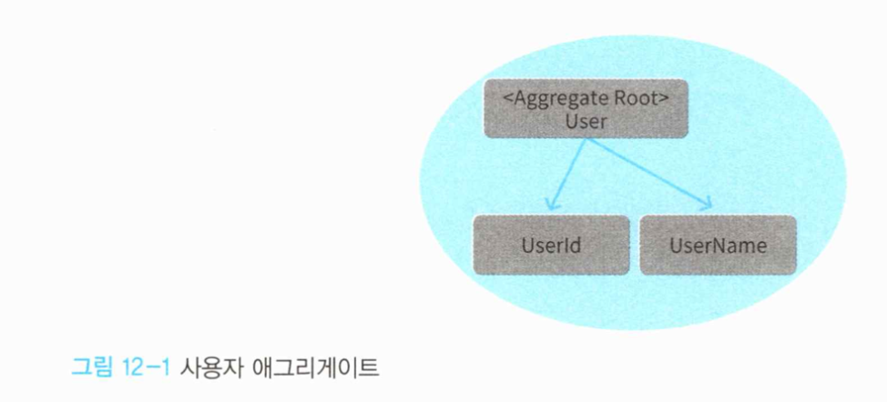
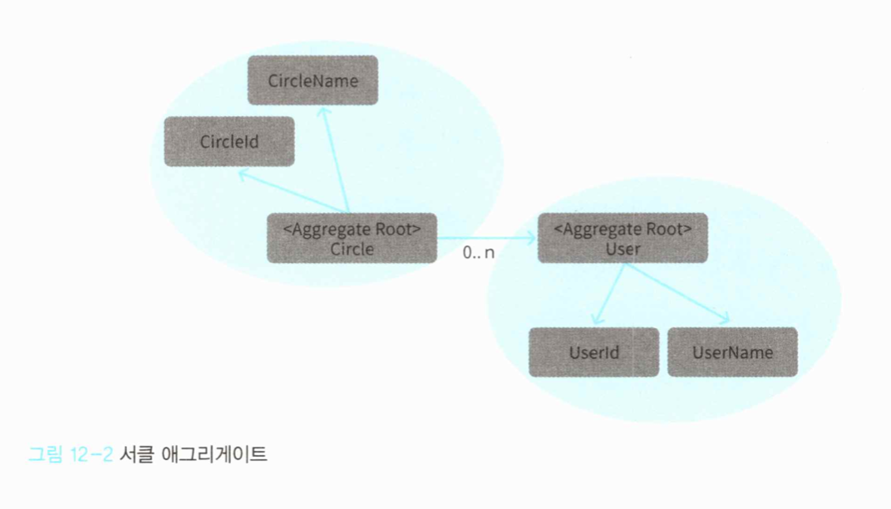
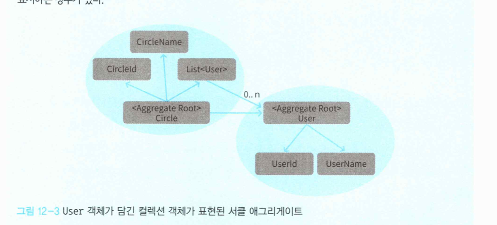
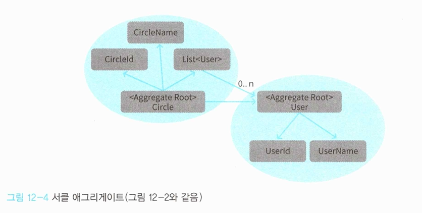
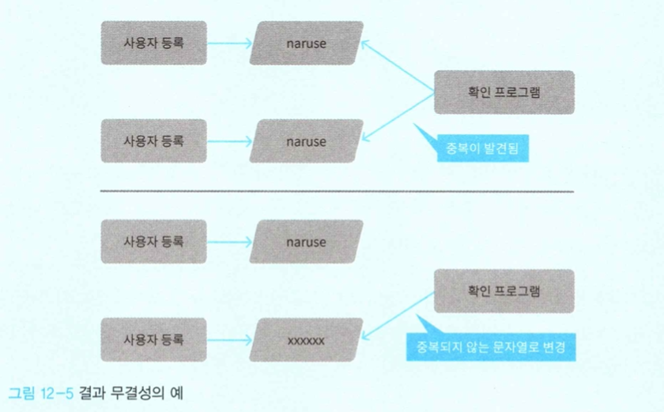

# 12. 도메인의 규칙을 지키는 '애그리게이트'

## 12.1 애그리게이트란?

객체지향 프로그래밍에서는 여러 객체가 모여 하나의 의미를 갖는 하나의 객체가 되는데, 이렇게 객체가 모여 이룬 객체는 어떤 불변 조건을 유지해야 한다.

> 불변객체란 어떤 처리를 수행하는 동안 참을 유지해야 하는 명제를 의미한다.

이 불변조건은 언제나 유지돼야 하지만 객체가 가진 데이터를 변경하는 조작을 무제한으로 허용하면 이를 유지하기 어렵다. 따라서 객체를 다루는 데도 질서가 필요하다.


애그리게이트는 불변 조건을 유지하는 단위로 꾸려지며 객체 조작의 질서를 유지한다.

애그리게이트는 경계와 루트를 갖는다. 경계는 에그리게이트에 포함되는 대상을 결정하는 경계이며, 루트는 애그리게이트에 포함되는 특정한 객체다.

외부에서 애그리게이트를 다루는 조작은 모두 루트를 거쳐야 한다. 애그리게이트에 포함되는 객체를 외부에 노출하지 않음으로써 불변 조건을 유지할 수 있다.


### 12.1.1 애그리게이트의 기본 구조

애그리게이트는 서로 연관된 객체를 감싸는 경계를 통해 정의된다. 예를들어 사용자를 나타내는 User클래스는 애그리게이트로 보면 다음과 같이 나타낼 수 있다.




외부에서는 애그리게이트 내부에 있는 객체를 조작할 수 없다. 애그리게이트를 조작하는 직접적인 인터페이스가 되는 객체는 애그리게이트 루트뿐이다. 따라서 사용자명 변경도 User 객체에 요청하는 형태를 취해야 한다.

```c#
var userName = new UserName("NewName");

// NG
user.Name = userName;

// OK
user.ChangeName(userName);
```

어떤 방식을 취하든지 그 결과는 같지만, ChangeName 메서드를 만들면 메서드를 통해 전달받은 값을 확인(null 체크등) 할 수 있다. 즉, 유효하지 않은 데이터의 존재를 방지할 수 있다.


이번에는 서클 애그리게이트를 살펴보자.



서클 애그리게이트에는 User 애그리게이트가 함께 나온다. 서클의 구성원은 사용자이므로 애그리게이트끼리의 관계가 나타나 있다.

User 애그리게이트는 서클 애그리게이트에 포함되지 않으므로 User 애그리게이트의 정보를 수정하는 조작은 서클 애그리게이트를 통하지 않는다. 

그러나 서클에 사용자를 구성원으로 추가하는 처리는 서클 애그리게이트가 담당한다.

```c#
circle.Members.Add(member); // 애그리게이트의 규칙을 위반하는 코드
```

서클 애그리게이트에 포함되는 Members에 대한 조작은 애그리게이트의 루트인 Circle 객체를 통해서 해야한다.


따라서 Circle 객체의 메서드를 추가하는 것이 옳다.

```c#
public class Circle 
{
  private readonly CircleId id;
  private User owner;
  
  // 소속된 사용자 목록을 비공개로 돌린다 
  private List<User> members;
  
  (...생략...)
  public void Join(User member) 
  {
  	if (member == null) throw new ArgumentNullException(nameof(member)); 
    if (members.Count >= 29) {
  		throw new CircleFullException(id);
  	} 
    members.Add(member);
	} 
}
```


Join 메서드를 통해 Member 속성이 외부에 공개되지 않게 할 수 있으므로, 서클에 새로운 사용자를 추가하려면 Join 메서드를 호출하는 방법 뿐이다. 결과적으로 서클에 사용자를 추가할 때 항상 최대 인원에 대한 유효성 검사가 이루어지며, '서클 최대 인원은 서클장 포함 최대 30명'이라는 불변 조건이 항상 유지될 수 있다.


```c#
circle.Join(user);
```

서클의 멤버에 새로운 사용자를 추가한다는 구체적인 처리 내용에서 서클에 새로운 사용자를 참여시키는 직관적인 내용으로 바뀌었다.

이렇듯 객체지향 프로그래밍에서는 외부에서 내부객체를 직접 다루는 대신, 내부객체를 감싸는 객체에 요청하는 형태를 취한다. 이런 방법으로 불변 조건을 유지하면서도 직관과 좀 더 일치하는 코드를 만들 수 있다. ('데메테르의 법칙')


> 애그리게이트를 담은 컬렉션은 다이어그램으로 나타내야 할까?
>
> 
>
> 이런 표현이 항상 옳은 것은 아니다. 예를 들어 실제로는 컬렉션 객체가 없이 데이터스토어에서 직접 컬렉션을 생성하는 경우도 있을 수 있다.
>
> ```c#
> public class Circle {
>   private readonly CircleId id;
>   (...생략...)
>   public List<User> Members 
>   {
>   	get {
>       using(var context = new MyDbContext()) 
>       {
>         circle.CircleMembers.Select(x => x.Circleld); 
>         var circle = context.Circles
>           .Inc1ude(x => x.CircleMembers) 
>           .ThenInclude(x => x.Circle)
>           .Single(x=>x.Id = id.Value);
>         var memberIds = circle.CircleMembers.Select(x => x.UserId);
>         var members = context.Users.Where(x => memberlds.Contains(x.Id)); 
>         
>         return members.Select(x => new User(
>         	new Userld(x.Id), new UserName(x.Name))
>         ).ToList();
>       }
>     }
>   }
> }
> ```
>
> 애그리게이트를 다이어그램으로 나타내는 것은 애그리게이트의 경계 안에 포함되는 모델이 무엇인지 나타내는 것이 목적으로, 코드를 정확히 나타내는 것이 아니다.


### 12.1.2 객체를 다루는 조작의 기본 원칙

객체 간의 어떤 질서 없이 메서드를 호출하면 불변 조건을 유지하기 어렵다. '데메테르의 법칙' 은 객체 간의 메서드 호출에 질서를 부여하기 위한 가이드라인이다.

데메테르의 법칙은 어떤 컨텍스트에서 다음 객체의 메서드만을 호출할 수 있게 제한한다.

- 객체자신

- 인자로 전달받은 객체

- 인스턴스 변수

- 해당 컨텍스트에서 직접 생성한 객체

  

예를 들어 자동차를 운전할 때 타이어에 직접 명령을 내리지 않듯이, 객체의 속성에도 직접 명령을 내리는 대신 그 속성을 갖는 객체(자동차)에 명령을 내려 해당 객체가 자신의 속성을 관리하게 하는 것이다.


법칙을 이해하지 못한 채 무조건 지킨다고 좋은 것은 아니다. 데메테르의 법칙이 해결하려던 문제가 무엇인지 살펴보자.

```c#
if (circle.Members.Count >= 29) 
{
	throw new CircleFullException(id); 
}
```

Circle 객체의 속성인 Members에 직접 접근하기 때문에 데메테르 법칙에서 명시한 '메서드를 사용할 수 있는 객체의 범위'를 벗어난다.

이 코드의 문제는 서클의 최대 인원에 대한 로직이 여기저기 흩어지게 만든다는 점이다. 


```c#
public class Circle
{
  private readonly CircleId id;
  
  // 멤버 목록을 비공개로 함 
  private List<User> members;
  
  (...생략...)
  
  public bool IsFull()
  {
  	return members.Count >= 29;
  }
  
  public void Join(User user)
  {
    if (user == null) throw new ArgumentNullException(nameof(user));
    if (IsFull()) {
    	throw new CircleFullException(id); 
    }
    members.Add(user); 
  }
}
```


최대 인원에 도달했는지 여부는 isFull 메서드를 통해 확인한다. 최대 인원 초과를 확인하는 코드는 모두 isFull을 사용하게 수정한다.

```c#
if (circle.IsFull())
{
	throw new CircleFullException(circleld);
}
```


게터를 만들지 말아야 할 이유가 바로 여기에 있다. 게터를 통해 필드를 공개하면 객체에 구현돼야 할 규칙이 다른 곳에서 중복 구현되는 일을 완전히 막을 수 없다.

데메테르의 법칙은 소프트웨어의 유지보수성을 향상시키고 코드를 더욱 더 유연하게 한다. 애그리게이트의 목표와도 부합한다.


### 12.1.3 내부 데이터를 숨기기 위해

객체의 내부 데이터는 함부로 외부에 공개돼서는 안되지만, 데이터를 외부에 전혀 공개하지 않으면 리포지토리가 객체를 데이터스토어에 저장할 수 없다.

```c#
public class EFUserRepository : IUserRepository 
{
  public void Save(User user) 
  {
  	// 게터를 이용해 데이터를 옮겨담는다 
    var userDataModel = new UserDataModel
    {
    	Id = user.Id.Value, 
      Name = user.Name.Value
    };
    
    context.Users.Add(userDataModel);
    context.SaveChanges(); 
  }
  
  (...생략...) 
}

```

EFUserRepository는 User 클래스의 객체를 저장할 때 프레임워크에서 사용되는 데이터 모델인 UserDataModel로 데이터를 옮겨 담는다.


UserDataModel 객체를 생성하려면 User 클래스의 Id와 Name에 접근해야 하므로 User 클래스가 Id와 Name을 완전히 비공개로 하면 이 코드는 컴파일 에러를 일으킨다. 

가장 단순한 해결책은 규칙을 이용한 보호이다. 리포지토리 객체 외에는 애그리게이트의 내부 데이터에 접근하는 코드를 함부로 작성하지 않는(다시 말해 게터 를 사용하지 않는) 것이다. 가장 적은 비용으로 효과를 누릴 수 있지만, 이런 류의 합의는 강제력이 없기 때문에 개발자가 실수 혹은 고의로 규칙을 깨는 상황이 벌어질 수 있다.


또 다른 방법은 노티피케이션 객체를 이용하는 것이다. 노티피케이션 객체를 이용하려면 먼저 인터페이스를 정의해야한다

```c#
public interface IUserNotification 
{
  void Id(UserId id);
  void Name(UserName name); 
}
```


다음은 인터페이스를 구현하는 Notification 객체를 작성한다.

```c#
public class UserDataModelBuilder : IUserNotification {
  // 전달된 데이터는 인스턴스 변수로 저장된다 
  private UserId Id;
  private UserName name;
  
  public void Id(UserId Id) 
  {
  	this.id = id; 
  }
  
  public void Name(UserName name) 
  {
  	this.name = name; 
  }
  
  // 전달받은 데이터로 데이터 모델을 생성하는 메서드 
  public UserDataModel Build()
  {
    return new UserDataModel {
      Id = id.Value, 
      Name = name.Value
    };
  }
}
```


User 클래스는 노티피케이션 객체의 인터페이스를 통해 내부 정보를 전달한다.

```c#
public class User
{
	// 인스턴스 변수는 모두 비공개 
  private readonly UserId id; 
  private UserName name; 
  (...생략...)

  public void Notify(IUserNotification note)
  {
  	// 내부 데이터를 전달 
    note.Id(id); 
    note.Name(name);
  } 
}
```


이런 방법으로 객체의 내부 데이터는 비공개로 두면서 외부에 데이터를 전달할 수 있다.

```c#
public class EFUserRepository : IUserRepository 
{
	public void Save(User user)
  {
	  // 노티피케이션 객체를 전달했다가 다시 회수해 내부 데이터를 입수한다 
    var userDataModelBuilder = new UserDataModelBuilder(); 		
    user.Notify(userDataModelBuilder);
    
  	// 전달받은 내부 데이터로 데이터 모델을 생성 	
    var userDataModel = userDataModelBuilder.Build();
    
	  // 데이터 모델을 ORM에 전달한다 
    context.Users.Add(userDataModel); 
    context.SaveChanges();
  }
	(...생략...) 
}
```

하지만 이 경우 작성할 코드 양이 크게 늘어난다는 것이 단점이다. 노티피케이션 객체 및 관련 코드를 한꺼번에 생성해주는 도구를 만들어 사용하면 이러한 문제를 피할 수 있다.


> **더욱 섬세한 접근 제어가 가능한 접근제어자(스칼라)**
>
> 내부 데이터에 접근할 수 있는 대상을 코드에서 지정할 수 있다면 개발자가 부주의하게 내부 데이터에 접근하지 못하게 할 수 있을 것이다. 스칼라는 내부데이터에 대한 접근 조건을 세세하게 지정할 수 있다.
>
> 스칼라의 더 섬세한 접근 제어 문법
>
> ```scala
> public class User (
>   private [IUserRepository] val id: UserId, 
>   private [IUserRepository] val name: UserName
> ) {
> }
> ```
>
> 이 문법은 접근제어자라고 한다. id와 name은 기본적으로 외부에 공개되지 않지만, []에 지정한 객체에 한해 접근을 허용한다.
>
> 스칼라의 접근제어자는 세세한 접근 제거가 가능한 기능은 물론이고 문법 자체가 선언적이라는 점이 더 훌륭하다. 코드를 보면 자연스럽게 리포지토리만 접근 가능하다는 의도를 알 수 있다.


## 12.2 애그리게이트의 경계를 어떻게 정할 것인가

애그리게이트의 경계를 정하는 원칙 중 가장 흔히 쓰이는 것은 '변경의 단위'다. 변경의 단위가 애그리게이트의 경계로 이어지는 이유는 그 원칙을 어겨보면 이해하기 쉽다.





서클과 사용자는 별개의 애그리게이트다. 그리고 애그리게이트는 변경의 단위다. 

그러므로 서클을 변경할 때는 서클 애그리게이트 내부로, 사용자를 변경할때도 User 애그리게이션 내부의 정보만 변경돼야 한다. 

만약 이러한 규칙을 위반하고 서클 애그리게이트에서 자신의 경계를 넘어 User 애그리게이트까지 변경하려고 하면 프로그램에 어떤 일이 일어날까?

```c#
public class Circle
{
  private List<User> members;
  (...생략...)
  
  public void ChangeMemberName(UserId id, UserName name) 
  {
    var target = members.FirstOrDefault(x => x.Id.Equals(id));
    if (target != null)
    {
    	target.ChangeName( name);
    }
  }
}
```

변경의 범위가 서클을 벗어나고 있다. (서클에 소속된 사용자의 이름을 변경)

이렇게 되면 그 영향이 리포지토리에 나타난다.


먼저 이전의 서클 애그리게이트의 퍼시스턴시 처리를 담당하는 코드를 살펴보자.

```c#
public class CircleRepository : ICircleRepository 
{
  (...생략...)
  public void Save(Circle circle) 
  {
  	using (var command = connection.CreateCommand()) 
    {
      command.CommandText = @"
        MERGE INTO circles
        USING (SELECT @id AS id, @name AS name, @ownerId AS ownerId ) AS data
        ON circles.id = data.id
        WHEN MATCHED THEN
        UPDATE SET name = data.name, ownerId = data.ownerId WHEN NOT MATCHED THEN
        INSERT (id, name, ownerld) VALUES(data.id,data.name,data.ownerld);
      ";
      
    	command.Parameters.Add(new SqlParameter("@id", circle.Id.Value));
      command.Parameters.Add(new SqlParameter("@name", circle.Name.Value)); 
      command.Parameters.Add(new SqlParameter("@ownerld",
    (object) circle.Owner?.Id.Value ?? DBNull.Value));
       command.ExecuteNonQuery(); 
    }
    
    using (var command = connection.CreateCommand()) 
    {
      command.CommandText = @" 
        MERGE INTO userCircles
        USING (
        SELECT @userId AS userId, @circleId AS circieId
        ) AS data
        ON userCircles.userld = data.userId AND userCircles.circleId = data.circleId WHEN NOT MATCHED THEN
        INSERT (userld, circield)
        VALUES (data.userld, data.circleld);
      ";
      
      command.Parameters.Add(new SqlParameter("@circleId", circle.Id.Value)); 
      command.Parameters.Add(new SqlParameter("@userId", null));
      
      foreach (var member in circle.Members) 
      {
        command.Parameters{'@userId'].Value = member.Id.Value;
        command.ExecuteNonQuery(); 
      } 
    }
  }    
}
```


서클 애그리게이트가 자신의 내부 데이터만을 변경한다는 규칙을 준수한다면 이 코드는 문제가 없다. 


그러나 여기서는 애그리게이트의 경계를 넘어 사용자 애그리게이트의 데이터를 변경한다. 이 상태로는 경계 너머 사용자 애그리게이트를 변경한 내용이 저장되지 않는다. 애그리게이트 경계를 넘어선 변경을 허용하려면 리포지토리에도 수정이 필요하다.


```c#
public class CircleRepository : ICircleRepository 
{
  (...생략...)
  
  public void Save(Circle circle) 
  {
    // 사용자 애그리게이션에 대한 업데이트 처리
    using (var command = connection.CreateCommand())
    {
      command.commandText = "UPDATE users SET username = @username WHERE id = @id";
      command.Parameters.Add(new SqlParameter("@id", null)); 
      command.Parameters.Add(new SqlParameter("@username", null));
      
      foreach (var user in circle.Members)
      {
        command.Parameters["@id"].Value = user.Id.Value; 
        command.Parameters["@username"].Value = user.Name.Va1ue;
        command.ExecuteNonQuery();
      } 
    }
    
		// 서클 애그리게이션에 대한 업데이트는 그 다음 
    (...생략...)
  }
}

```

서클 리포지토리 로직 대부분이 사용자의 정보를 수정하는 코드로 오염됐다. 더불어 이러한 코드 대부분이 User 리포지토리 코드와 중복된다.


이것은 변경의 단위를 넘어서는 변경을 시도했다가 발생한 문제다. 애그리게이트에 대한 변경은 해당 애그리게이트 자신에게만 맡기고 퍼시스턴시 요청도 애그리게이트 단위로 해야 한다.

지금까지 리포지토리를 만드는 단위가 무엇인지 언급하지 않았는데, 지금과 같은 이유로 리포지토리는 애그리게이트마다 하나씩 만든다.


### 12.2.1 식별자를 이용한 컴포지션

발생할 수 밖에 없는 일을 문제로 생각하는 사고 방식이 있다. Circle 객체는 User 클래스 인스턴스를 컬렉션 객체(Members)에 저장하고, 프로퍼티를 통해 객체에 접근해 메서드를 호출할 수 있는데 그것 자체를 문제로 보는 시각이 그렇다.

애그리게이트의 경계를 넘지 않는다는 암시적 규칙보다 더 나은 방법은 없을까?

바로 인스턴스를 갖지 않는 것이다. 인스턴스를 실제로 갖지는 않지만 그런 것처럼 보이게 하는 것이 바로 식별자이다.


서클 애그리게이트가 사용자 애그리게이트를 직접 포함하는 대신, 사용자 애그리게이트의 식별자를 포함하게 코드를 수정해보자.

```c#
public class Circle 
{
  public CircleId Id { get; }
  public CircleName Name { get; private set; }
  // public List<User> Members { get; private set; } 
  public List<UserId> Members { get; private set; }
  (...생략...) 
}
```


이런 방법을 사용하면 Member 프로퍼티를 공개하더라도 User 객체의 메서드를 호출하는 일은 없을 것이다.

UserRepository에서 User 객체를 복원한뒤 메서드를 호출하도록 강제한다면, 부주의하게 메서드를 호출해 애그리게이트 너머의 영역을 변경하는 일은 일어나지 않는다.


또 이 방법은 메모리를 절약하는 부수적인 효과도 있다.

서클명 변경 처리를 예로 들어보자

```c#
public class CircleApplicationService
{
  private readonly ICircleRepository circleRepository;
  (...생략...)
  
  public void Update(CircleUpdateCommand command)
  {
    using (var transaction =new TransactionScope())
    {
      var id = new CircleId(command.Id);
      
      // 이 지점에서 User 객체가 복원되지만,
      var circle = circleRepository.Find(id); 
      
      if (circle == null)
      {
        throw new CircleNotFoundException(id); 
      }
      
      if (command.Name != null)
      {
        var name = new CircleName(command.Name); 
        circle.ChangeName(name);
        if (circleService.Exists(circle))
        {
          throw new canNotRegisterCircleException(circle, "이미 등록된 서클임");
        }
    	}
      circleRepository.Save(circle);
      transaction.Complete();
    	// User 객체를 사용하지 않고 처리가 끝남 
    }
  }
}
```

서클명을 변경하니 당연히 사용자 객체를 다룰 일은 없다. Circle 객체가  User 객체 형태로 포함하는 경우에는 리포지토리가 사용자 객체를 복원해도 전혀 사용되지 않고 버려진다. 

UserId를 포함한다면, 모든 User 객체를 복원할 만큼의 처리 능력을 절약할 수 있고, 인스턴스를 저장하기 위한 메모리도 절약될 것이다.

> **식별자의 게터에 대한 시시비비**
>
> 지금까지 게터는 가능한 한 두지 말아야 하는 것으로 설명했다. 그러나 게터의 대상이 식별자라면 조금 이야기가 달라진다.
>
> ```c#
> public class Circle
> {
>   private CircleName name;
>   private UserId owner;
>   private List<UserId> members;
>   
>   public Circle(CircleId id, CircleName name, UserId owner, List<UserId> members) 
>   {
>     if (id == null) throw new ArgumentNullException(nameof(id));
>     if (name == null) throw new ArgumentNullException(nameof(name));
>     if (owner == null) throw new ArgumentNullException(nameof(owner));
>     if (members == null) throw new ArgumentNullException(nameof(members));
>     
>     Id = id;
>     this.name = name; 
>     this.owner = owner; 
>     this.members = members;
>   }
>   
>   public CircieId Id { get; }
>   public void NotiFy(ICircleNotification note)
>   {
>     note.Id(Id);
>     note.Name(name); 
>     note.Owner(owner); 
>     note.Members(members);
>   } 
>   (...생략...)
> }
> ```
>
> 이 Circle 클래스는 식별자를 게터를 통해 공개한다. 식별자는 엔티티를 나타내기 위한 필연적 속성으로, 그 자체로 애그리게이트를 대체할 수 있는 편리한 수단이다. 이런 경우 식별자를 공개하는 이점이 단점보다 크다.


## 12.3 애그리게이트의 크기와 조작의 단위

트랜잭션은 데이터에 lock을 건다. 애그리게이트의 크기가 크면 클수록 이 락의 적용 범위도 비례해 커진다.


애그리게이트의 크기가 지나치게 커지면 그만큼 애그리게이트를 대상으로 하는 처리가 실패할 가능성도 높다.

따라서 애그리게이트 크기는 가능한 작게 유지하는 것이 좋다.


또, 한 트랜잭션에서 여러 애그리게이트를 다루는 것도 가능한 피해야 한다. 여러 애그리게이션에 걸친 트랜잭션은 마찬가지로 광범위한 데이터에 락을 걸 가능성이 높다.

> **결과 무결성**
>
> 수정을 애그리게이트 단위로 하는 것이 최선이라고 설명했지만, 때로는 여러 애그리게이트에 걸친 수정이 꼭 필요하다. 이런 경우에 유용한 것이 결과 무결성이다.
>
> 트랜잭션 무결성이 모든 순간에 유지되는 무결성인데 비해, 결과 무결성은 처리 도중에 한해 특정 시점의 모순 발생이 허용된다.
>
> 극단적인 예를 들면, 하루 1번 동작하는 cron 작업으로 사용자를 모두 검사해 사용자 명이 중복되는 사용자가 있으면 해당 사용자의 사용자명을 중복되지 않는 무작위 문자열로 변경하는 것과 같다.
> 
>
> 시스템이 어떤 무결성을 필요로 하는 지 잘 따져보면 모든 순간에 유지되는 무결성이 필요한 경우는 생각보다 적다. 만약 트랜잭션 무결성을 적용하는데 문제가 있다면 결과 무결성을 한 번 고려해보기 바란다.


## 12.4 언어 표현과의 모순 제거하기

서클에 대한 규칙 중에 '서클에 소속되는 인원은 서클장을 포함해 최대 30명까지 허용된다'라는 것이 있었다. 30이라는 구쳬적인 수치가 규칙에 실려 있지만, 정작 코드에 나오는 수치는 29다.

```c#
public class Circle
{
  private User owner;
  private List<User> members,
  (...생략...)
  
  public bool IsFull() 
  {
  	return members.Count >= 29; 
  }
}
```

코드에 문제가 없다고 해서 언어 표현과의 모순을 그대로 두면 오해를 일으키기 쉽다.

오해를 막기 위해 Circle클래스에 서클장을 포함한 소속 사용자수를 구하는 메서드를 추가하자

```c#
public class Circle {
  private User owner;
  private List<User> members;
  
  (...생략...)
  public bool IsFull() {
  	return CountMembers() >=30; 
  } 
  
  public int CountMembers()
  {
  	return members.Count + 1;
	}
}
```


## 12.5 정리

이번 장에서는 객체의 불변 조건을 유지하기 위한 경계 역할을 하는 애그리게이트에 대해 배웠다.

애그리게이트는 정해진 규칙대로 정의되는 것이 아니다. 도메인의 개념은 애초부터 서로 밀접하게 엮여있는 개념이며 이들을 구분하는 경계선을 정의하는 것도 간단하지는 않다.

애그리게이트의 경계선을 정하는 일은 도메인 개념을 잘 파악하고 여기에 따르는 불변조건을 제대로 유도한 다음, 도메인과 시스템이 균형을 이루는 최적의 지점을 찾는 과정이다. 어느 한 쪽으로 지나치게 기울지 않는 균형 잡힌 지점을 찾는다.