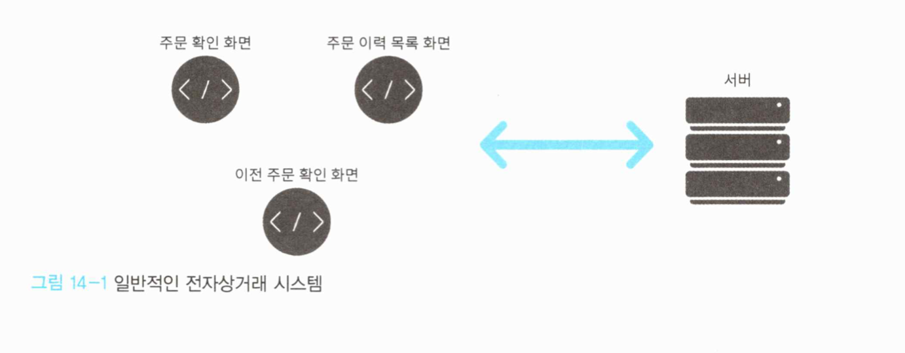
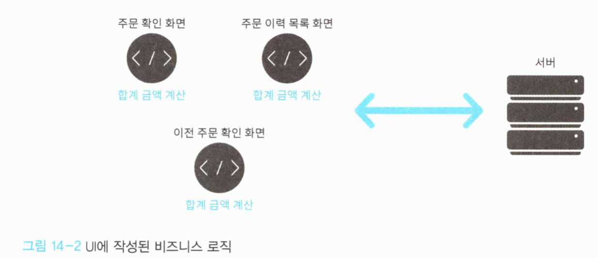
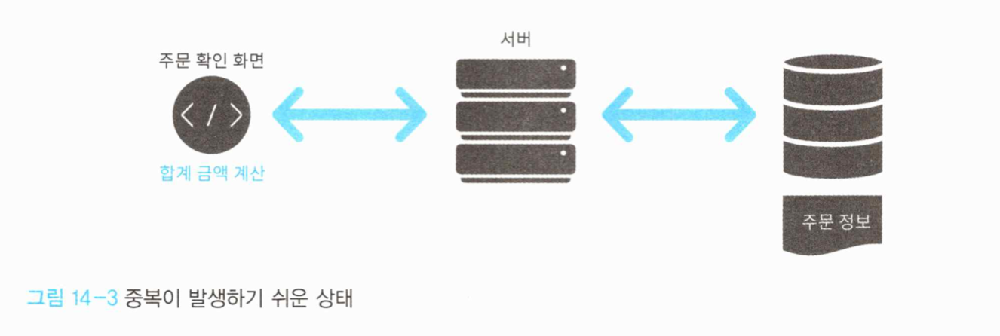
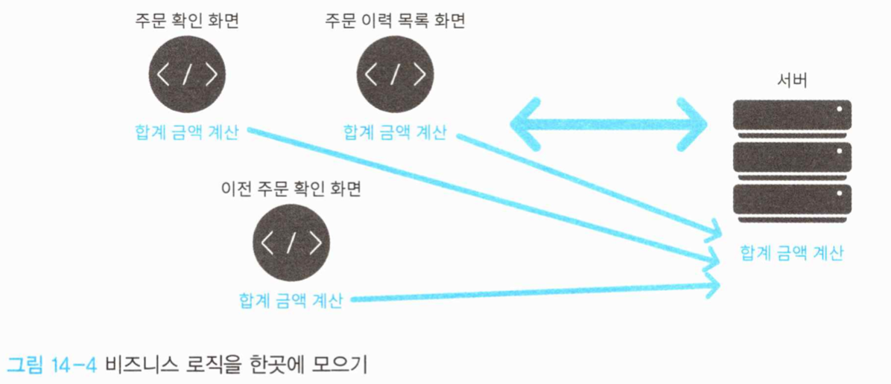
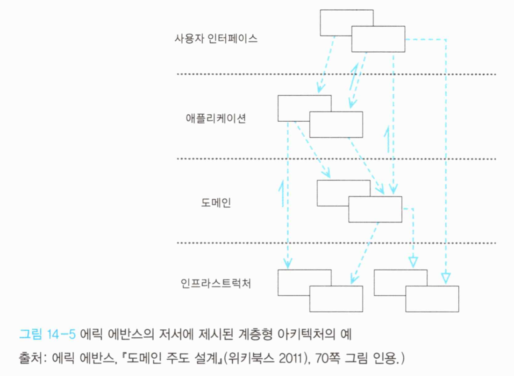
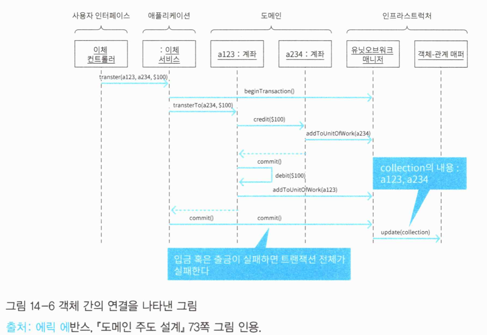
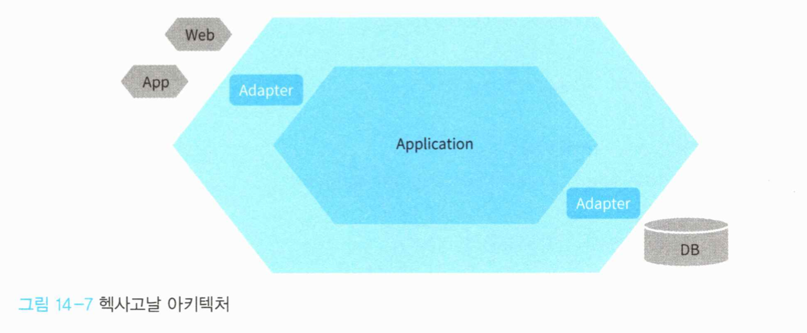
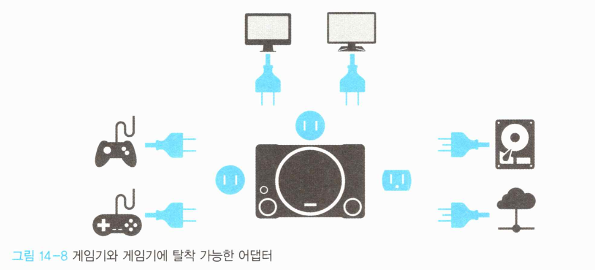
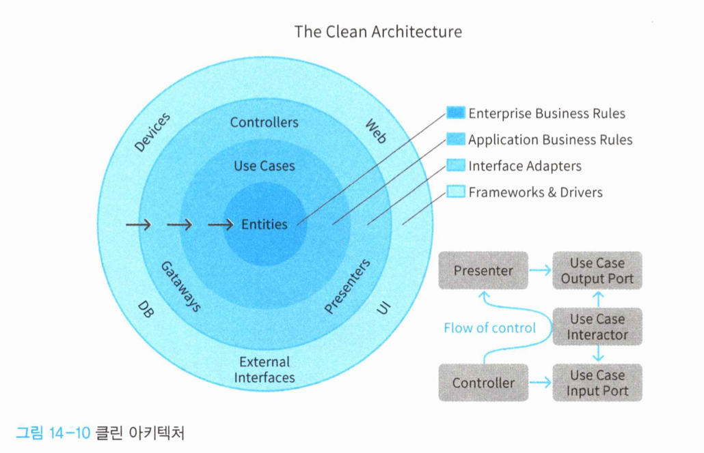
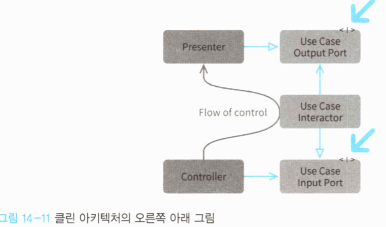

# 14. 아키텍처

## 14.1 아키텍처의 역할

도메인 주도 설계에서 아키텍처는 결코 주역이 아니다.


### 14.1.1 안티패턴 - 스마트 UI

시스템의 유연성을 치명적으로 저해하는 안티 패턴 중 하나가 바로 '스마트UI'다.


스마트 UI는 원래대로라면 도메인 객체에 위치해야 할 중요 규칙 구현 코드가 사용자 인터페이스까지 끌려나오게 하도록 한다.

주로 도메인을 분리하기에 적합하지 않은 애플리케이션에서 자주 발견된다. (주로 이런 시스템은 개선 비용이 매우 높으며 결과적으로 유연성을 크게 잃는다)




전자상거래 사이트 사용자는 웹 사이트에서 상품을 주문한다.


우선 사용자는 주문하려는 상품을 선택한 다음, 주문을 위해 **주문 확인 화면**으로 이동한다. 

- 앞으로 확정할 주문의 합계 금액을 보여준다.

- 확인한 내용에 문제가 없다면 사용자는 주문을 확정한다.

  

자신이 주문한 내용에 잘못된 점이 없는지 확인하기 위해 사용자는 **주문 이력 목록 화면**을 연다. 

- 이전에 주문했던 주문이 목록형식으로 나타난다.
- 주문마다 해당 주문의 합계 금액이 표시된다.


사용자는 상세한 주문 내용을 확인하기 위해 **이전 주문 확인 화면**을 연다. 

- 이 화면에서도 합계금액이 표시된다.


지금 살펴본 화면에는 모두 합계금액이 표시된다. 




3개의 화면이 제각기 합계 금액을 계산해 화면에 표시한다.

이런 구성은 문제가 많다. **합계금액을 계산하는 방법**에 변화가 생긴 상황을 생각해 보자.

- 합계 금액을 계산하는 방법 자체는 한가지이지만, 이에 대한 수정으로 3군데의 코드를 수정해야 한다.

- 각 화면이 방대해졌을 때, 자세히 들여다보지 않으면 모른다.


처음에 화면이 하나뿐일 경우, 개발자는 '주문확인화면'만 있기 때문에 **합계 금액 계산**을 '주문 확인 화면'에 구현해도 문제가 없다고 생각하게 된다.




UI는 사용자의 입력을 받고 출력을 보여주는 것이 맡은 바 책임이다.

비즈니스 로직이 UI에 구현되어서는 안 되며, UI에는 최소한의 로직만 존재해야 한다.

 

스마트 UI 대신, 비즈니스 로직을 한 곳에 모으면 이와 같다. 화면마다 제각기 다른 사정이 끼어들 여지가 사라지며, 계산 방법이 변경되더라도 한 곳만 수정하면 된다.

먼저 해야할 일은 지금 만들고 있는 소프트웨어가 매우 단순한 것이라는 선입견을 버리는 것이다.


### 14.1.2 도메인 주도 설계가 아키텍처에게서 원하는 것

똑똑한 UI를 만들지 않겠다고 결심했더라도 이를 실제로 실천하기는 그리 간단치 않다. 

비즈니스 로직을 있어야 할 자리에 배치하는 것은 비즈니스 로직의 중요성을 익히 알고 있는 개발자로서도 쉬운 일이 아니다. 이 해결책이 바로 아키텍처다.

아키텍처는 간단히 말해 코드를 구성하는 원칙이다. 어떤 내용을 구현한 코드가 어디에 배치돼야 하는지에 대한 답을 명확히 제시하며 로직이 무질서하게 흩어지는 것을 막는다. 이것은 개발자가 도메인 주도 설계의 본질인 '도메인을 파악하고 잘 표현하는' 것에집중할 수 있게 해준다.

도메인 주도 설계가 아키텍처에게서 원하는 것은 도메인 객체가 서로 얽힌 레이어를 분리해 소프트웨어 구현에 필요한 사정으로 부터 도메인 객체를 지켜내는 것이다. 이것이 가능하다면 어떤 아키텍처를 사용해도 무방하다.


## 14.2 아키텍처

도메인주도 설계와 함께 자주 언급되는 아키텍처다.

- 계층형 아키텍처
- 헥사고날 아키텍처 
- 클린 아키텍처

도메인 주도 설계에서 중요한 것은 도메인을 분리하는 것이지, 이들 중 어떤 아키텍처를 반드시 써야하는 것은 아니며, 아키텍처를 잘 준수했다고 해서 반드시 도메인 주도 설계를 제대로 실천한 것은 아니다.

중요한 것은 도메인의 본질에 집중할 수 있는 환경을 만드는 것이다.


### 14.2.1 계층형 아키텍처

- 여러 층이 쌓인 구조

  

계층형 아키텍처를 구성하는 4개의 계층

- 프레젠테이션 계층 (사용자 인터페이스 계층)
- 애플리케이션 계층
- **도메인 계층**
- 인프라 스트럭처 계층


(1) **도메인 계층**

- 소프트웨어가 적용될 분야에서 문제 해결에 필요한 지식을 담는 계층이다. 
- 이 계층에 도메인 객체를 분리해두고, 다른 계층으로 벗어나지 않게 한다.


(2) **애플리케이션 계층**

- 도메인 계층의 요소를 지휘하는 요소가 모인 계층이다. 
- 애플리케이션 서비스가 이 계층에 속한다.

애플리케이션 서비스는 도메인 객체의 직접적인 클라이언트가 되며 유스케이스를 구현하는 진행자 역할을 한다. 도메인 계층에 속하는 요소는 도메인을 나타내는데 전념하므로 애플리케이션으로서 독립적으로 기능하려면 애플리케이션 계층의 요소가 도메인 객체를 이끌어야 한다.


(3) **프레젠테이션 계층**

- 프레젠테이션 계층은 사용자 인터페이스와 애플리케이션이 연결되는 곳이다.

- 시스템 사용자가 이해할 수 있게 출력을 표시하고, 사용자의 입력을 해석한다. 


(4) **인프라 스트럭처 계층**

- 자신 외의 계층을 지탱하는 기술적 기반에 대한 접근을 제공한다.
- 메시지송신, 도메인을 위한 퍼시스턴시 제공 모듈 등이 이 계층에 포함된다.


여기서 원칙은 의존의 방향이 위에서 아래를 향한다는 점이다. 상위에 있는 계층은 자신보다 하위에 있는 계층에 의존할 수 있다. 이 방향을 거스르는 의존은 허용되지 않는다.


의존의 관점에서 보면, 도메인 계층에서 인프라스트럭처 계층으로 의존을 나타내는 화살표가 뻗어있는 것이 의아해 보일 것이다. 이 화살표는 도메인 계층의 객체가 인프라스트럭처 계층의 객체를 다루고 있다는 뜻이 아니라 리포지토리 인터페이스와 구현 클래스 간 관계의 추상화가 포함된 관계(속이 빈 화살표) 등을 나타낸다.


에릭 에반스의 '도메인 주도 설계'를 보면 계층을 넘어서는 객체 간의 연결을 나타낸 그림이 나온다.




**A234: 계좌** 에서 addToUnitOfWork라는 메시지를 '유닛오브워크 매니저'에 보내는 것으로 봐서 도메인 객체가 인프라 스트럭처 계층의 객체에 의존하는 예로 들 수 있다.


이전 장에서 설명과 함께 구현했던 애플리케이션을 다시 계층형 아키텍처의 관점에서 살펴보자.


#### 1) 프레젠테이션 계층

* UserController

```c#
[Route("api/[controller]")]
public class UserController : Controller 
{
  private readonly UserApplicationService userApplicationService; 
  
  public UserController(UserApplicationService userApplicationService) 
  {
    this.userApplicationService = userApplicationService;
  }
  
  [HttpGet]
  public UserIndexResponseModel Index()
  {
    var result = userApplicationService.GetAll();
    var users = result.Users.Select(x => new UserResponseModel(x.Id,
    x.Name)).ToList();
    return new UserlndexResponseModel(users); 
  }
  
  [HttpGet("{id}")]
  public UserGetResponseModel Get(string id)
  {
    var command = new UserGetCommand(id);
    var result = userApplicationService.Get(command);
    var userModel = new UserResponseModel(result.User);
    return new UserGetResponseModel(userModel); 
  }
  
  [HttpPost]
   public UserPostResponseModel Post([FromBody] UserPostRequestModel request)
   {
     var command = new UserRegisterCommand(request.UserName); 
     var result = userApplicationService.Register(command);
     
     return new UserPostResponseModel(result.CreatedUserld);
   }
  
  [HttpPut("{id}")]
  public void Put(string id, [FromBody] UserPutRequestModel request)
  {
    var command = new UserUpdateCommand(id, request.Name); 	
    userApplicationService.Update(command);
   }
  
  [HttpDelete("{id}")]
  public void Delete(string id)
  {
  	var command = new UserDeleteCommand(id); 
    userApplicationService.Delete(command);
  } 
}
```


MVC 프레임워크의 컨트롤러는 사용자의 입력 데이터인 HTTP 요청을 애플리케이션에 전달할 수 있게 변환하는 역할을 하므로 프레젠테이션 계층에 걸맞은 요소이다.

또한, 애플리케이션 서비스의 클라이언트이므로 의존 방향성에도 어긋나지 않는다.


#### 2) 애플리케이션 계층

* UserService

```c#
public class UserApplicationService 
{
	private readonly lUserFactory userFactory; 
  private readonly lUserRepository userRepository; 
  private readonly UserService userService;
  
  public UserApplicationService(IUserFactory userFactory, lUserRepository userRepository, UserService userService)
  {
  	this.userFactory = userFactory; 
    this.userRepository = userRepository; 
    this.userService = userService;
  }
  
  public UserGetResult Get(UserGetCommand command) {
   	var id = new Userld(command.Id); 
    var user = userRepository.Find(id); 
    if (user == null)
    {
	    throw new UserNotFoundException(invitedUserId,"사용자를 찾지 못했음");
    }
    var data = new UserData(user);
    return new UserGetResult(data); 
  }
  
  public UserGetAliResult GetAl1() {
    var users = userRepository.FindAll();
    var userModels = users.Select(x => new UserData(x)).ToList();
    return new UserGetAllResult(userModels);
  }
  
	public UserRegisterResult Register(UserRegisterCommand command) {
    using (var transaction = new TransactionScope()) 
    {
    	var name = new UserName(command.Name); 
      var user = userFactory.Create(name); 
      
      if (userService.Exists(user)) 
      {
        throw new CanNotRegisterUserException(user, "이미 등록된 사용자임"));
        userRepository.Save(user);
        transaction.Complete();
        
        return newUserRegisterResult(user.Id.Value); 
      }
  }

  public void Update(UserUpdateCommand command) {
    using (var transaction = new TransactionScope()) 
    {
      var id = new Userld(command.Id); 
      var user = userRepository.Find(id); 
      
      if (user == null)
      {
        throw new UserNotFoundException(id);
      }
      
      if (command.Name != null) {
        var name = new UserName(command.Name); 
        user.ChangeName(name);
        if (userService.Exists(user)) 
        {
          throw new CanNotRegisterUserException(user,"이미등록된사용자임"), 
        }
      }
      userRepository.Save(user);
      transaction.Complete(); 
    }
  }
    
  public void Delete(UserDeleteCommand command) {
    using (var transaction = new TransactionScope()) 
    {
      var id = new UserId(cornmand.Id); 
      var user = userRepository.Find(id); 
      if (user == null)
      {
      return;
      }
      userRepository.Delete(user);
      transaction.Complete(); 
    }
  }
}
```

애플리케이션 계층에 속하는 요소다. 자신보다 하위에 있는 도메인 계층과 인프라 스트럭처 계층에 의존한다.

애플리케이션 계층의 목적은 애플리케이션 서비스의 목적과 같다. 즉, 문제를 해결하기 위해 도메인 객체의 할 일을 진행하고 관리하는 것이다. 상황에 따라 필요하다면 다른서비스와 협조할 수도 있다.

이 계층에서 주의할 점은 도메인 규칙이나 동작을 직접 구현해서는 안 된다는 것이다. 이 구현은 도메인 계층에 있어야 한다.


#### 3) 도메인 계층

이번에 살펴볼 도메인 계층은 가장 중요한 계층이다.  사용자를 코드로 나타낸 User 클래스와 도메인 서비스인 UserService 클래스가 이 계층에 속한다.

- User

```c#
public class User
{
  public User(UserId id, UserName name, UserType type)
  {
    if (id = null) throw new ArgumentNullException(nameof(id)).
    if (name = null) throw new ArgumentNullException(nameof(name));
    Id = id; 
    Name = name; 
    Type = type;
  }
  public Userld Id { get; }
  public UserName Name { get; private set; } 
  public UserType Type { get; private set; }
  
  public bool IsPremium => Type == UserType.Premium;
  
  public void ChangeName(UserName name)
  {
  	if (name == null) throw new ArgumentNullException(nameof(name)); 
    Name = name;
  }
  
  public void Upgrade() 
  {
  	Type = Userlype.Premium; 
  }
  
  public void Downgrade()
  {
  	Type = UserType.Normal;
  }
  
  public override string ToString() 
  {
    var sb = new ObjectValueStringBuilder(nameof(Id), Id)
      .Append(nameof(Name), Name);
    return sb.ToString(); 
  }
}
```


* UserService

```c#
public class UserService {
  private readonly IUserRepository userRepository;
  public UserService(IUserRepository userRepository) 
  {
  	this.userRepository = userRepository; 
  }
  public bool Exists(User user)
  {
  	var duplicatedUser = userRepository.Find(user.Name); 
    return duplicatedUser != null;
	} 
}
```

도메인 모델을 표현하는 코드는 모두 이 계층에 존재한다. 또한 도메인 객체를 지원하는 팩토리나 리포지토리의 인터페이스도 이 계층에 포함된다.


#### 4) 인프라 스트럭처 계층

* UserRepository

```c#
public class EFUserRepository : IUserRepository {
  private readonly ItdddDbContext context;
  
  public EFUserRepository(ItdddDbContext context) 
  {
  	this.context = context; 
  }
  
  public User Find(UserId id)
  {
  	var target = context.Users.Find(id.Value); 
    if (target == null)
  	{
      return null; 
    }
  	return ToModel(target); 
  }
  public List<User> Find(IEnumerab1e<UserId> ids)
  {
    var rawlds = ids.Select(x => x.Value);
    var targets = context.Users
      .Where(userData => rawIds.Contains(userData.Id));
    return targets.Select(ToModel).ToList(); 
  }
  
  public User Find(UserName name)
  {
    var target = context.Users
      .FirstOrDefault(userData => userData.Name = name.Value); 
    if (target == null)
    {
      return null;
    }
  return ToModel(target); 
  }
(...생략...) 
}
```

인프라 스트럭쳐 계층에는 도메인 객체를 지원하는 기술적 기능 외에도 애플리케이션이나, 프레젠테이션 계층에 기술적 기능을 제공하는 객체도 포함된다.


### 14.2.2 헥사고날 아키텍처

육각형이 모티브로, 애플리케이션과 그 외 인터페이스나 저장 매체를 자유롭게 탈착 가능하게 한다.

헥사고날 아키텍처의 목적을 설명하기 좋은 예가 게임기이다.




게임기는 게임 컨트롤러와 모니터 등 사용자와 직접 접하는 인터페이스를 가는다.

게임 커트롤러는 취향에 따라 서드파티 제품을 사용할 수도 있고, 모니터 역시 게임기 입장에서 어떤 모니터를 사용하든 화면을 보여준다는 의미에서 동등하다.




이러한 관계를 어플리케이션에 적용해보자.

인터페이스 종류는 다양하지만, 애플리케이션 입장에서 보면 사용자의 입력을 전달하고 처리 결과를 사용자에게 다시 알려줄 수만 있다면 그 종류가 무엇이든 상관이 없다.

저장 매체 역시 애플리케이션이 필요로하는 것은 객체를 저장했다가 복원하는 수단이므로 그 매체가 무엇이든 상관없다.


헥사고날 아키텍처는 이렇게 애플리케이션 이외의 모듈을 다른 것처럼 바꿔끼워도 애플리케이션에는 그 영향을 미치지 않는다.

또한, 어댑터가 포트 모양만 맞으면 동작하는 것과 같다고 해서 포트앤어댑터라고 부르기도 한다.

> 포트는 어플리케이션에서 입출력이 들어왔다가 나가는 단말부, 
> 어댑터는 어떤 인터페이스를 다른 인터페이스로 변환하는 클래스


- primary port, primary adapter : 애플리케이션에 대한 입력을 받음
- secondary port, secondary adapter : 애플리케이션이 외부와 상호작용


지금까지 살펴본 예제 코드는 이 헥사고날 아키텍처를 따르는 코드다. 


* UserApplicationService

```c#
public class UserApplicationService
{
  private readonly IUserRepository userRepository; 
  private readonly UserService userService;
  
  (...생략...)
  
  public void Update(UserUpdateCommand command) 
  {
    using (var transaction = new TransactionScope()) 
    {
    	var id = new Userld(command.Id); 
      var user = userRepository.Find(id); 
      
      if (user == null)
      {
      	throw new UserNotFoundException(id); 
      }
      
      if (command.Name != null)
      {
      	var name = new UserName(command.Name); 
        user.ChangeName(name);
        if (userService.Exists(user))
        {
        	throw new CanNotRegisterUserException(user, "이미 등록된 사용자임"); 
        }
      }
      
      // 세컨더리 포트인 IUserRepository의 메서드를 호출 
      // 실제 처리는 세컨더리 어댑터가 수행 
      userRepository.Save(user);
 		  transaction.Complete();
   } 
  }
}
```

사용자 정보를 수정하는 Update 메서드를 호출하는 클라이언트는 프라이머리 어댑터가 되고, Updater 메서드는 프라이머리 포트가 된다.

프라이머리 어댑터는 새로운 사용자 정보 값을 프라이머리 포트에서 요구하는 UserUpdateCommand 타입으로 변환해 어플리케이션을 호출한다.


어플리케이션은 IUserRepository라는 세컨더리 포트를 호출해 이를 구현한 구현체에(세컨더리 어댑터) 인스턴스 복원이나 저장을 요청한다.


앞서 설명했던 계층형 아키텍처와의 차이점은 인터페이스를 이용해 의존관계를 관리한다는 점이다. 계층형 아키텍처에서는 논리적 계층 분리만 되어 있을 뿐 인터페이스를 사용할지 여부는 강제되지 않는다. 그러나 실무에서는 계층형 아키텍처를 채택하더라도 대부분 인터페이스를 이용한 의존 관계 역전을 적용한다. 따라서 양자 간의 실질적인 차이는 거의 없다.


### 14.2.3 클린 아키텍처




클린아키텍처는 4개의 동심원이 있는 특징적인 그림으로 설명되는 아키텍처다.

비즈니스 규칙을 캡슐화한 모듈을 중심에 둔다.


그림에서 나오는 Entity는 우리가 배운 Entity가 아닌, 비즈니스 규칙을 캡슐화한 객체, 혹은 데이터 구조와 함수를 묶은 것을 가리키며, 우리가 배운 도메인 객체에 가까운 개념이다.


클린아키텍처는 사용자 인터페이스나 데이터 스토어같은 세부사항은 가장자리로 밀어내고, 의존관계 방향을 안쪽으로 향하게 함으로써 세부사항이 추상에 의존하는 의존관계 역전 원칙을 달성한다.


헥사고날 아키텍처와 목적이 같지만, 가장 큰 차이점은 구현 내용이 언급되는지 여부에 있다. 헥사고날 아키텍처에서는 포트와 어댑터를 이용해 탈착이 가능하게 하라는 원칙만 있었다. 이에 비해 클린 아키텍처에는 콘셉트를 실현하기 위한 구체적인 구현방식이 명시된다. (오른쪽 아래 그림)


화살표를 잘 보면 2종류가 있다. 한 가지는 일반적인 화살표고 의존관계를 나타내며, 다른 하나는 속이 빈 화살표고 추상화를 의미한다. 추상화를 의미하는 화살표가 뻗어가는 방향에서 짐작했듯이 <I>는 해당모듈이 인터페이스임을 의미한다. Flow of control은 프로그램이 실행될 때의 제어흐름을 가리킨다.





실제 코드로 구현해 보자.


* InputPort

```c#
public interface IUserGetInputPort {
	public void Handle(UserGetInputData inputData); 
}
```

InputPort는 클라이언트에서 사용하는 인터페이스로, 컨트롤러에서 호출된다.


* Interactor

```c#
public class UserGetInteractor : IUserGetInputPort {
  private readonly IUserRepository userRepository; 
  private readonly IUserGetPresenter presenter;
  
  public UserGetInteractor(IUserRepository userRepository, IUserGetPresenter presenter) 
  {
    this.userRepository = userRepository;
    this.presenter = presenter; 
  }
  
  public void Handle(UserGetInputData inputData) 
  {
  	var targetId = new UserId(inputData.userld); 
    var user = userRepository.Find(targetId);
  	var userData = new UserData(user.Id.Value, user.Name.Value); 
    var outputData = new UserUpdateOutputData(userData);
    presenter.Output(outputData);
	} 
}
```


Interactor는 InputPort를 구현해 유스케이스를 실현한다.

UserGetInteractor는 애플리케이션 서비스의 메서드를 그대로 클래스로 만든것이다. 기존 애플리케이션 서비스에서 달라진 것은 presenter 객체가 출력을 받는다는 점이다.


UserGetInteractor는 IUserGetInputPort를 구현하므로 다음과 같이 스텁을 만들 수 있다.

```c#
public class StubUserGetInteractor : IUserGetInputPort
{
  private readonly IUserGetPresenter presenter;
  
  public UserGetlnteractor(IUserGetPresenter presenter)
  {
     this.presenter = presenter;
  }
  
  public void Handle(UserGetInputData inputData)
  {
    var userData = new UserData("test-id", "test-user-name"); 
    var outputData = new UserUpdateOutputoata(userData).presenter.Output(outputData);
	} 
}
```

클라이언트는 IUserGetInputPort를 통해 Interactor를 호출하므로 구현체를 스텁으로 교체해서 테스트를 실시할 수 있다. 이런 방법으로 원하는 모듈의 테스트를 수행할 수 있다는 점도 클린 아키텍처의 중요한 특징이다.

클린 아키텍처의 콘셉트에서 가장 중요한 것은 비즈니스 모듈을 캡슐화한 모듈을 중심에 두고 의존관계의 방향을 절대적으로 통제하는데 있다. 이는 헥사고날 아키텍처의 콘셉트와도 일맥 상통하는 부분이다.

어느 아키텍처를 사용하든지 도메인 주도 설계에서 가장 중요한 것은 도메인을 적절히 분리하는 것이다. 모든 세부사항이 도메인에 의존하게하면 소프트웨어의 주도권을 중요도가 높은 도메인이 쥐게 할 수 있다.


## 14.3 정리

아키텍처에서 공통으로 지적하는 것은 한번에 너무 많은 것을 생각하려고 하지 말라는 것이다.

아키텍처를 선정하면 모델을 고찰하는 시간을 더 확보할 수 있다.

소프트웨어에서 가장 중요한 것은 사용자의 필요를 만족시키는 것과 문제를 해결하는 것이다. 이런 본질에 집중할 수 있게 적절하게 아키텍처를 선택해라.