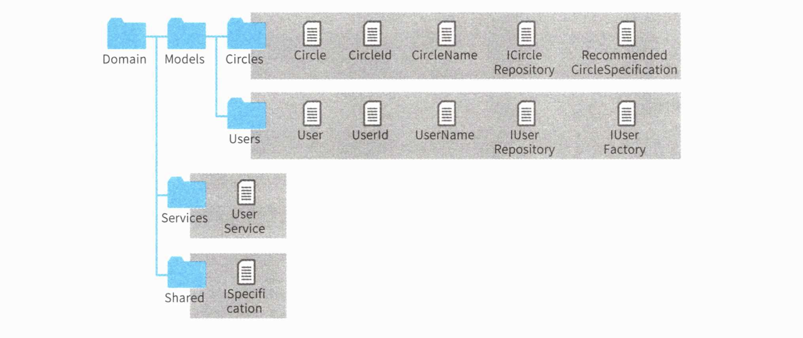
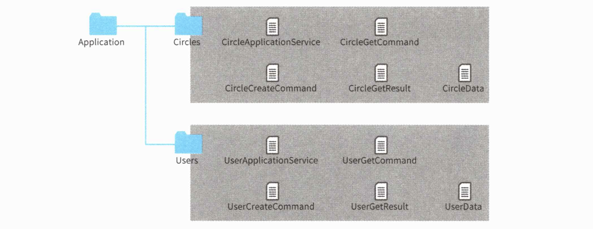
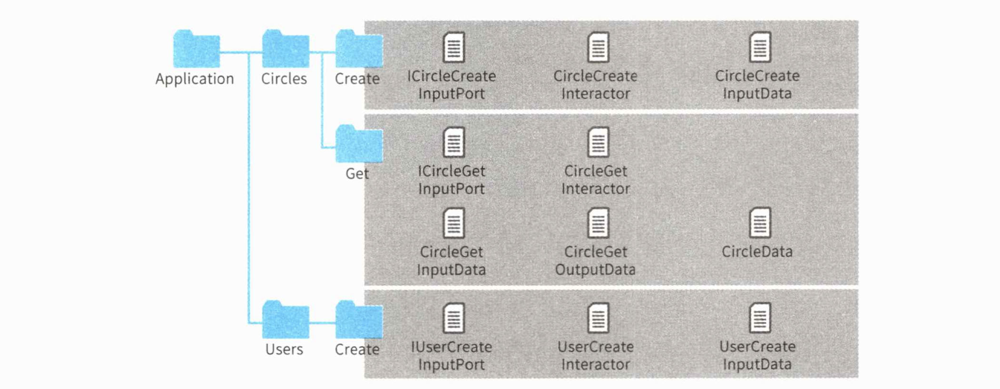
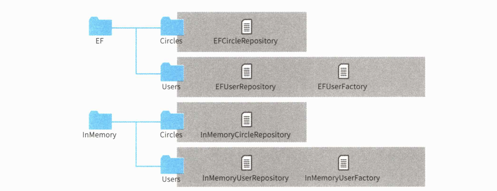
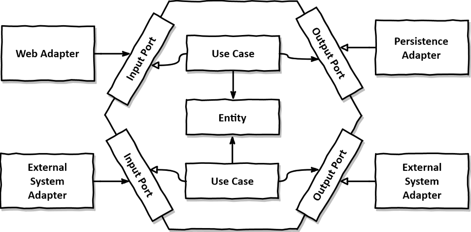
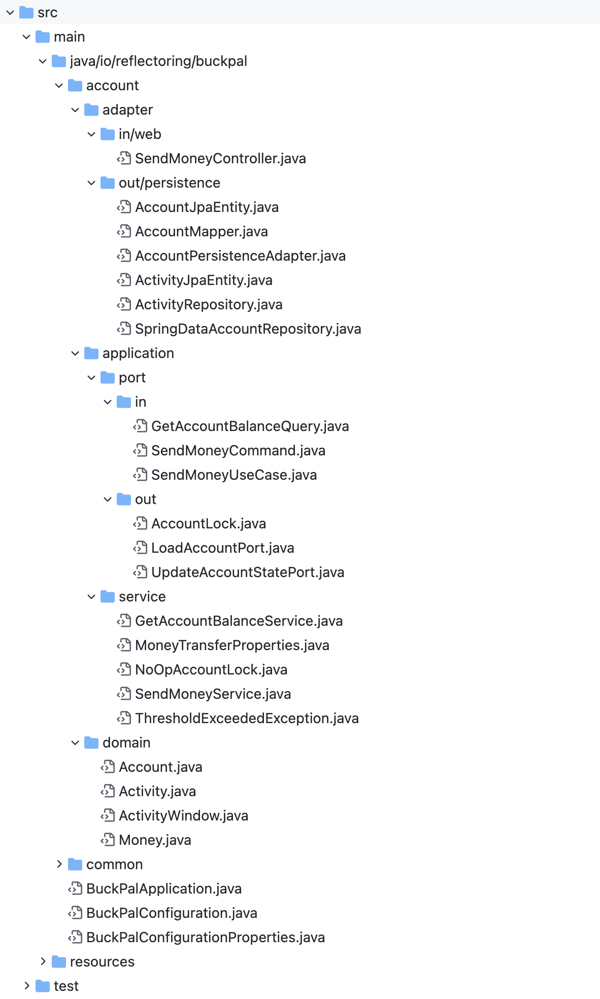

# 16 솔루션 구성

솔루션 구성은 개발 초기에 결정해야하는 사항인 만큼 많은 고민을 안겨준다. 지금까지 배운 것을 적용하려면 이 허들을 넘어야 한다.

이번에는 계층형 아키텍처를 예로 솔루션을 구성하고 각 레이어를 배치하는 과정을 다뤄보자

> 🔍 **솔루션이란?**
>
> 비쥬얼 스튜디오에서 C#으로 개발하기 위해서는 먼저 프로젝트 솔루션을 만들어야한다. 프로젝트는 프로그램을 만들기 위해 필요한 파일을 관리하는 수단으로 실제 소스코드와 리소스르르 담고 있다. 솔루션이란 이 프로젝트를 여러개 묶어 관리하는 것을 말한다.
>
> 자바로 바꿔말하면 IntelliJ IDEA의 프로젝트가 솔루션이고, 모듈이 프로젝트에 해당한다.

## 16.1 소프트웨어 개발의 첫걸음

***"Screaming Architecture - Uncle Bob, Clean Architecture"***

소프트웨어 개발에서 가장 먼저 해야할 작업은 프로젝트 구성 결정이다. 이는 까다로운 작업이다. 왜냐하면 여기서 결정된 내용이 제품이 살아있는 내내 영향을 미치기 때문이다. 이러한 결정을 할 때 고려할 사항과 구체적 구성을 알아보자.

## **4계층과 패키지 구성**

계층형 아키텍처를 적용해 패키지 분할을 진행해보자.

- 프레젠테이션 계층

- 애플리케이션 계층
- 도메인 계층
- 인프라스트럭처 계층

### 도메인 레이어의 패키지 구성

모듈 구성을 들어가기전에 각 패키지 구성에 대해 확인해보자. 먼저 도메인 레이어다.

***도메인 레이어의 구성***

이 레이어는 기술적 라이브러리에 의존하지 않고, 크게 3개의 구성으로 나뉜다.

1. Model 패키지
   - 도메인 객체가 위치하고, 애그리게이트를 구성하는 엔티티나 값 객체는 물론이고 팩토리, 리포지토리, 명세도 이곳에 위치한다. 또한 명세도 이곳에 위치한다.
   - 팩토리나 리포지토리가 엔티티나 값 객체와 같은 패키지에 위치하는게 이상하게 보일 수 있다. Domain.Factories나 Domain.Repositories 같은 패키지에 두는 건 어떤가? 그러나 이런 구성은 좋지 않다. 마치 사무용 칼과 식칼을 같은 곳에 두는 것과 같다. 
   - User 클래스에는 팩토리와 리포지토리가 있다. 팩토리를 통해 객체르르 만들고 리포지토리가 저장 및 복원을 맡는다. 그러므로 User 클래스의 생성자 메서드는 팩토리나 리포지토리에서 호출 될 것을 전제로 만든다. 이 점을 후임 개발자도 자연스럽게 알 수 있게 한 곳에 두는 것이다. 
   - 클래스의 성격보다 의미적인 유사성을 더 고려하도록하자.
2. Service 패키지
   - 도메인 서비스를 두기 위한 패키지다. 서비스 객체는 두 가지 이상의 도메인 객체를 다뤄야 하는 경우가 많다. 그러므로 중립적으로 Domain.Service에 두지만, UserService처럼 특정 도메인에 얽혀 있다면 해당 도메인 객체의 패키지에 두는 것도 고려해볼만 하다.
3. Shared 패키지
   - 꼭 만들 필요는 없다. ISpecification 같은 경우는 다른 모듈에서도 사용되는 정의이므로 공통 모듈로 분리해 Domain 패키지가 이 모듈에 의존하게 구성하는 것도 가능하다.

### 애플리케이션 레이어의 패키지 구성

***애플리케이션 레이어의 패키지 구성***

애플리케이션 레이어의 패키지 구성은 위와 같다. 커맨드 객체를 이용할 수 있게 서비스마다 별도의 패키지를 두었다. 패키지가 너무 많다면 하위 패키지를 만들어서 관리해도 좋다.

***클린 아키텍처를 따른 구성***

14장에서 설명했던 클린 아키텍처처럼 유스케이스마다 별도로 클래스를 두었다면 위와 같은 구성이 될 것이다.

### 인프라스트럭처 레이어의 패키지 구성

***인프라스트럭처 레이어의 패키지 구성***

인프라스트럭처는 의존하는 기술 기반마다 패키지를 두었으나 같은 패키지에 둘 수도 있다.

## 16.2 솔루션 구성

이 부분은 언어적, IDEA적 특성을 타므로 '클린 아키텍처'나 '만들면서 배우는 클린 아키텍처나'를 참고하도록 하자.

***헥사고날 아키텍처***

***만들면서 배우는 클린아키텍처의 헥사고날 아키텍처 패키지 구성 예시***

## 16.3 정리

***"중요한 도메인 규칙이 다른 곳을 의존하지 않도록 아키텍처 적으로 규제를 하자!"***

개발자는 코드뿐만 아니라 그 구조에서도 아름다움을 발견할 수 있다. 후임 개발자에게 코드를 파악하는 힌트가 되거나 의도치 않은 호출을 방지하기 위해 프로그래밍 언어의 기능을 충분히 활용하는 프로젝트 구성을 도출해내자.