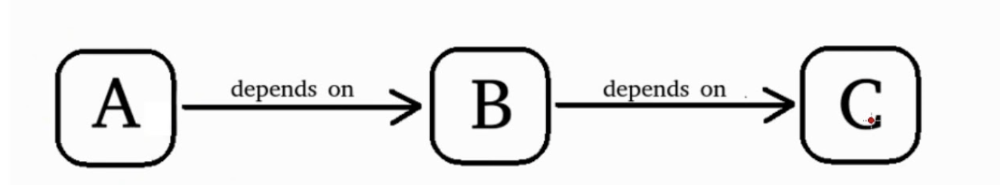
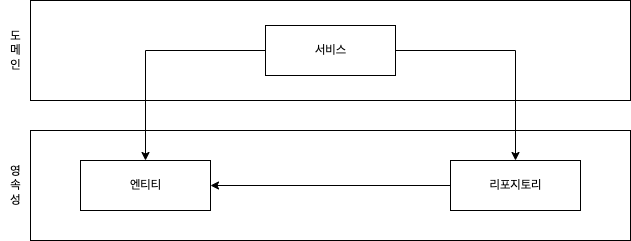
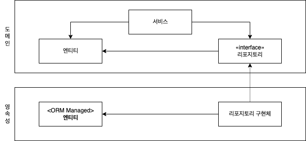
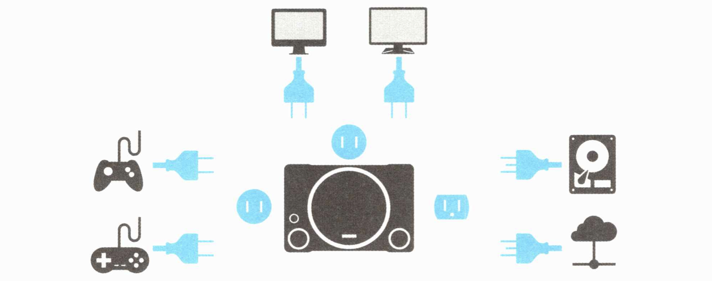
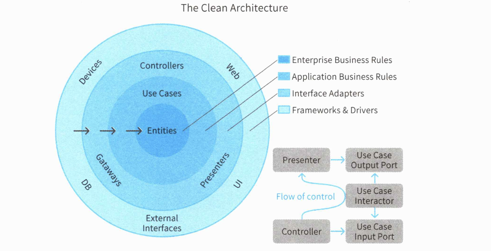

# 의존성 역전하기

### 아키텍처의 역할

개발자는 '모든 일이 다 중요하다'는 말을 외면하고 언젠가 리팩토링 할 날이 오려니 생각하기 쉽습니다. 물론 리팩토링 할 날 따위는 오지 않습니다. 이러한 코드들은 점점 유지보수 비용을 높이고 괴롭힙니다. 이 해결책이 바로 아키텍처입니다. 

아키텍처는 간단히 말해 코드를 구성하는 원칙입니다. 어떤 내용을 구현한 코드가 어디에 배치돼야 하는지에 대한 답을 명확이 제시하여 무질서하게 흩어지는 것을 막아줍니다. 개발자는 아키텍처가 제시하는 원칙에 따르면서 '어떤 로직을 어디에 구현할 것인지'를 고민하지 않아도 됩니다. **개발자가 '도메인을 파악하고 잘 표현하는' 것에 집중할 수 있게 해줍니다.**

> ❓ **아키텍처는 만능 대안?**
>
> 개발에서 중요한 것은 도메인을 분리하는 것이지 이들 아키텍처를 잘 준수한다고 해서 제대로 설계된다는 것은 아닙니다. **중요한 것은 도메인의 본질에 집중할 수 있는 환경을 만드는 것이라고 생각합니다.**
>

### 계층형 아키텍처의 대안

이전 장에서 다뤘던 계층형 아키텍처는 도메인을 잘 파악하고 잘 표현하는 것에 집중하기 어려웠습니다. 이 부분을 해결할 수 있는 클린 아키텍처와 육각형 아키텍처를 알아보도록 하겠습니다. 먼저 두 아키텍처의 핵심인 단일 책임 원칙과 의존성 역전 규칙을 먼저 살펴봅니다.

### 단일 책임 원칙

<i>"하나의 컴포넌트는 오로지 한 가지 일만 해야 하고, 그것을 올바르게 수행해야 한다."</i>

단일 책임 원칙라고 하면 다음 정의를 찾으면 다음과 같습니다.

<i>"컴포넌트를 변경하는 이유는 오직 하나뿐이어야 한다."</i>

하지만 실제로는 다음 정의에 더 가깝습니다. 컴포넌트를 변경할 이유가 오로지 한 가지라면 컴포넌트는 딱 한 가지 일만 하게 되는 것입니다.

***전의 의존성(transitive dependency)***

아키텍처 관점에서 보면 변경할 이유라는 것은 컴포넌트 간 의존성을 통해 많이 전파됩니다. 

위의 플로우 차트를 보면 컴포넌트 `C`를 변경할 이유는 새로운 요구사항에 의해 `C`의 기능을 바꿔야 할때 뿐입니다. 반면에 `A`의 경우는 `B`가 바뀌는 경우 잠재적으로 같이 바뀔 여지가 있습니다.

많은 코드는 의존성으로 인해 단일 책임 원칙을 위반하기 때문에 시간이 갈수록 변경이 어려워지고 그로 인해 변경 비용이 증가합니다.  변경할 이유가 많이 쌓인 후에는 한 컴포넌트를 바꾸는 것이 다른 컴포넌트가 실패하는 원인으로 작용할 수 있습니다.

이러한 의존성으로 인한 변경해야하는 이유의 증가를 어떻게 막을 수 있을까요?

### 의존성 역전 원칙

***계층형 아키텍처의 의존성 방향***

계층형 아키텍처에서는 계층 간 의존성이 항상 다음 계층인 아래 방향을 가리킵니다. 단일 책임 원칙을 고수준에서 적용할 때 상위 계층들이 하위 계층들에 비해 변경할 이유가 더 많다는 것을 알수 있습니다.

***도메인 계층이 영속성 계층에 의존하고 있는 아키텍처***

영속성 계층에대한 도메인 계층의 의존성 때문에 영속성 계층 변경 시마다 잠재적으로 도메인 계층도 변경해야하죠. 이러한 의존성을 제거할 수 있는 방법이 의존성 역전 원칙(Dependency Inversion Prinsiple, DIP)입니다. 

***의존성 역전(Dependency Inversion Prinsiple)***

의존성 역전은 어떻게 동작할까요?

1. 도메인에 특화된 도메인 규칙이 있는 정보를 분리해 도메인 계층으로 엔티티를 올립니다.
2. 도메인 계층에 리포지토리의 인터페이스를 만들고 실제 리포지토리는 영속성 계층에서 구현하게 합니다. 
3. 도메인이 리포지토리 인터페이스를 참조하게 함으로서 도메인 계층과 영속성 계층의 의존성을 역전시킵니다.

이것이 바로 아래에서 다룰 클린 아키텍처와 육각형 아키텍처의 핵심입니다.

### 육각형 아키텍처(헥사고날 아키텍처)

***육각형 아키텍처***

육각형 아키텍처의 콘셉트는 애플리케이션과 그 외 인터페이스나 저장 매체를 자유롭게 탈착 가능하게 하는 것입니다. 

***마치 게임기 같은 육각형 아키텍처***

육각형 아키텍처의 목적을 설명하기 좋은 게임기를 예로 들어보겠습니다. 게임기는 게임 컨트롤러와 모니터 등 사용자와 직접 접하는 인터페이스를 같습니다. 순정품을 사용하던 사용자 취향에 따라 서드파티 제품을 연결하던 그대로 사용이 가능합니다. 모니터 역시 LCD, CRT 등 여러 선택지가 있지만 게임기 입장에선 화면을 보여주는 의미에서 동등합니다. 저장 매체 또한 내장 디스크, 클라우드 등 저장할 수 있습니다. 게임기 입장에서는 저장만 되면 저장 매체는 상관 없는 것입니다.

육각형 아키텍처는 이러한 개념을 애플리케이션 구조에 도입한 것입니다. 어댑터가 포트 모양만 맞으면 동작하는 것과 같다고 해서 포트 앤 어댑터 아키텍처라고 부르기도 합니다.

계층형 아키텍처와의 차이점은 인터페이스를 이용해 의존관계를 관리한다는 점입니다. 계층형 아키텍처에서는 논리적 계층 분리만 되어 있을 뿐 인터페이스를 사용할지 여부는 강제되지 않습니다. 

> 그러나 실무에서는 계층형 아키텍처를 채택하더라도 대부분 인터페이스를 이용한 의존관계 역전을 사용하므로 큰 차이는 없다고 느껴집니다.

### 클린 아키텍처

***클린 아키텍처***

클린 아키텍처는 4개의 동심원이 있는 특징적인 아키텍처입니다. 요점은 도메인 코드가 바깥으로 향하는 어떤 의존성도 없도록 하는 컨셉입니다.

클린 아키텍처는 사용자 인터페이스나 데이터스토어 같은 세부사항은 가장자리로 밀어내고, 의존성 역전 원칙의 도움으로 의존관계의 방향을 도메인 코드를 향하게 합니다. 즉 세부사항이 추상에 의존하는 의존관계 역전의 원칙을 달성합니다.

### 클린 vs 육각형 아키텍처

클린 아키텍처와 육각형 아키텍처는 의존성 역전을 통해 도메인 규칙이 외부 시스템에 의존하지 않도록 격리하는 부분을 보면 유사합니다. 그럼 차이점은 무엇일까요? 가장 큰 차이점은 구현 내용이 언급되는지 여부에 있습니다. 육각형 아키텍처에서는 포트와 어댑터를 이용해 탈착이 가능하게 하라는 원칙만 있습니다. 이에 비해 클린 아키텍처는 컨셉트를 실현하기 위한 구체적인 구현 방식이 명시 됩니다. 

이러한 차이점을 차치하고 어느 아키텍처를 사용하든지 **가장 중요한 것은 도메인을 적절히 분리하는 것**입니다. 모든 세부사항이 도메인에 의존하게 하면 소프트웨어의 주도권을 중요도가 높은 도메인이 쥐게 할 수 있습니다.

